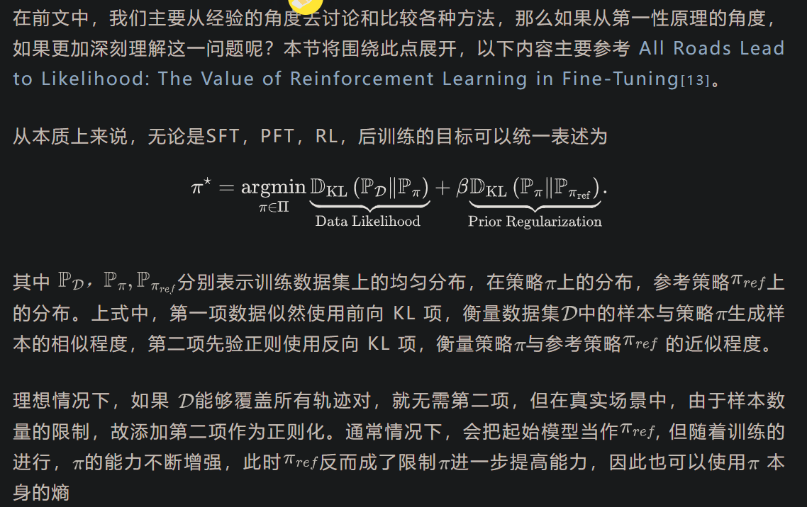
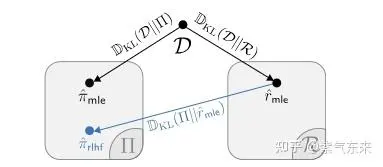

# 1. 从 RL 角度再思考 Post-training

## 1.1 RLHF 中的 RL 基础概念

RL 中有一些必要的概念与构成，如环境、状态、动作、奖励等，下面我们将 RLHF 中的各环节对应起来。

状态(State): 初始状态即由用户输入 prompt 

动作(Action)：对于语言模型来说，动作空间由模型词汇表中的所有token组成，即大小为 vocab_size

奖励(Reward):

- response level：策略  根据当前上下文生成 token，逐步构建的回答 y = （y1, y2, ..., yr） , 在评估时，通常以最后一个 token EOS 的分数代替（这是最常见的做法，上图显示就是这种）。
- token level: 该方式基于一种认识：每一个 token 是一个 action，生成的完整 completion 构成一个决策序列，这种方式事实上与自然语言的特点并不相容，即人类通常不会逐字去评估一段话，而是看完一整句或整段后进行评估，因此这种方式采用的也比较少。

序列决策：经典 RL 处理的都是序列决策问题，即一次探索由多个交互（动作）构成。而在 RLHF 中，如果我们将 response 看做 action，那么 RLHF 实际上就是一种单步的、即时奖励的 RL。

环境(Environment): 在经典 online RL 中，环境是客观的、能够提供即时反馈，从而帮助模型进行更新；而在 RLHF 中环境实际上由策略模型和奖励模型本身构成，而奖励模型还是预先训练好的、静态的，从这个角度来说，RLHF 更类似于offline RL 或监督学习，而不是online RL。

策略(Policy): 在 RLHF 中，策略即 LLM 本身

| 概念       | 经典 RL                         | RLHF                                |
|------------|----------------------------------|--------------------------------------|
| 状态空间   | 物理状态（如像素、坐标）         | 文本上下文（token 序列）            |
| 动作空间   | 离散/连续控制（如按键）          | 生成下一个 token（词汇表分布）      |
| 奖励       | 环境反馈（如得分）               | 奖励模型或规则                       |
| 可观测性   | 通常完全观测                     | 完全观测（文本历史已知）            |

## 1.2 基于策略梯度的更新方法
RLHF 中的算法都是基于策略梯度的 RL 算法，即通过深度学习模型为策略建模，输入某个状态，然后输出动作的概率分布，目标是寻找一个最优策略并最大化该策略在环境中的期望回报。

依据训练数据产生的方式，主流的 RLHF 方法可以大致分为两大类：

- On-Policy: 在训练过程中，模型主动生成自己的数据样本，进而根据模型当前状态持续探索和更新，这种方式的瓶颈主要在数据生成过程（耗费计算资源和时间），典型方法的如 PPO
- Off-Policy: 训练依赖于预先收集的数据（或由另一个策略生成的数据），无需实时生成，这种方式样本效率高，典型方法如 DPO
接下来以 On-Policy 的 PPO 算法为例来回顾 RLHF 中策略更新的核心过程，一个典型的 PPO 算法包括以下组成：

- Actor: 即策略模型，用以生成输出，并根据反馈进行更新
- Critic: 扮演教练的角色，为每个生成的输出提供即时反馈，并随着模型能力的提升与 Actor 模型同步更新
- Reward Model: 作为裁判，分配最终得分或偏好评估，预先由偏好数据训练得到，在PPO训练过程中保持不变
- Reference Model: 作为策略模型的参考，防止演员模型偏离原始预训练分布太远
接下来简要回顾策略优化的过程，强化学习中的目标是优化策略以最大化期望回报

## 1.3 重要性采样与梯度裁剪

# 2. 主流算法的思路及其比较

## 2.1 PPO 与 VC-PPO

可以看到，PPO 是 token-level 的动作，而其奖励确实 response-level（只在 EOS 位置有奖励值），这种方式实际上会导致奖励非常稀疏。

主流框架的实现可参考：

- trl/ppo_trainer[2]
- OpenRLHF/get_advantages_and_returns[3]
- verl/compute_gae_advantage_return[4]

标准的 PPO 算法直接来源于经典 RL ，对语言序列的特点考虑的有限，特别是在长文本上，对此 VC-PPO 做了一些特异性修正，下面理解一下其核心点：长序列中的值模型偏差及其消除

## 2.2 RLOO

可以看到 RLOO 与 PPO 的计算过程明显不同，主要体现在：

- PPO 的计算过程是 token-level 的（即将 token 看做 action），而 RLOO 的计算过程是 response-level 的（即将 response 看做 action）
- RLOO 没有 PPO 中的 value model(critic) ，而需要对每个 prompt 产生多个输出，即显存占用变少而产生样本变多；
- PPO 使用 GAE 的方式计算 A 函数，而 RLOO 通过与基线的差值来计算 A 函数
当然，RLOO 也可以通过 token-level 的方式进行计算，更多实现可参考：

- trl/rloo_trainer (token-level & response-level)[5]
- OpenRLHF (token-level)[6]
- verl/compute_rloo_outcome_advantage (response-level)[7]

## 2.3 GRPO 与 Dr,GRPO

Dr. GRPO 提出在这种情况下移除标准差项，但这会以降低那些全部错误但有少数正确答案的提问的权重为代价，这可能会被视为有价值的信号。

Dr. GRPO 移除了标准差归一化项。这解决了对低奖励方差问题（即几乎所有答案都是正确或错误的）的偏差，在常数缩放因子下等同于 RLOO 估计

主流框架的实现可参考：

- trl/grpo_trainer[8]
- OpenRLHF/grpo & dr_grpo[9]
- verl/compute_grpo_outcome_advantage[10]
- Dr_GRPO/compute_advantages[11]

## 2.4 REINFORCE 与 ReMax

## 2.5 DAPO 与 VAPO

通过这种方法大大提高了强化学习训练过程中正样本的利用效率。

# 3. 从理论角度再思考 LLM + RL

从前文的讨论可以看到，与 RL 的经典场景不同，使用 RL 训练 LLM 显得比较“拧巴”，其根本原因就是语言本身的特点及其建模过程导致的。那么我们是否可以从更高的角度来思考这一问题呢？

## 3.1 DPO：有监督对齐

## 3.2 统一视角理解从 SFT 到 RL

# 参考

[1] 思考 RLHF 的本质以及主流算法思路, https://mp.weixin.qq.com/s/30YhvVmjPJLDfi2jczw1GQ

[1] 深度强化学习（五）：策略梯度的方法:https://zhuanlan.zhihu.com/p/450690041
[2]trl/ppo_trainer:https://github.com/huggingface/trl/blob/main/trl/trainer/ppo_trainer.py#L506
[3]OpenRLHF/get_advantages_and_returns:https://github.com/OpenRLHF/OpenRLHF/blob/main/openrlhf/trainer/ppo_utils/experience_maker.py#L569
[4]verl/compute_gae_advantage_return:https://github.com/volcengine/verl/blob/main/verl/trainer/ppo/core_algos.py#L66
[5]trl/rloo_trainer (token-level & response-level):https://github.com/huggingface/trl/blob/main/trl/trainer/rloo_trainer.py#L432
[6]OpenRLHF (token-level):https://github.com/OpenRLHF/OpenRLHF/blob/main/openrlhf/trainer/ppo_utils/experience_maker.py#L539
[7]verl/compute_rloo_outcome_advantage (response-level):https://github.com/volcengine/verl/blob/main/verl/trainer/ppo/core_algos.py#L197
[8]trl/grpo_trainer:https://github.com/huggingface/trl/blob/main/trl/trainer/grpo_trainer.py#L927
[9]OpenRLHF/grpo & dr_grpo:https://github.com/OpenRLHF/OpenRLHF/blob/main/openrlhf/trainer/ppo_utils/experience_maker.py#L539
[10]verl/compute_grpo_outcome_advantage:https://github.com/volcengine/verl/blob/main/verl/trainer/ppo/core_algos.py#L107
[11]Dr_GRPO/compute_advantages:https://github.com/sail-sg/understand-r1-zero/blob/main/train_zero_math.py#L293
[12]online DPO:https://arxiv.org/pdf/2402.04792
[13]All Roads Lead to Likelihood: The Value of Reinforcement Learning in Fine-Tuning:https://arxiv.org/pdf/2503.01067

 

往期推荐