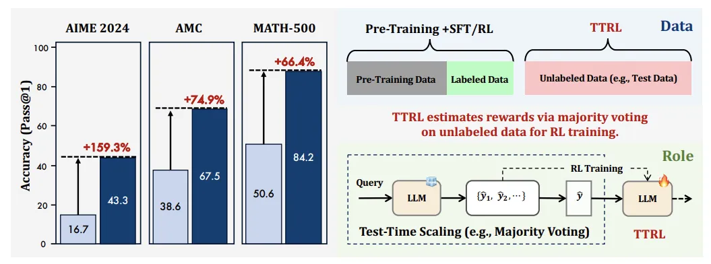
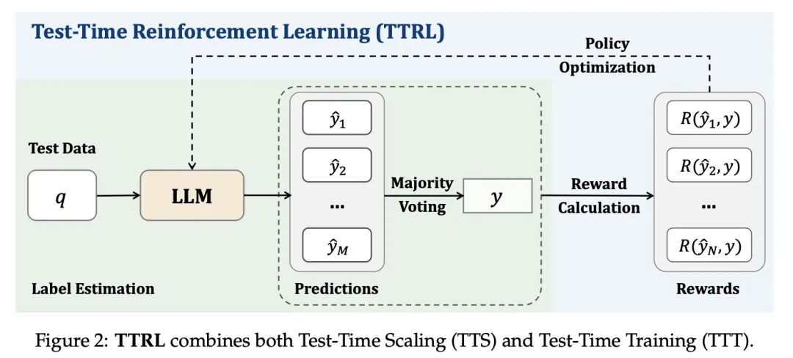
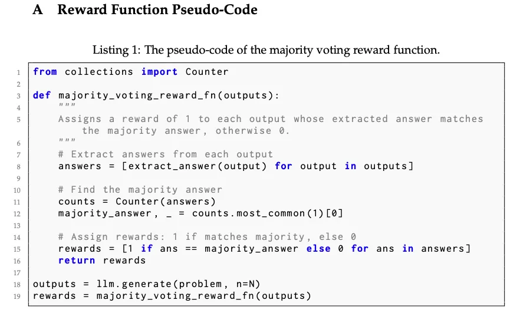
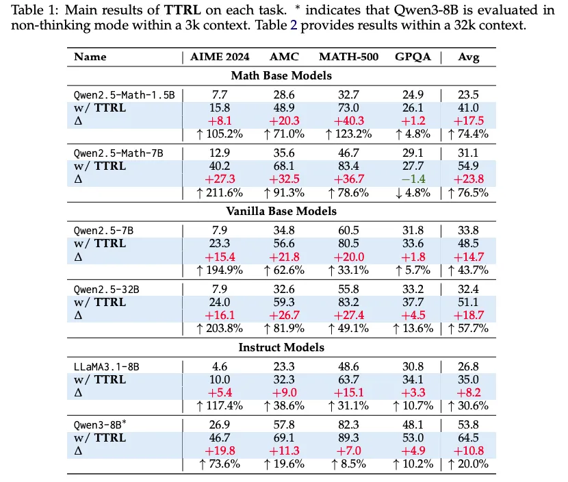

# 1. 资源

- 论文：TTRL: Test-Time Reinforcement Learning
- 链接：https://arxiv.org/pdf/2504.16084
- 代码：https://github.com/PRIME-RL/TTRL

# 2. 原理

</> 聚焦：提出的TTRL（Test-Time强化学习） 给出了答案：让AI自己生成答案，通过“投票”选出共识，再用共识作为奖励信号驱动学习。

</> 方法精讲：

训练流程
- 输入处理：给定一个提示x，LLM会对其进行处理以生成响应。
- 多次采样：模型通过从其策略πθ(y|x)中采样来生成N个候选输出{y₁, y₂, ..., yₙ}。
- 共识形成：应用多数投票来确定最常见的答案y*，作为正确答案的代理。
- 奖励计算：每个采样的输出都会根据其与共识答案的一致性获得奖励（如果匹配，则为1；否则为0）。
- 策略优化：使用诸如PPO或GRPO之类的RL算法更新模型的参数θ，以最大化预期奖励。

简单概括：利用LLM自身的采样生成特点，生成多条答案，基于Rule-Based Reward策略（策略伪代码如下）得到最优的答案，更新优化LLM的参数，目标就是期望最大化。

应用层面直觉上是可行，但是：
我得生成多少个答案呢？这个地方随机性还是比较高的，有不稳定的风险
原始的LLM效果还得不能太差，比如一个通用LLM直接应用于某高P的场景，如果效果本身就不太好，感觉这个方法就很鸡肋了，适合：精调阶段，比如模型在某个场景本身有90%的准确率了，要提升到93%

</> 性能评估：

效果上杠杠的，感觉是因为在代码/math场景，该类场景本身就有其特殊性，不知道扩展到比如：客服、金融等场景，特别是那种不需要Long-CoT的场景。

# 参考

[1] TTRL(Test-Time RL)微调新方法：极简版RL，效果吊打SFT, https://mp.weixin.qq.com/s/T6YmLjqoVtnPd33WXycU1Q