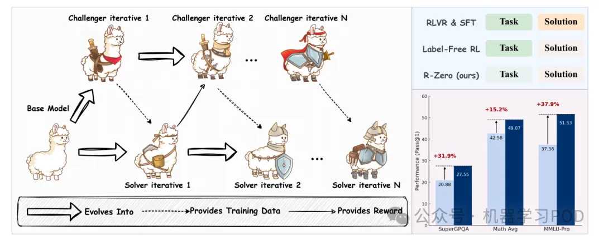

# 1. 资源

- 论文标题：R-Zero: Self-Evolving Reasoning LLM from Zero Data
- 论文链接：https://www.arxiv.org/pdf/2508.05004

# 2. 简介

2025年8月7日，腾讯AI西雅图实验室在arXiv上发表了一篇论文，叫 《R-Zero: Self-Evolving Reasoning LLM from Zero Data》。这篇论文提出了一个叫 R-Zero 的全自动框架，这个框架不依赖任何现有的任务和人类标注，能自己生成训练数据，让模型不断进化。

# 3. 问题

人类标注数据的“三重困境”
- 成本高昂与规模化难题：高质量的标注数据是“奢侈品”。例如，在数学推理、代码生成或专业问答等领域，寻找能够提供准确标注的专家本身就极其困难，其成本更是天文数字。这导致我们很难构建一个足够庞大且多样化的数据集来覆盖所有需要的知识和技能。
- 质量与一致性瓶颈：人非圣贤，孰能无过。即便是专家，在进行标注时也可能出现错误、偏见或不一致。这些“噪声”会直接影响模型的学习效果，甚至误导模型的价值对齐。
- 超越人类的“天花板效应”：这是最根本的限制。如果我们希望AI解决那些连人类专家都束手无策的问题（如攻克癌症、设计新材料），那么我们从何获取“正确答案”来指导模型呢？依赖人类监督的模式，本质上是将模型的认知上限锁定在了人类的现有水平。

# 4. 方法

为了打破数据依赖的枷锁，研究者们进行了一系列有益的尝试。

- 无标签强化学习（Label-Free RL）：这类方法尝试直接从模型自身的输出中提取奖励信号，例如利用模型输出的置信度、序列的熵或不同推理路径间的一致性。这在一定程度上减少了对显式标签的需求。然而，它们仍然需要一个预先存在的、固定的“问题集”或任务语料库。它们解决了“如何评价答案”的问题，却没有解决“问题从哪里来”的根源性问题。
- 自我挑战（Self-Challenging）：这类方法让模型自己生成任务来训练自己，这与R-Zero的思想更为接近。然而，现有的大多数自我挑战方法严重依赖于“外部验证器”。例如，在代码生成领域，模型可以生成代码问题，然后通过一个真实的编译器或单元测试来验证答案的正确性。但在更广泛的、缺乏这种“上帝视角”验证工具的开放域推理（如复杂的数学证明、哲学思辨）中，如何保证自生成问题的质量和答案的正确性，就成了一个巨大的挑战。

正是在这样的背景下，R-Zero横空出世，它旨在同时解决“问题生成”和“答案验证”两大难题，构建一个完全封闭、自给自足的进化循环，而无需任何外部任务语料或验证 oracle。

全新的自进化框架

R-Zero的核心思想，可以用一句话来概括：通过两个扮演不同角色的模型进行“对抗性”的协同进化，实现从零开始的自我完善。

这个框架的设计精妙之处在于，它模拟了人类社会中“教”与“学”的动态过程。想象一个顶尖的教师和一个聪明的学生：

- 教师（挑战者，Challenger）的目标是出一些稍稍超出学生当前能力边界的题目。太简单，学生学不到新东西；太难，学生会完全无法下手，同样没有学习效果。
- 学生（解题者，Solver）的目标是尽力去解决老师提出的这些有挑战性的问题，从而提升自己的能力。

随着学生能力的提升，老师也必须出更难的题目来继续挑战他。

这个“教学相长”的过程，使得师生二人的能力螺旋式上升。R-Zero正是将这一动态过程编码成了一套算法框架。

如图1左图所示，R-Zero的流程如下：

初始化：从一个基础的LLM（Base Model）开始，克隆出两个功能上独立的模型：挑战者 () 和 解题者 ()。在初始状态，它们的水平是完全一样的。

迭代循环（Iterative Loop）：整个框架以迭代的方式进行。在第N次迭代中：

- 挑战者进化：系统会根据解题者  在这批问题上的表现（比如回答的正确率）来给挑战者  一个“奖励”。如果出的题“恰到好处”（即解题者表现出最大的不确定性），挑战者就会获得高奖励，并据此更新自己，以便在下一轮出更高质量的题。
- 解题者进化：系统会从挑战者出的题中，筛选出一批质量最高的“好题”，并利用解题者自己生成的“伪标签”（pseudo-label，通常通过多次采样后多数投票产生）作为答案，构成新的训练数据。然后，解题者  会在这个新的、更有挑战性的数据集上进行训练和微调，从而进化成一个更强大的解题者 。
- 挑战者出题：挑战者  的任务是生成一批新的、对当前解题者 来说具有挑战性的问题。
- 解题者解题：当前的解题者  会尝试回答这些新问题，并给出自己的答案。

奖励与进化：
- 持续迭代：进入第N+1次迭代，更强大的解题者  将面对来自更强大挑战者  的、更困难的问题。如此循环往复，两个模型的能力共同提升。

这个过程是完全自动化和自包含的。它不需要外部提供任何问题或答案，仅仅从一个基础模型出发，就能源源不断地创造出越来越难的“课程”和越来越强的“学生”。

图1右图直观地展示了这一框架带来的巨大性能提升，我们将在第五章详细分析这些结果。

使用GRPO算法。

复合奖励函数

挑战者的目标是生成“好”问题。那么，什么样的问题才是“好”问题？R-Zero认为，一个好问题应该具备两个特质：1. 有挑战性；2. 有新颖性。为此，它设计了一个复合奖励函数，由三部分构成：不确定性奖励、重复度惩罚和格式检查惩罚。

# 5. 实验

理论的优雅最终需要实验来验证。R-Zero的作者们在一系列模型和基准测试上进行了详尽的实验，结果令人印象深刻。

5.1 实验设置
基础模型：实验涵盖了两种不同的模型架构和多种尺寸，以验证框架的通用性。
Qwen3系列：Qwen3-4B-Base 和 Qwen3-8B-Base。
OctoThinker系列：OctoThinker-3B 和 OctoThinker-8B（基于Llama-3.1）。选择这个系列是因为其原始论文报告称直接对其进行RL训练效果不佳，更能凸显R-Zero的有效性。
评估基准：评估分为两大类。
数学推理：这是R-Zero主要训练的领域，因为它答案的对错客观、易于验证。涵盖了AMC, Minerva, MATH-500, GSM8K, Olympiad-Bench等7个极具挑战性的数学基准。
通用领域推理：为了测试模型通过数学训练获得的能力是否可以泛化到其他领域，作者们在MMLU-Pro, SuperGPQA, BBEH等顶级通用推理基准上进行了评估。
5.2 数学推理能力：显著且持续的提升

消融研究（Ablation Study）是验证一个复杂系统设计合理性的标准方法，通过逐一“拿掉”某个组件来观察其对整体性能的影响。表3清晰地展示了R-Zero三大核心组件的重要性。

移除挑战者的RL训练 (w/o RL-Challenger)：这是影响最大的部分。当挑战者不再通过RL进行智能课程生成，而退化为随机出题时，数学平均分下降了3.7分，通用平均分更是暴跌4.1分。这再次印证了“智能教师”的核心价值。
移除重复度惩罚 (w/o Rep. Penalty)：性能同样出现显著下滑。这说明，如果不对生成问题的多样性加以约束，挑战者很容易陷入“舒适区”，反复生成同质化的问题，从而阻碍解题者的全面发展。
移除任务过滤 (w/o Filtering)：性能也出现了明显下降，尤其是在通用领域。这说明，我们之前讨论的任务过滤步骤（保留30%-70%正确率的问题）起到了关键的“课程筛选”和“质量控制”作用。如果没有这个过滤器，解题者会被迫学习大量“脏数据”（噪声、歧义问题）和效率低下的数据（太简单或太难），从而损害其学习的鲁棒性。

# 6. 点评
这篇论文最大的亮点和贡献，在于提出了一个真正意义上“从零数据”（from Zero Data）的、完全自主的 LLM 自我进化范式。

摆脱“双重依赖”：在此之前，所谓的“自学”或“自洽性”方法，虽然摆脱了对“人工标签”（answers）的依赖，但仍然需要一个预先存在的、大规模的“问题集”（tasks）。R-Zero 更进一步，连“问题集”都由模型自己生成。它成功地将学习过程封闭在一个完全内生的循环中，这是对现有范式的一次重大突破。

“课程自生成”的理念：R-Zero 的核心思想，即让一个系统自主地创造出适合自己学习的课程（curriculum），是一个非常深刻且强大的概念。它从根本上解决了 AI 发展的“数据瓶颈”问题，为实现超越人类知识边界的智能提供了一条极具想象力的路径。

可以说，R-Zero 在理念上是具有开创性的。它将“自对弈”（self-play）的思想从 AlphaGo 的棋类游戏，成功地、巧妙地迁移到了更开放、更复杂的语言推理领域。

对“客观真理”的强依赖，这是该框架最核心的、也是最大的适用性限制。整个奖励机制（不确定性）和伪标签生成（多数投票）都建立在一个前提上：问题存在一个或少数几个可收敛的、客观正确的答案。

适用领域略窄：这使得 R-Zero 在数学、编程等逻辑性强的领域表现出色，但几乎无法直接应用于绝大多数现实世界任务，例如：

主观创造类：写一首感人的诗、写一篇风格独特的短篇小说。
开放式总结与分析：总结一份复杂的财报、为一项政策提供利弊分析。
策略与规划类：为公司制定下一季度的市场策略。 在这些任务中，“最好的答案”是开放的、主观的、依赖于上下文和价值判断的，无法通过“多数投票”来决定。

# 参考

[1] 腾讯 AI Lab提出R-Zero「实现零数据自进化」, https://mp.weixin.qq.com/s/rKgDfJ24m86dHhHTAFf1Xg