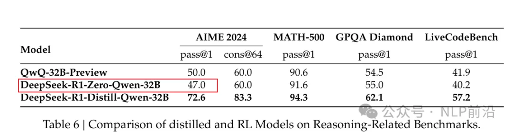
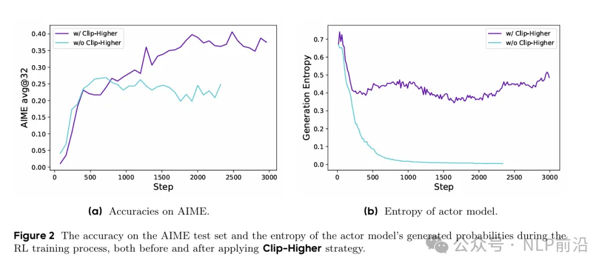
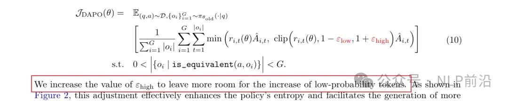
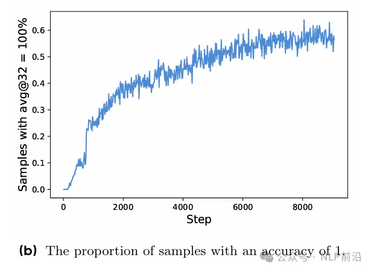
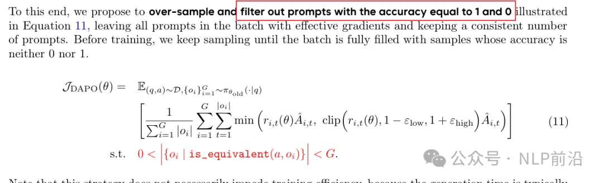
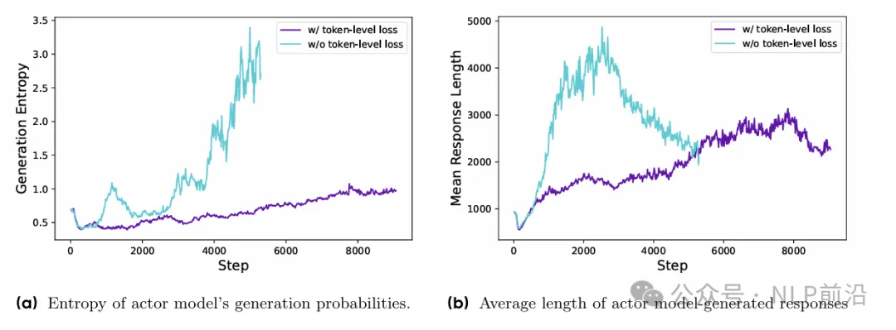
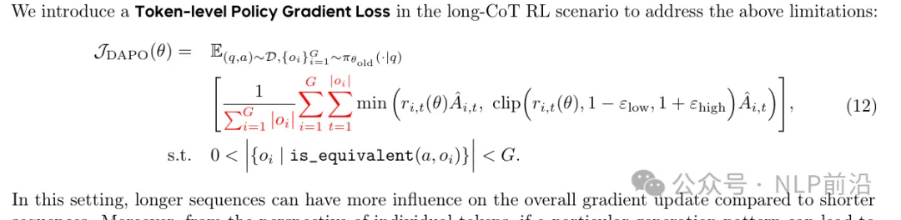
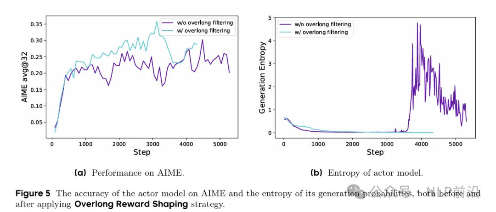
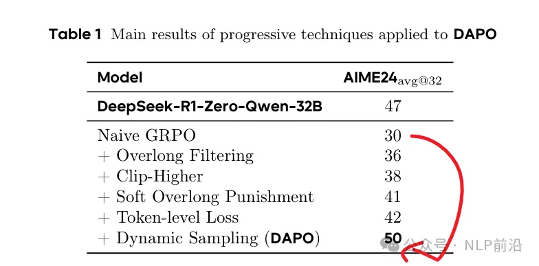

# 1. 资源

论文地址：https://arxiv.org/html/2503.14476v1

# 2. 问题

打开deepseek-r1的论文，论文里边提到使用GRPO用R1-zero的方式，训练 qwen-32B，在AIME 2024上可以达到47分。

# 3. 解决

然后字节的大佬们，尝试复现了一下，发现用GRPO跑一下32B的Qwen，只能训出来30分。

这差出来的小20分，应该都是deepseek看家的不传之秘了（起码目前的技术报告中都没有透露）。

那这咋整尼，就分析，发现了用GRPO训练，存在一些问题，比如说熵崩溃、奖励噪声、训练不稳定。然后针对这些问题观察，见招拆招，就有了DAPO的工作。

熵崩溃，是发现，在训练的早期，策略的熵快速下降，因为组里边的响应基本都一致了。

在ppo、grpo中，通过裁剪对策略更新比例进行了限制，确保每次更新不会很大，保持u需哪里稳定性。但是这个clip机制的上下限是一致的，这就一定程度限制了低概率token的探索能力。

所以DAPO的第一个观察改进就是，将上下限解耦， 给低概率的token增加留出更多的空间，从而避免熵崩溃。

接下来，第二个改进是为了提高训练效率的，在训练过程中，当某些输入的准确率是1/0, 这些样本对梯度没贡献了。看下图，step涨，正确的样本比例也在持续涨。

所以DAPO的采样过滤掉这些样本，确保每个批次样本都能有效贡献梯度。（持续采样，直到满足采样条件）

GRPO的损失，是先样本内的损失平均，再样本间的损失平均。这样每个样本赋予的权重是一样的，但是对于长序列这很显然就不公平了。包含较多token的样本，会出现一些低质量模式，如下图，熵和长度都呈现不正常的增长。

所以引入了token级别的策略梯度损失，让较长序列对整体梯度更新有更大的影响。（每个token的损失被单独计算，在整体损失中按其在序列中的位置进行加权。）

最后一个改进，在强化学习训练中，过长的样本可能会被截断，这个截断的样本会引入奖励噪声，干扰了训练。

所以作者们提出了2个策略来应对，一个是直接屏蔽截断样本的损失，其次是对超过预设长度的样本施加惩罚。

最后几层优化buff叠下来，起飞。

# 参考

[1] GRPO训练的坑，字节帮你淌了，DAPO开源, https://mp.weixin.qq.com/s/s721lnVxTPBuNdB1GP6H0A