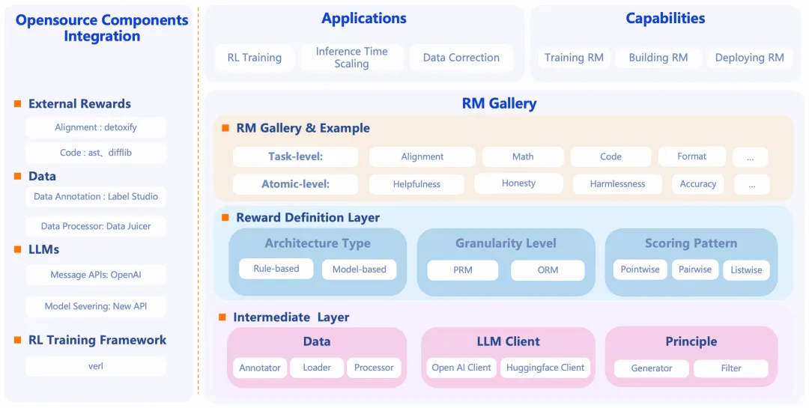

# 1. 资源

在Github上： https://github.com/modelscope/RM-Gallery

集奖励模型训练、构建与应用于一体的一站式平台。RM-Gallery通过标准化奖励接口可以灵活构建奖励模型，内置了丰富的奖励模型库你可以即拿即用，并且提供了多种奖励应用场景和高性能reward server的实践。基于RM-Gallery你可以很方便的训练、构建、应用你需要的奖励模型。

# 2. 介绍

RM-Gallery 是一个集奖励模型训练、构建与应用于一体的一站式平台，支持任务级与原子级奖励模型的高吞吐、容错实现，助力奖励模型全流程落地。

奖励模型训练

集成奖励模型训练流程：提供基于RL的推理奖励模型训练框架，兼容主流框架（如verl），并提供集成RM-Gallery的示例。

奖励模型构建

统一奖励模型架构：

通过标准化接口灵活实现奖励模型，支持多种架构 (model-based/free)、奖励格式 (scalar/critique)、打分模式 (pointwise/listwise/pairwise)。

丰富的奖励模型库：

内置多种任务（如Math、Code、Alignment）现成可用的奖励模型，支持任务级（RMComposition）与组件级（RewardModel）调用。用户可直接应用RMComposition/RewardModel，或按需组装自定义RMComposition。

Principle-Critic-Score范式：

采用Principle-Critic-Score的推理奖励模型范式，提供最佳实践，助力用户在偏好数据有限时高效生成原则。

# 参考

[1] RM-Gallery: 一站式奖励模型平台, https://mp.weixin.qq.com/s/WXln-eTSS3tdv0OZu01DSA