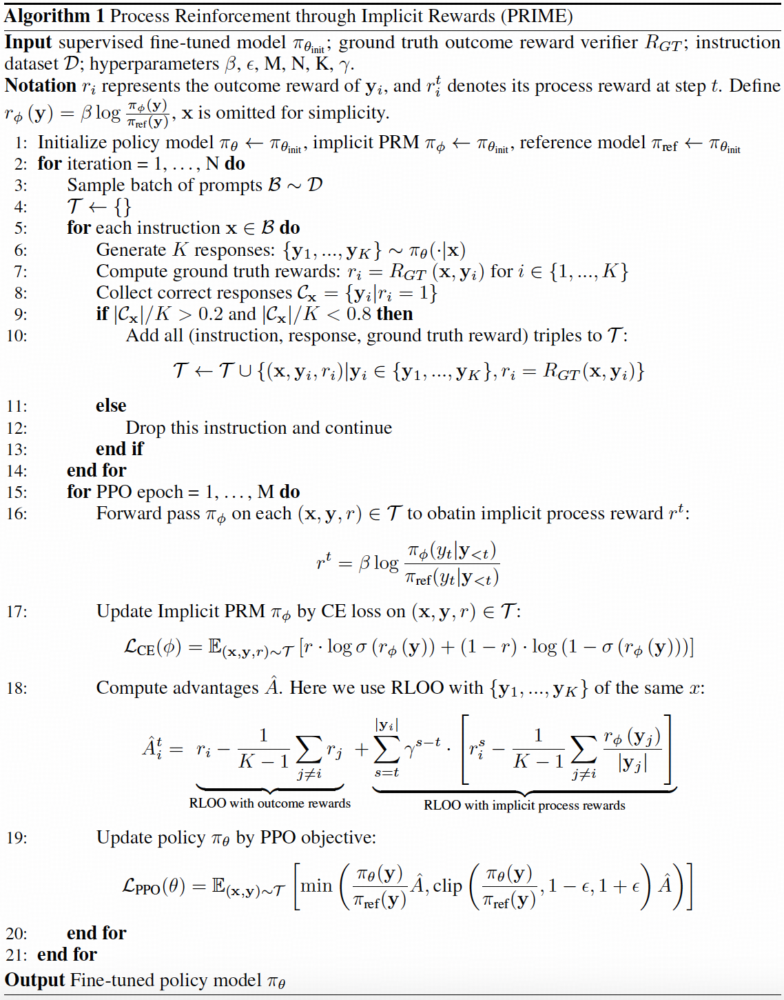
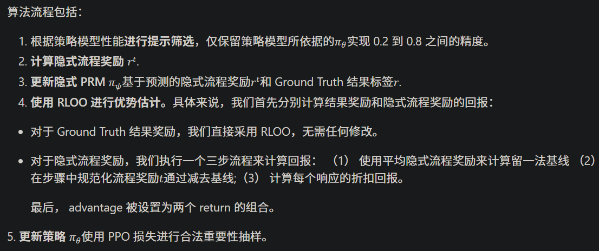

# 1. PRIME
- Github (1.6k stars): https://github.com/PRIME-RL/PRIME

大型语言模型 （LLM） 的高级推理虽然可以通过数据驱动的模仿进行改进，但仍然受到严重的可扩展性挑战的困扰。我们相信，克服这些挑战的关键在于将数据驱动的方法转变为基于探索的方法，强化学习 （RL） 就是一个例子。为此，需要缓解两个关键瓶颈来弥合这种转变：（1） 如何高效、可扩展地获得精确的奖励信号，尤其是对于密集的奖励信号？（2） 我们如何构建有效的 RL 算法来充分释放这些信号的潜力？

我们寻求通过高效的奖励建模和强化学习实现高级推理能力的可扩展路径。我们的工作源于隐式流程奖励建模 （PRM） 目标。无需任何流程标签，隐式 PRM 被训练为结果奖励模型 （ORM），然后用作 PRM。除了通过推理扩展提高模型性能外，隐式 PRM 的真正强大功能还在在线 RL 训练中显现出来。具体来说，它为 RL 带来了三个好处：

密集奖励：隐式 PRM 直接学习一个 Q-function，为每个代币提供奖励，这缓解了奖励稀疏问题，而无需额外的价值模型。
可扩展性：隐性 PRM 可以仅使用结果标签进行在线更新。因此，我们可以在给定结果验证器的情况下，通过按策略推出直接更新 PRM，从而缓解 PRM 的分发变化和可扩展性问题。
单纯：隐式 PRM 本质上是一种语言模型。在实践中，我们表明没有必要事先训练 PRM，因为 SFT 模型本身已经是一个强大的起点。
然后，我们深入研究 RL 以找出其关键算法设计和实现技术。为此，我们通过 IMplicit rEwards， PRIME 提出了 Process Reinforcement，它有效地在 RL 中整合和更新了 PRM。

