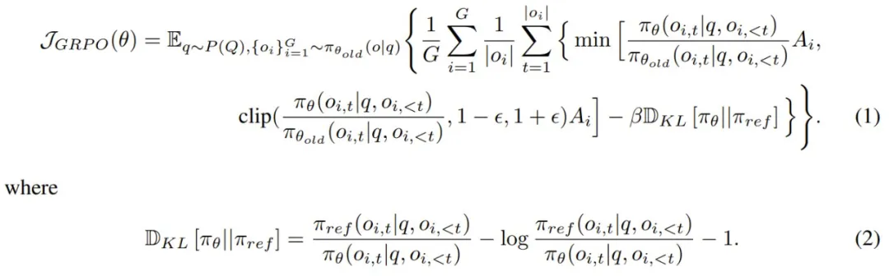
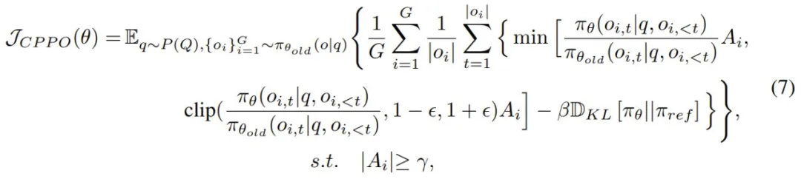
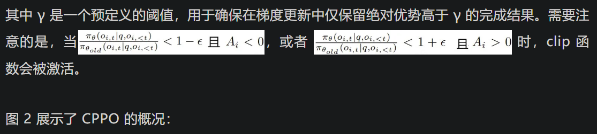
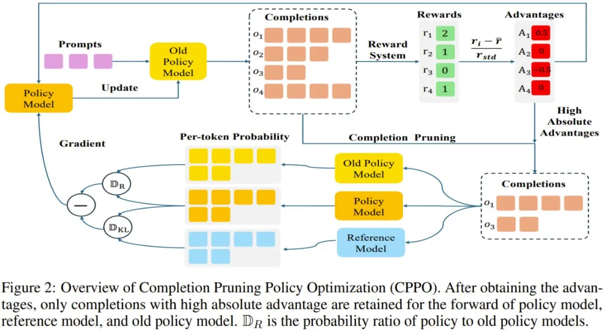
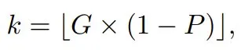
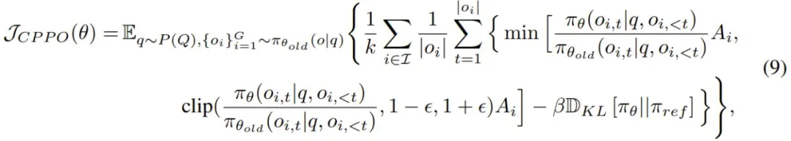
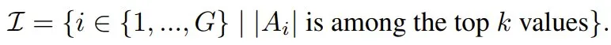
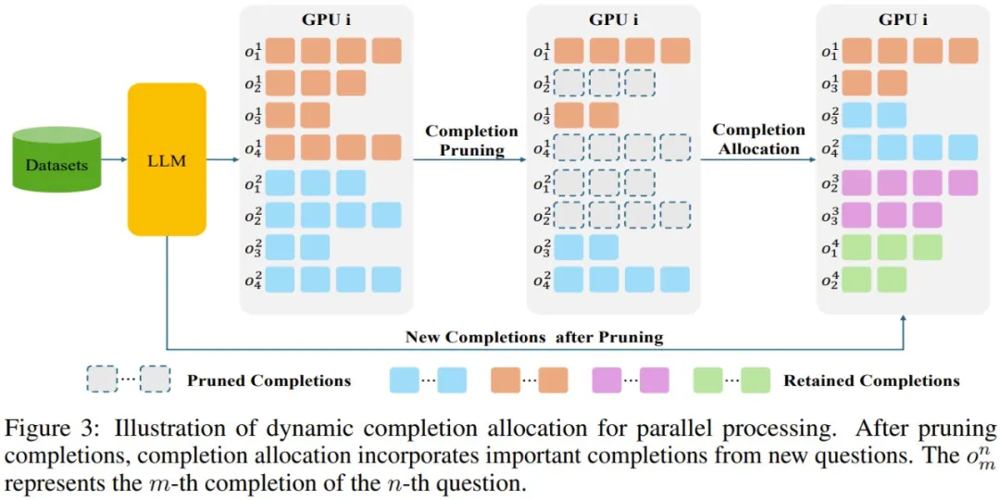
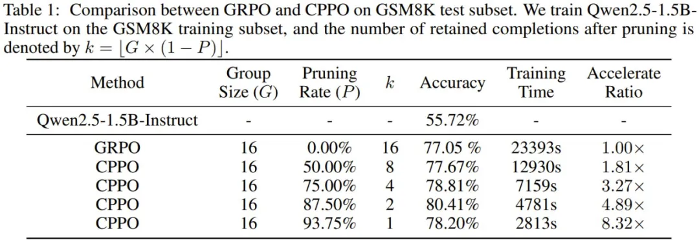
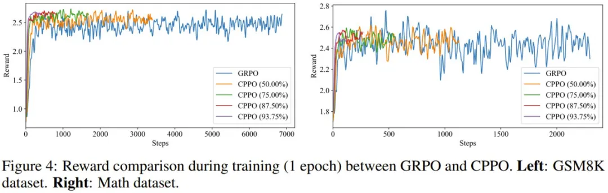

# 1. 资源

- 论文标题：CPPO: Accelerating the Training of Group Relative Policy Optimization-Based Reasoning Models
  - CPPO（Completion Pruning Policy Optimization / 完成剪枝策略优化
- 论文地址：https://arxiv.org/pdf/2503.22342
- 项目地址：https://github.com/lzhxmu/CPPO

太长不看，一句话概括：
- 本文是对GRPO的改进，在GRPO中，每个问题都采样一组完成结果，对这些结果不重要的进行剪枝

效果：（基准：性能不变下，Qwen-2.5-1.5B-Instruct 和 Qwen-2.5-7B-Instruct）
- 在 GSM8K 基准上的速度比 GRPO 快 8.32 倍
- 在 MATH 基准上快 3.51 倍

# 2. 问题提出

GRPO 是直接根据组分数估计基线，因此消除了对 critic 模型的需求。但是，这又需要为每个问题都采样一组完成结果，进而让训练过程的计算成本较高。

# 3. 原理

GRPO其公式如下：

其中，q 是从数据集分布 P (Q) 中采样的问题，{o_1, o_2, ... , o_G} 是 G 个完成结果，π_θ 是策略模型，π_θ_old 是旧策略模型，π_θ_ref 是参考模型，ϵ 和 β 是超参数，A_i 是使用一组奖励 {r_1, r_2, ... , r_G} 计算的优势。

相比于 GRPO，CPPO 引入了一个选择性条件，该条件仅会包括表现出足够高优势的完成结果。CPPO 的目标公式如下：

统一单/多 GPU 设置

在多 GPU 训练场景中，该团队观察到具有显著优势的完成结果的数量因设备而异。在这种情况下，整体训练效率会有设备处理最多完成结果数量的瓶颈 —— 这种现象称为「木桶效应（bucket effect）」。为了缓解这种情况，对于每台 GPU，该团队的选择是只保留每个问题具有最大绝对优势的 k 个完成结果，其中

其中 P ∈ (0, 1] 表示剪枝率。在此策略下修改后的 CPPO 为：

其中仅在具有最高绝对优势值的 k 个完成结果对应的索引集 I 上进行求和，即

CPPO 算法的流程如下：

旧策略模型为每个问题采样一组完成结果；

奖励函数计算每个完成结果的奖励；

计算每个完成结果的相对优势；

CPPO 保留 k 个具有最高绝对优势的完成结果；

根据选定的完成结果更新策略模型。

CPPO 和 GRPO 之间的关键区别是：CPPO 不会将所有完成结果用于策略模型、参考模型和旧策略模型的前向计算。相反，通过仅保留具有高绝对优势的完成结果进行梯度更新，CPPO 可显著降低前向传递期间的计算开销，从而加速了训练过程。

通过动态完成结果分配进行并行处理

该团队还提出了一种新的动态完成结果分配策略，以进一步优化 CPPO 的训练效率。

由于 GPU 内存限制，传统方法（如 GRPO 采用的方法）面临固有的局限性。具体而言，单台设备每批最多可以处理 B 个问题，每个问题生成 G 个候选完成结果。剪枝操作之后，每台设备保留的完成结果总数减少到 B × k，进而导致 GPU 利用率不理想，并行计算能力未得到充分利用。

为了解决这种低效率问题，该团队的方法是将来自其他问题的剪枝后的完成结果动态分配到设备的处理管道中，如图 3 所示。

此策略通过不断用来自原始问题和新引入问题的高质量完成结果填充其内存，确保每个设备都能以满负荷运行。至关重要的是，所有新合并的完成结果都经过相同的严格剪枝过程，以保持一致性和相关性。

这种方法的好处有两个：

- 通过充分利用设备的并行计算潜力，它能最大化 GPU 利用率。
 -它能使每台设备每批处理更多的问题，从而减少实现收敛所需的总训练步骤数。

有这两大优势，CPPO 便可在保证训练质量的同时提高训练效率。

# 4. CPPO 的实验效果

使用 Qwen2.5-1.5B-Instruct 和 Qwen2.5-7B-Instruct 模型，该团队在 GSM8K 和 MATH 数据集上对 CPPO 进行了实验评估。此外，为了评估模型的分布外推理能力，他们还引入了 AMC2023 和 AIME2024 作为测试基准。

在 GSM8K 上的结果如表 1 所示，CPPO 在准确度和加速比上都明显优于 GRPO。值得注意的是，CPPO 在各种剪枝率下都达到了与 GRPO 相当甚至更高的准确度。在 87.50% 的剪枝率下，CPPO 的准确度达到 80.41%，比 GRPO 的 77.05% 高出 3.36%。

在效率方面，CPPO 大大加快了训练速度。在 93.75% 的剪枝率下，其加速比达到 8.32 倍。这些结果表明，CPPO 不仅能保持或提高准确度，还可显著提高训练效率。因此，CPPO 有潜力成为大规模推理模型训练的实用有效解决方案。

在 MATH 上的表现见表 2。可以看到，CPPO 可以很好地扩展到更大的模型 —— 在不牺牲准确度的情况下在 MATH 上实现了高达 3.51 倍的加速。例如，在 87.5% 的修剪率下，CPPO 保持了与 GRPO (75.20%) 相当的准确度，同时还将训练时间减少了 3.51 倍。

# 参考

[1] 在GSM8K上比GRPO快8倍！厦大提出CPPO，让强化学习快如闪电, https://mp.weixin.qq.com/s/7AygQMOcfk57yGqtGHhTDA