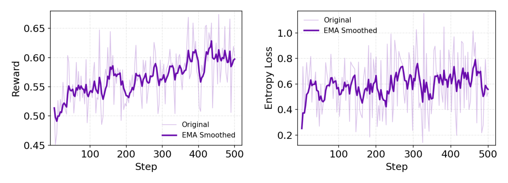

通过 RL 构建高质量的代理是一项复杂的系统工程挑战;如果将整个开发过程视为“强化学习”循环，那么其组件的任何不稳定性或缺乏鲁棒性都可能导致错误的“奖励”信号。我们现在将分享我们在 RL 方面的实践，涵盖算法和基础设施方面。

对于 RL 算法，我们使用定制的策略组相对策略优化 （GRPO） 取得了多项算法突破。我们采用严格的策略训练方案，确保学习信号始终与模型的当前能力相关。使用标记级策略梯度损失优化训练目标。其次，为了进一步减少优势估计的方差，我们采用了留一策略。此外，我们对负样本采用了保守策略，观察到一组未经过滤的负轨迹会显着降低训练稳定性。这可能表现为扩展训练后的“格式崩溃”现象。为了缓解这种情况，我们有选择地从损失计算中排除某些负样本，例如，那些由于超过长度限制而无法产生最终答案的样本。为了提高效率，我们不采用动态抽样。相反，我们利用更大的批次和组规模，这有助于保持较小的方差并提供足够的监督。

# 参考

[1] Tongyi DeepResearch: A New Era of Open-Source AI Researchers, https://tongyi-agent.github.io/blog/introducing-tongyi-deep-research/