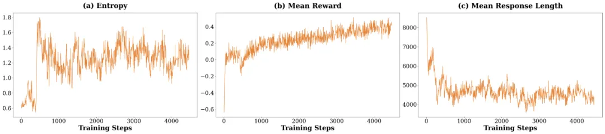
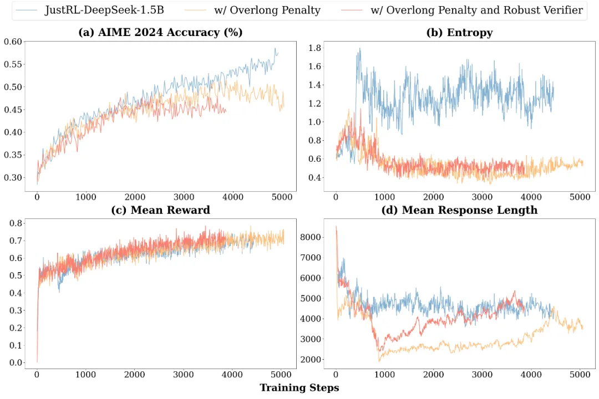

# 1. 资源

技术博客：https://relieved-cafe-fe1.notion.site/JustRL-Scaling-a-1-5B-LLM-with-a-Simple-RL-Recipe-24f6198b0b6b80e48e74f519bfdaf0a8

开源模型：https://huggingface.co/collections/hbx/justrl

评测脚本：https://github.com/thunlp/JustRL

# 2. 原理

如果有人告诉你：不用分阶段做强化学习、不搞课程学习、不动态调参，只用最基础的 RL 配方就能达到小模型数学推理能力 SOTA，你信吗？

清华团队用两个 1.5B 模型给出了答案：不仅可行，还特别高效。

- 核心发现： 单阶段训练 + 固定超参数 = SOTA 性能 + 省一半算力

- 意外之喜： 训练曲线平滑得像教科书，4000 步没遇到任何 "典型问题"

- 关键启示： 充分 scale 的简单 baseline，可能比我们想象的强大得多

也许比最终性能更令人惊讶的是训练过程本身。研究者详细记录了 JustRL-DeepSeek-1.5B 整个 4000 步 RL 过程中的关键动态指标：策略熵、平均奖励、响应长度。

意外发现：4000 步训练，异常平稳

也许比最终性能更令人惊讶的是训练过程本身。研究者详细记录了 JustRL-DeepSeek-1.5B 整个 4000 步 RL 过程中的关键动态指标：策略熵、平均奖励、响应长度。

策略熵始终在 1.2-1.4 范围内健康震荡，没有出现向上漂移（探索崩塌）或向下崩溃（过早收敛）；平均奖励从 - 0.6 单调上升到 +0.4，虽然有噪声但趋势清晰，没有长时间的 plateau 或突然的下跌；响应长度从初始的 8000 tokens 自然压缩到 4000-5000 tokens，并稳定在这个范围，这一切都是在没有使用 overlong penalty 的情况下发生的，仅仅设置了最大 16k 的上下文长度。

JustRL-DeepSeek-1.5B 的训练 dynamic

这与很多现有工作报告的训练困难形成鲜明对比。

ProRL："我们观察到熵崩溃和训练不稳定性…"

BroRL："训练到瓶颈只能加 rollout 加大探索…"

QuestA："需要课程学习避免熵崩塌（简单题）或者减缓学习效率（难任务）…"

而在 JustRL 的训练中，这些问题都没有出现。这给了我们一个有趣的观察：也许在某些配置下，当 baseline 足够简单、训练规模足够充分时，一些在复杂系统中出现的稳定性问题可能就不容易发生。

一个有趣的插曲：加 "优化" 反而更差

训练过程中，团队尝试了两个 "按常理应该有帮助" 的修改。这两个实验的结果颇具启发性。

第一个实验是加入显式的长度惩罚。 动机很直接：不少工作证明长度惩罚有效，那么添加一个惩罚项应该能让模型输出更简洁，提高训练效率。结果却令人意外：性能从 55% 下降到 50%。深入分析发现，显式惩罚导致了熵崩塌，熵值从 1.2-1.4 降到 0.4-0.6 ，探索空间被过早压缩。模型还没来得及充分探索有效的解题策略，就被迫收敛到更短的响应上。

第二个实验是换用更宽松的验证器。 逻辑同样合理：减少假阴性（正确答案被误判为错误）应该能提供更清晰的学习信号。但性能继续下滑到 45%。可能的原因包括：更宽松的验证器虽然减少了误判，但也降低了学习信号的细粒度 ——"几乎正确" 和 "完全正确" 不再有明显区分；另一种可能是，严格的格式要求实际上在迫使模型发展更鲁棒的内部推理，而宽松的验证器消除了这种压力。

两组 ablation 效果

这说明什么？一方面，ablation 在接近 2k steps 的尺度上才开始分道扬镳，意味着现有的 RL tricks ablation 可能在小规模上（几十 / 几百步）得到的结论不一定适合于大规模 scaling，要验证 tricks 的作用可能长期才能看出区别；另一方面，不是说这些技术本身不好（它们在其他工作中确实有效），而是：

技术的价值高度依赖于 baseline 的特性

在一个稳定的 baseline 上，某些 "优化" 可能适得其反

不是所有看起来合理的东西都该加

这个工作想说什么？

不是要证明 "简单永远最好"

不是说： "复杂方法都没用"

而是说： "我们可能低估了简单方法在充分 scale 下的潜力"

不是说： "大家都做错了"

而是说： "建立清晰的简单 baseline，能更准确地评估复杂技术的价值"

不是说： "永远别用复杂技术"

而是说： "先验证简单方法的极限在哪，再决定是否需要复杂度"

# 参考

[1] 清华团队：1.5B 模型新基线！用「最笨」的 RL 配方达到顶尖性能, https://mp.weixin.qq.com/s/F4zvQfWusb-QetDi-ReErg