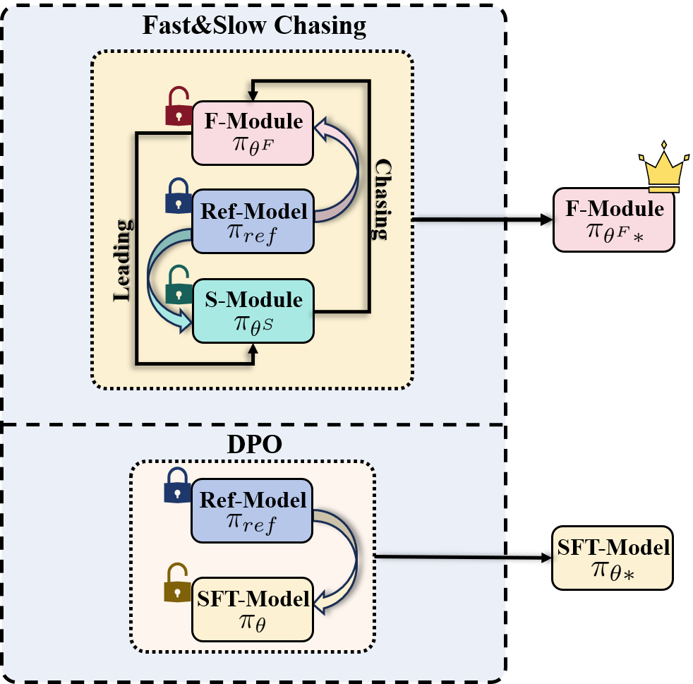
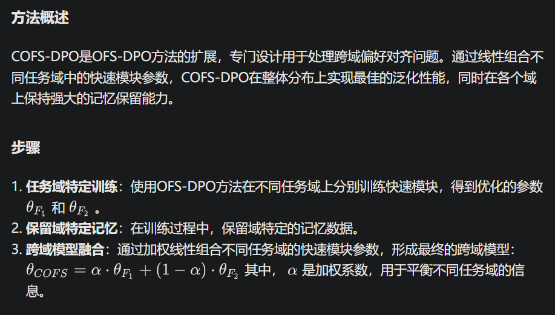

# 1. 资源

- 论文：Online DPO: Online Direct Preference Optimization with Fast-Slow Chasing
- https://arxiv.org/html/2406.05534#:~:text=Inspired%20by%20intraspecific%20competition%20driving%20species%20evolution%2C%20we,slow%20chasing%20among%20models%20to%20facilitate%20rapid%20adaptation.
- 2024.7，清华大学

# 2. 原理

# 参考

[1] 快速-慢速追逐在线直接偏好优化（OFS-DPO）方法解析, https://zhuanlan.zhihu.com/p/702954175?utm_source=chatgpt.com