# 1. 资源

论文标题：Learning to Reason under Off-policy Guidance

论文地址：
https://arxiv.org/abs/2504.14945

Huggingface 地址：

https://huggingface.co/papers/2504.14945

Github 地址：
https://github.com/ElliottYan/LUFFY

# 2. 介绍

本文提出 LUFFY 强化学习方法，一种结合离线专家示范与在线强化学习的推理训练范式，打破了“模仿学习只学不练、强化学习只练不学”的传统壁垒。LUFFY 通过将高质量专家示范制定为一种离策略指引，并引入混合策略优化与策略塑形机制，稳定地实现了在保持探索能力的同时高效吸收强者经验。在六项数学竞赛级基准测试中，LUFFY 显著超越现有 Zero-RL 方法，平均提升+7.0 分，并展现出优异的泛化能力，为通用推理模型训练提供了新思路。

# 3. 背景：“只学不练”与“只练不学”的困境

在大推理模型（large reasoning models）学习复杂推理技能的过程中，最近的一系列研究工作主要尝试了两种策略：一是模仿学习（例如 SFT），让模型去学习强大神经模型或人类专家的推理示范；二是强化学习（尤其是 zero-RL 范式），让模型通过与环境的交互自行摸索解决问题的策略。前者侧重从强者策略”学“习，后者鼓励在环境中历”练“。然而，两种策略各有其无法规避的弊端：

SFT“只学不练”：如果模型只是模仿强者的解题步骤（如直接用专家轨迹进行监督微调），它或许能快速取得不错的表现，但很可能只是照猫画虎地套用了示范中的模式。一旦遇到超出示范分布的新问题，它往往难以举一反三，暴露出泛化能力的不足[1,2]。

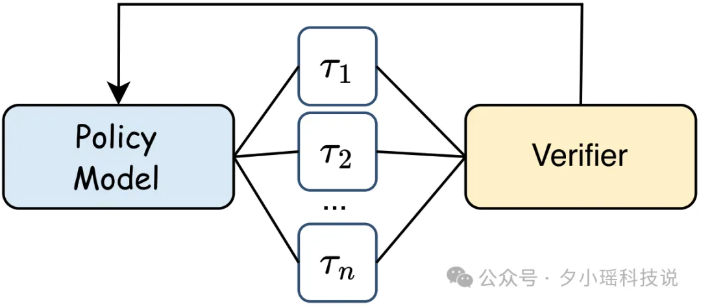

图 2. 模仿学习（SFT）：模型通过模仿专家模型生成的高质量推理轨迹，学习完成推理任务。

zero-RL“只练不学”：另一种极端下，模型完全依赖自身的试错来提升推理能力。然而，该策略受制于模型本身能力，闭门造车，很难在推理行为上产生质的飞跃。最近也有研究[3,4]表明，该范式更多地是放大模型在预训练阶段学习到的行为，并没有获取额外的推理能力。

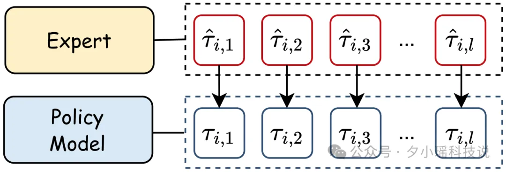

图 3. 强化学习：模型通过多轮推理尝试，根据与环境（如验证器）的交互反馈，不断优化自身策略。

显然，“只学不练”和“只练不学”都无法让推理模型充分挖掘潜力。那么有没有办法让模型既能借鉴高手经验，又能保持自身探索，兼顾两方面的优点呢？

这正是研究者们一直思考的问题。最近，上海 AI Lab 联合西湖大学、南京大学和香港中文大学提出了一种全新的大模型推理强化学习范式，取名为 LUFFY（Learning to reason Under oFF-policY guidance），其核心理念在于从更优策略中汲取推理知识，并即时融入自身推理实践之中，从而实现真正意义上的“边学边练，学以致用”。

# 4. LUFFY 方法

LUFFY 的“边学边练”新范式

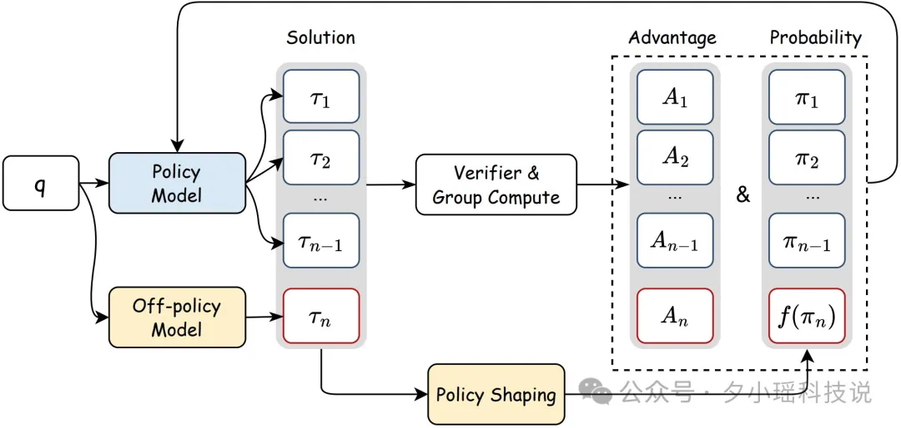

图 4. LUFFY：边学边练的推理学习框架。LUFFY 在强化学习框架中引入外部优质推理轨迹，通过“策略塑形”机制，融合自身尝试（on-policy）与专家示范（off-policy）的优势。当模型自身推理失败时，它从专家示范中学习关键步骤；而当自身表现优异时，则保持独立探索。

LUFFY 的名字来源于“离策略（off-policy）指导下学习推理”。它所倡导的“边学边练”范式，指的是模型能够一边向更强的老师学习，一边立即把学到的本领用于问题求解。在 LUFFY 的训练框架中（如图 4 所示），我们会同时利用离策略的示范轨迹和模型自身的在线演练：

一方面，LUFFY 会引入来自强大外部策略的高质量推理示范（off-policy traces），例如让一个性能很强的“大师级”模型先解一道题，提供它的思考步骤。当 LUFFY 的模型在自己尝试某个问题时，如果陷入失败或走入死胡同，就可以参考这些离策略示范，模仿其中有效的推理步骤，相当于向高手取经。

另一方面，LUFFY 并不是盲目照搬示范。它仍然让模型不断进行自主的推理尝试（on-policy rollouts），并在模型自己解对了的时候坚持让它走自己的路，给予模型自由探索的空间。

通过将这两种来源的经验融合，LUFFY 实现了模仿与探索的动态平衡：模型既不会因为缺少练习而固步自封，也不会因为缺少指引而原地打转。正如作者所说，LUFFY 让模型的训练过程达到了一个“即模仿又探索”的自适应平衡。

值得注意的是，实现这种平衡并非易事。如果简单地把外部示范硬塞给模型，实验表明会出现训练收敛过快甚至“熵”崩塌（Entropy Collapse）的问题。换句话说，模型可能会因为过度依赖示范而变得贪婪保守，只记住表面的套路，反而学不到深层次的推理本领。LUFFY 通过一系列巧妙的技术设计，化解了这一矛盾，使“边学边练”真正奏效。

## 4.1 方法创新：混合策略 GRPO 与“策略塑形”

从技术实现上看，LUFFY 基于强化学习算法 GRPO，针对融合外部示范的挑战引入了两大关键机制：

## 4.2 混合策略训练：

LUFFY 在策略优化过程中，将离策略示范与在线轨迹相结合，形成一种混合的训练策略（Mixed-Policy）。具体来说，在每一轮更新中，模型的自身 rollout 生成的轨迹与来自强者的 off-policy 轨迹一起用于计算强化学习中的优势函数（advantage）。

那些外部示范往往伴随着更高的奖励信号（因为强者解题更正确），在优势估计中提供了宝贵的信息。因此，当模型自己的解答不理想时，优化算法会倾向于学习模仿外部高奖励的示范；反之，当模型自己表现良好时，则主要依据自身轨迹来更新。这种混合策略的 GRPO 训练让模型能够见贤思齐，又不失去自主成长的机会。

## 4.3 策略塑形（Policy Shaping）与熵保持：
为了避免模型对示范的生搬硬套，LUFFY 引入了策略塑形机制。它通过一种正则化的重要性采样技巧，放大那些对成功至关重要但在模型当前策略下出现概率很低的行动的学习信号。简单来说，就是让模型更加关注那些它原本很少尝试、但专家解题中出现的关键步骤。这种策略塑形相当于有针对性地纠偏：既引导模型汲取高手解题的精华，又防止模型把不重要的表面模式一股脑模仿过去。

同时，作者在训练中注意保持模型决策的熵值（entropy）。这意味着模型在学习示范的同时仍保有一定的随机探索成分，不会彻底放弃对新解法的尝试。最终，LUFFY 的模型既能吸收示范中蕴含的巧妙思路，又能持续拓展自己的能力边界。如图 5 所示，策略塑形通过非线性函数，缓解了直接引入离策略示范导致的熵崩塌[5]。

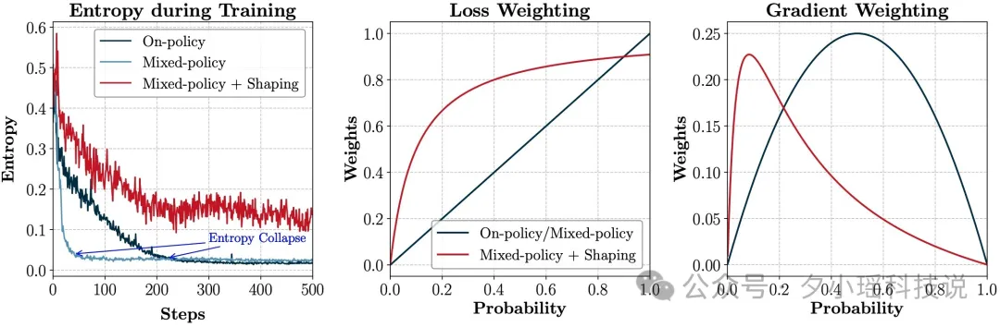

图 5. 策略塑形在 LUFFY 中的作用效果。LUFFY 通过“策略塑形”机制缓解混合策略训练中的熵崩塌问题，提升模型对低概率关键动作的关注度。左图：训练过程中的策略熵对比。传统 on-policy 与混合策略方法在早期迅速熵崩塌（即生成高度确定性），而 LUFFY 借助策略塑形保持较高熵值，显著增强了持续探索能力。中图：不同方法下损失函数基于决策概率的权重分配。右图：基于决策概率的梯度加权情况对比。LUFFY 通过非线性权重提升了对罕见（低概率）但重要行为的梯度响应，进而引导模型更有效地从 off-policy 示范中习得深层推理模式。

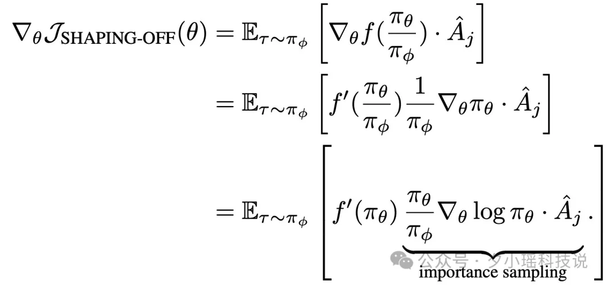

图 6. 策略塑形函数 f() 可被看作正则约束下的重要性采样，鼓励模型关注低概率、但可能重要的行为决策。

通过上述技术创新，LUFFY 实现了“边学边练”的有效融合：模型能够在强化学习训练的每一步，都动态地决定何时该学习别人、何时该相信自己，从而逐步习得超越其起始能力的推理技能。

# 5. 实验结果：“边学边练”的优势

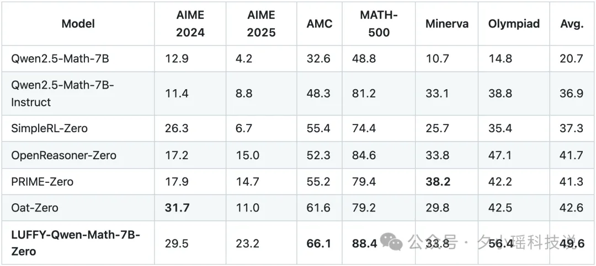

表 1. 在六项竞赛级数学推理基准上的整体表现。在 AIME 2024、AIME 2025、AMC、MATH-500、Minerva Math 和 OlympiadBench 六个高难度基准测试中，LUFFY 取得了平均 49.6% 的准确率，显著超越现有 zero-RL 范式。

LUFFY 方法在多项高难度数学推理基准上取得了令人瞩目的成绩（完整数据已在 GitHub 项目中公开）。表 1 总结了在 6 个竞赛级别的数学推理数据集上的总体表现（底座模型为 Qwen-Math-7B）。可以看到，LUFFY 的平均解题准确率达到了 49.6%，相较此前一系列纯强化学习方案提升了约 7 个百分点，刷新了这一领域的最佳水平（SOTA）。这证明将外部高手示范融入强化学习能够带来显著性能提升。

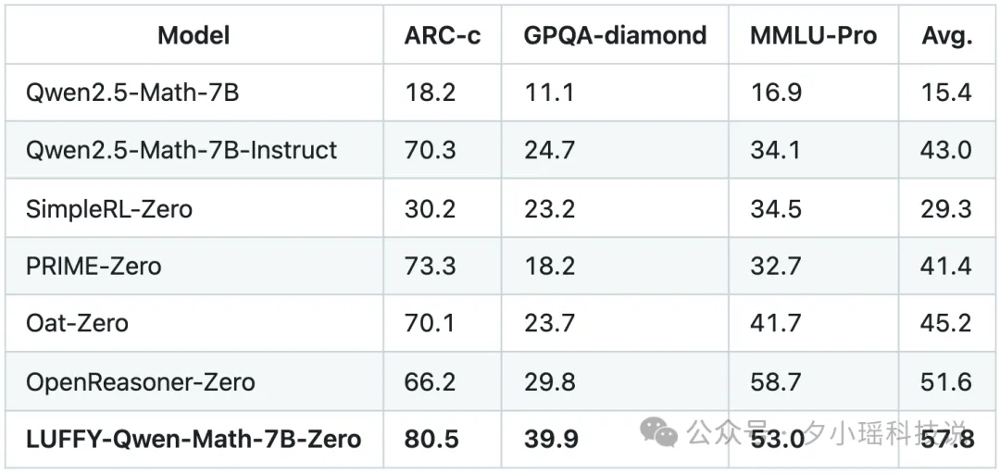

表 2. 分布外测试集的性能表现（ARC-c，GPQA-diamond 和 MMLU-Pro）。

更令人惊喜的是，在更具挑战性的分布外测试中（即模型遇到超出训练分布的新题型，结果汇总如表 2），LUFFY 同样表现出色：平均准确率 57.8%，显著超越此前系列 zero-RL 方法，且比纯模仿的 SFT 高出约 10 个百分点。换言之，LUFFY 训练出的模型不仅在见过类型的问题上表现突出，在举一反三的能力上也胜过照搬示范的模型。

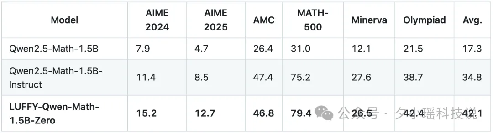

表 3. LUFFY 在 Qwen2.5-Math-1.5B 上的性能表现。

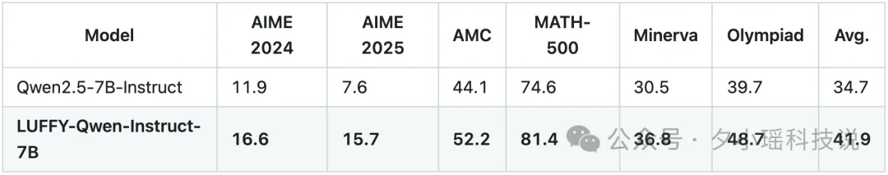

表 4. LUFFY 在 Qwen2.5-Instruct-7B 上的性能表现。

此外，如表 3 和 4 所示，LUFFY 也在其他模型上展现出了有效性，例如更小的模型和指令对齐后的模型。

# 6. 学以致用：对优质推理策略的深度理解

研究人员的分析进一步表明：LUFFY 的模型在推理时能够灵活地借鉴示范，但并不会拘泥于固定模式；相比之下，传统的 SFT 模型更多是刻板地记忆了示范套路，这也解释了为何 LUFFY 在泛化性上更胜一筹。

从图 7 可以看出，LUFFY 在生成正确解时的平均推理长度明显短于 SFT，展现出更高效的推理路径。尤其在错误解的分布中，SFT 倾向于陷入冗长、低效的表面推理过程，生成大量无效信息；而 LUFFY 则更倾向于早停错误尝试，避免无意义展开，体现了其更强的推理控制能力和路径优化能力。

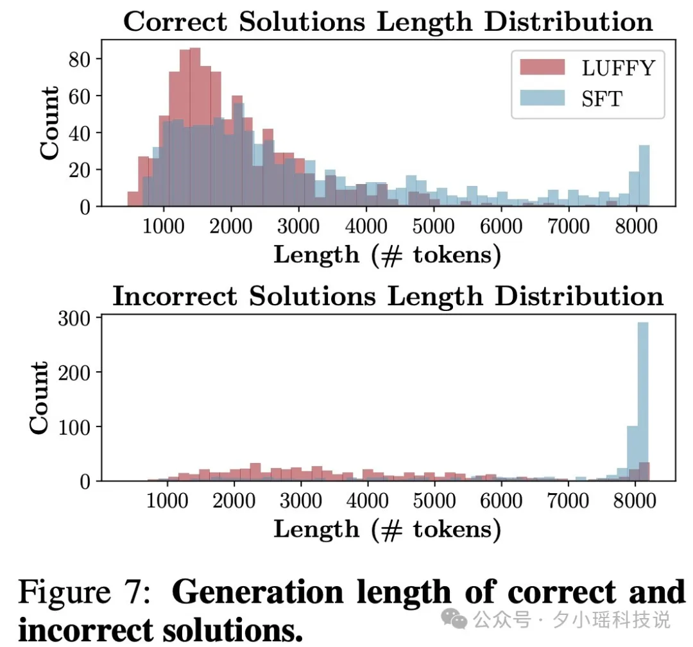

图 7. LUFFY 和 SFT 的推理长度对比。

从图 8 可见，LUFFY 在不同温度下均展现出稳定且持续增长的 pass@8mailto:pass@8 表现，展现出优异的测试阶段探索能力。与之相比，SFT 仅在低温度（接近确定性解码）下表现尚可，但在温度升高后性能反而下降，难以挖掘新的解题路径。这表明 LUFFY 不仅能学习已有推理模式，更具备泛化探索能力，而 SFT 更容易陷入“模式记忆”，缺乏动态适应性。

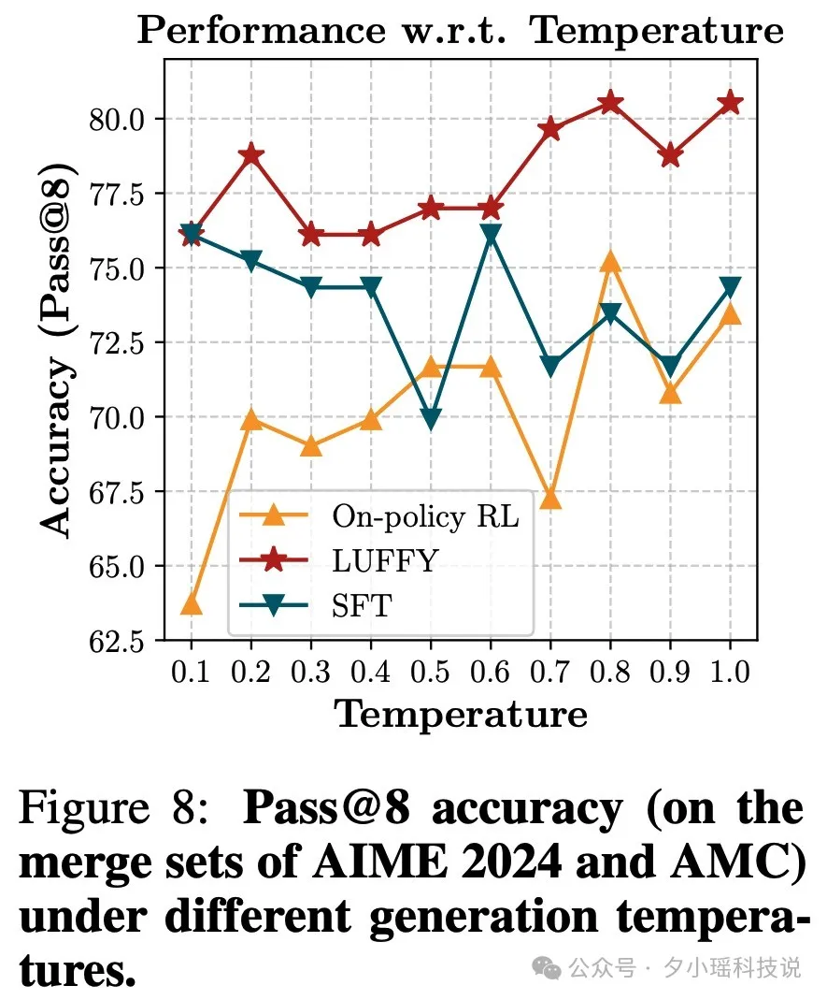

图 8. LUFFY 和 SFT 在测试时探索能力对比。

# 7. 结语：意义与展望

LUFFY 所开创的“边学边练”范式，为大模型推理能力的训练提供了一条兼顾效率与效果的新路径。通过桥接“模仿学习”和“强化学习”这两种思路，LUFFY 证明了离策略指导在提升模型高阶推理能力上的巨大潜力：模型可以突破自身的先天局限，吸收更强者的经验而又不失自我进化的空间。这一方法具有相当的通用性：未来，随着更强大的推理模型出现，我们完全可以将其作为“教师”融入 LUFFY 框架，不断提高“学生”模型的上限；同时，“边学边练”的理念也有望推广到数学之外的其它复杂推理领域，比如代码推理、科学问答等。

对于研发 AI 应用的工程师来说，LUFFY 的思路也提供了启发：我们无需在“模仿”还是“探索”之间二选一，而是可以设计智能体一边向历史经验学习，一边在实践中创新。目前，LUFFY 的代码和模型已在 GitHub 开源，有兴趣的读者可以亲自尝试这一“边学边练”的新范式。未来，我们期待看到 LUFFY 在更多领域的探索和改进，持续推动推理模型迈向更通用、更智慧的推理时代。

另外，感兴趣的读者可以上 alphaXiv 向作者提问，参与讨论~

# 参考

[1] SFT Memorizes, RL Generalizes: A Comparative Study of Foundation Model Post-training
[2] Sft or rl? an early investigation into training r1-like reasoning large vision-language models
[3] Echo chamber: Rl post-training amplifies behaviors learned in pretraining
[4] Does Reinforcement Learning Really Incentivize Reasoning Capacity in LLMs Beyond the Base Model?
[5] DAPO: An Open-Source LLM Reinforcement Learning System at Scale
[7] Hugging Face论文热榜第一！AI推理新方法，打破强化学习天花板，全面开源, https://mp.weixin.qq.com/s/TJjz9SYLVqDvnUbDA5eAMA