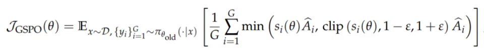
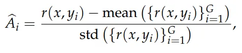
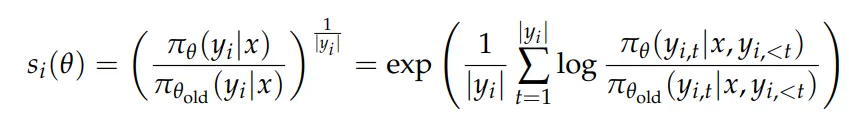
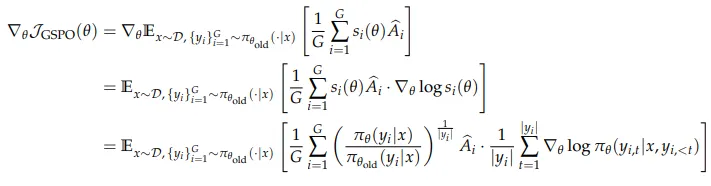
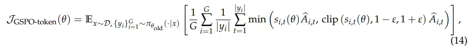
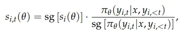
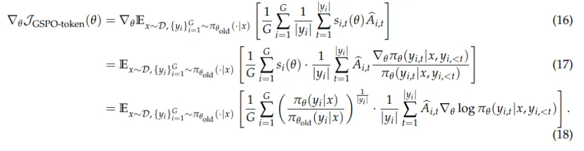
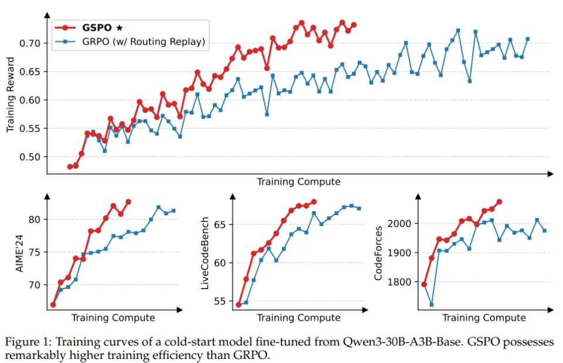
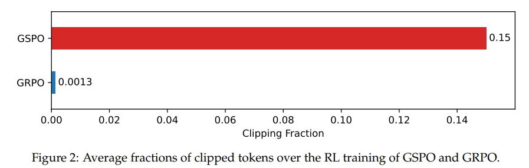
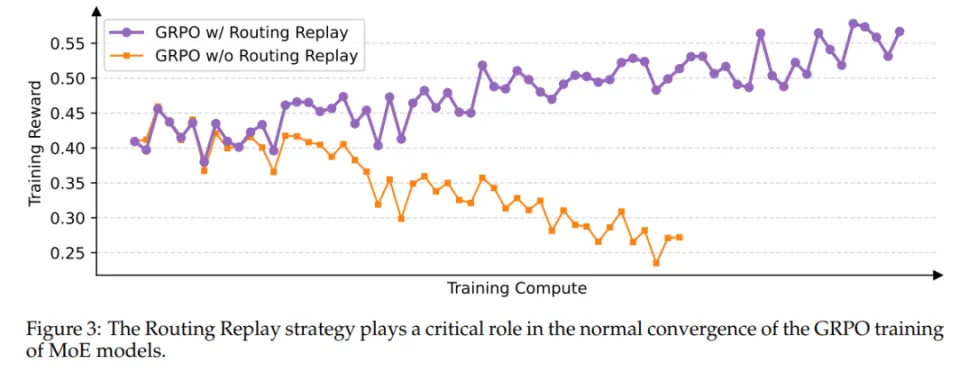

# 1. 资源

- 论文标题：Group Sequence Policy Optimization
- 论文链接：https://arxiv.org/pdf/2507.18071v1

# 2. 方法

研究者发现GRPO的不稳定性源于其算法设计中重要性采样权重（Importance Sampling Weights）的误用和失效。GRPO中基于单个Token计算的重要性权重无法实现分布修正，并且会引入高方差噪声。该噪声随着响应长度的增加而逐步累积，并因裁剪机制进一步放大，最终导致模型崩溃。

针对上述问题，研究者提出组序列策略优化（Group Sequence Policy Optimization，GSPO）算法，将优化单位从Token级提升至序列级别。GSPO采用以下序列级优化目标：

采用了基于组的优势估计：

并基于序列似然定义重要性比率：

GSPO将裁剪应用于完整响应序列而非单个Token，以排除过度off-policy的样本参与梯度估计，同时匹配序列级奖励机制和优化目标。需要注意的是，研究团队在图片中采用长度归一化来降低方差，并将其控制在统一数值范围内。因为少数Token的似然变化会导致序列级重要性比率剧烈波动，且不同长度的响应需要不同的裁剪范围。

GSPO的梯度推导如下所示（省略裁剪项）：

GRPO算法对每个Token的梯度使用独立的重要性权重，权重范围：图片或图片这种动态范围大且不均衡的权重会导致梯度更新幅度不一致，可能会引发模型训练的不稳定；GSPO对响应中所有Token平等加权，消除了不稳定因素。

在多轮强化学习中需要更细粒度的Token级优势调整。为此，研究团队提出GSPO-token，其目标函数为：

在多轮强化学习中需要更细粒度的Token级优势调整。为此，研究团队提出GSPO-token，其目标函数为：

重要性比率设计：

其中，sg[⋅]表示只取数值、停止梯度传播，对应于PyTorch中的detach操作。GSPO-token的梯度可以推导为：

其中，图片项的数值为1，将响应图片中所有Token的优势值设为相同值时，即图片，GSPO-token在优化目标、裁剪条件和理论梯度上与GSPO数值完全相同，同时保留了按Token调整优势值的灵活性。

# 3. 评估

研究团队采用基于Qwen3-30B-A3B-Base微调而来的冷启动模型进行实验，训练结果如图1所示。可以发现：

采用GSPO算法的强化学习训练始终保持稳定增长；

增加训练计算量、定期更新查询集以及拓展生成长度，GSPO能够持续提升模型性能；

与GRPO相比，在相同的训练计算资源和查询消耗条件下，GSPO训练准确率和基准性能更高。

研究团队已成功将GSPO应用于最新Qwen3模型的强化学习训练，证明了GSPO算法能够有效拓展LLMs强化学习的潜力。

关于裁剪比例的实验如图2所示。可以发现，尽管GSPO裁剪的Token数量显著多于GRPO，但其训练效率反而更高。进一步表明GRPO 的Token级梯度估计本质上存在较大的噪声，导致样本利用效率低下。相比之下，GSPO序列级强化学习提供了更可靠且有效的学习信号。

相比稠密模型的强化学习训练，MoE模型的稀疏激活特性更容易引发训练的不稳定性。在采用GRPO算法时，专家激活波动性（expert activation volatility）会导致Token级重要性比率剧烈波动从而失效，最终阻碍了强化学习训练的正常收敛。图3可以看出，研究者采用路由回放（Routing Replay）方法，能够使得MoE模型的GRPO训练正常收敛。但这种方法会带来额外的内存和通信开销，并且也可能限制MoE模型的实际容量。

相比之下，GSPO专注于序列似然，对单个Token似然的变化不敏感。由于MoE模型始终保持其语言建模能力，序列似然不会出现剧烈波动。因此，GSPO从根本上缓解了专家激活波动带来的问题，无需依赖路由回放等引入额外内存与通信开销的复杂方法即可实现稳定训练。这不仅简化了训练流程，也使模型能更充分地发挥其全部容量。

# 参考

[1] 超越GRPO！阿里通义千问提出强化学习算法GSPO，为最新Qwen3模型突破奠定基础, https://news.qq.com/rain/a/20250728A03G1L00