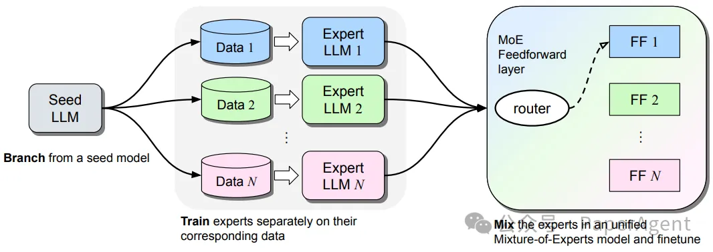
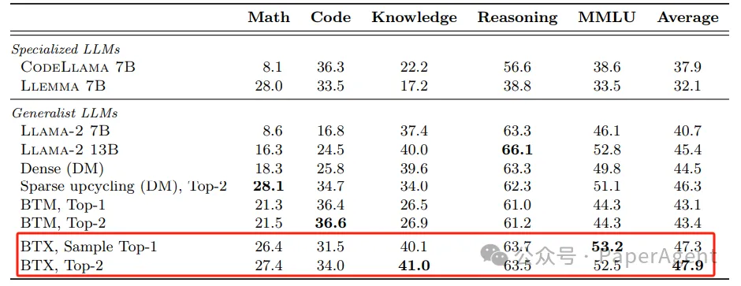

# 1. 原理

Branch-Train-MiX:Mixing Expert LLMs into a Mixture-of-Experts LLM
https://arxiv.org/pdf/2403.07816.pdf

Branch-Train-MiX (BTX)旨在高效地训练大型语言模型（LLMs），使其在多个专业领域（如编程、数学推理和世界知识）具备能力。BTX方法从一个种子模型开始，将其分支出去，以并行且高效的方式训练专家模型，减少了通信成本。这些专家模型在训练后，其前馈参数被整合到混合专家（Mixture-of-Expert, MoE）层中，并进行平均参数的合并，接着通过MoE微调阶段学习token级别的路由。BTX方法综合了Branch-Train-Merge和Mixture-of-Experts两种特殊情况的优点，同时减少了它们的不足。与替代方法相比，BTX在准确性和效率之间取得了最佳平衡。

Branch-Train-MiX (BTX) 方法有三个步骤（分支、训练和混合：Branch, Train, and MiX）：1) 从一个预训练的种子LLM分支出来，通过制作多个副本；2) 在不同的数据子集上分别训练这些副本，以获得专家LLMs；3) 通过将这些专家LLMs合并到一个使用混合专家前馈（FF）层的单一LLM中，并微调整个统一的模型。

使用了Llama-2 7B模型作为种子模型，并在数学、编程和维基百科等不同数据子集上训练专家LLMs。通过将原始Llama-2 7B权重作为第四个专家加入，对合并后的MoE模型进行了相对较短的微调。实验结果表明：
- 与种子模型Llama-2 7B相比，BTX模型（无论是Sample Top-1还是Top-2，这取决于激活参数的数量）在所有专家领域，如数学、编程和世界知识方面都有所改进，而没有在其他任务，如常识推理上退步。
- BTX使用Top-2专家（默认设置）也接近专门模型Llemma 7B和CodeLlama 7B在数学和编程领域的最高性能，同时在这些模型不擅长的领域，如世界知识和常识推理上，有大幅度提升。
- 与替代的持续预训练方法（如Dense和BTM）相比，BTX在平均性能上取得了更好的成绩，数学和编程领域的性能差距很小。BTX在平均性能上大幅超过了BTM，这表明通过MoE微调学习token级别的路由是有益的。
- 总的来说，结果表明BTX是一种更高效的持续预训练方法，能够抵御多任务学习的干扰。即使Llama-2 13B使用了显著更多的训练计算资源，并且拥有稍微更多的活跃参数，BTX在所有任务上也表现更好。

# 参考

[1] Branch-Train-MiX：让大模型拥有多个专业领域能力（编程、数学和世界知识）的高效训练方法，https://mp.weixin.qq.com/s?__biz=Mzk0MTYzMzMxMA==&mid=2247485147&idx=2&sn=1d02df2ba113805d2a3c201bbdc35f3e&chksm=c31900f2447424c17b22363ec6077553b0157b590c1f2732a3b79a1f662bf65a78fae6cb29b6&scene=132&exptype=timeline_recommend_article_extendread_samebiz&show_related_article=1&subscene=21&scene=132#wechat_redirect