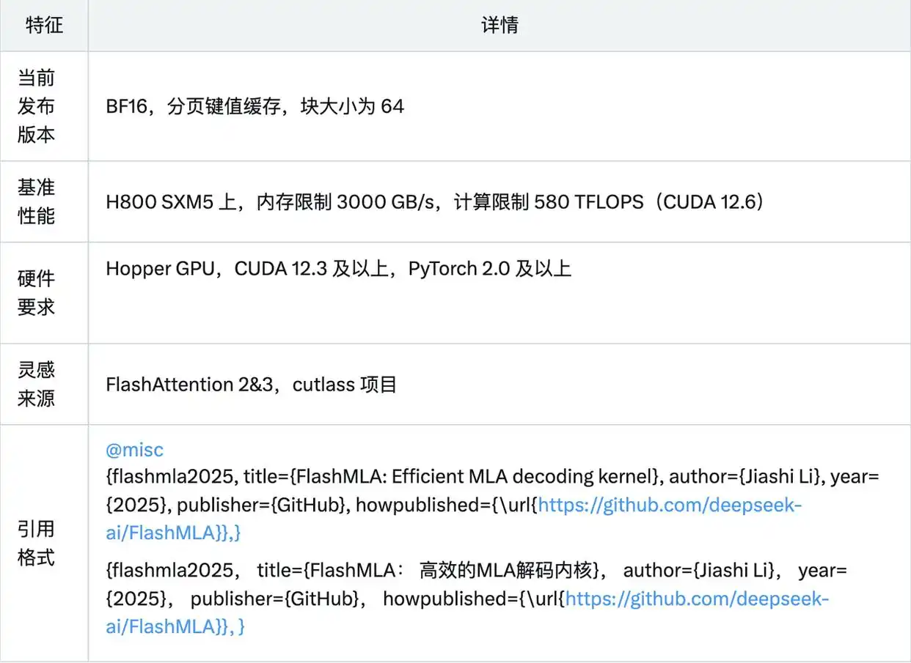
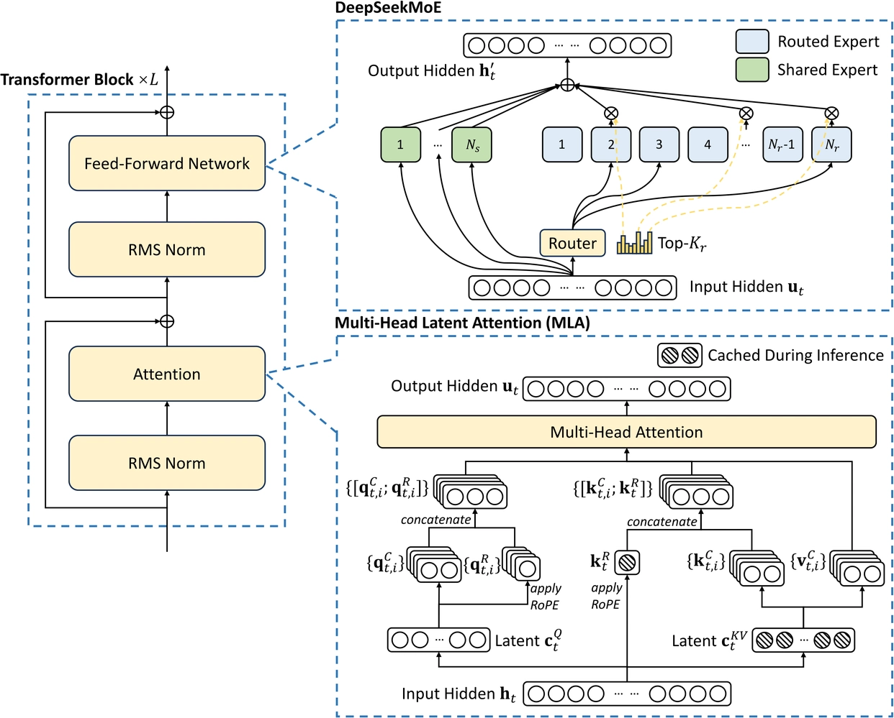
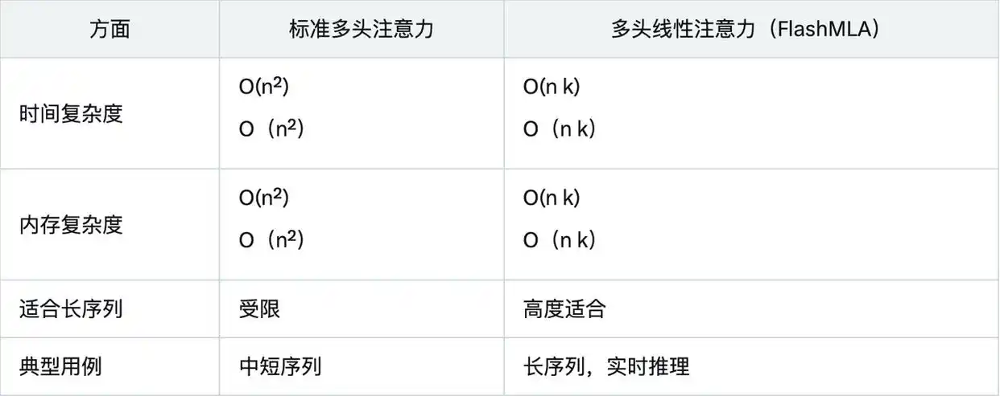

# 1. 资源

MLA 的升级之处在于一种叫「低秩分解」的方法。

它把那个大仓库压缩成一个小仓库，但功能还是一样好，就像把一个大冰箱换成一个小冰箱，但里面的东西还是能放得下。这样一来，

在处理语言任务的时候，不仅节省了空间，速度还更快了。

不过，虽然 MLA 把仓库压缩了，但它的工作效果和原来一样好，没有打折扣。

当然，除了 MLA 和 MoE，DeepSeek 还用了其他一些技术来大幅降低了训练和推理成本，包括但不限于低精度训练、无辅助损失的负载均衡策略以及多 Token 预测（MTP）。

性能数据表明，FlashMLA 在内存和计算限制下的表现远超传统方法，这得益于其线性复杂度的设计和针对 Hopper GPU 的优化。

与标准多头注意力的对比，更是进一步凸显 FlashMLA 的优势：

# 参考

[1] 一文看懂 DeepSeek 刚刚开源的 FlashMLA，这些细节值得注意, https://mbd.baidu.com/newspage/data/landingsuper?rs=238177517&ruk=h9CVHUmui2FToeZnV2s7Tw&urlext=%7B%22cuid%22%3A%22guvSf0PQva_0PHiG08HU8laEBtlkiv81l8vRig8kStK50qqSB%22%7D&isBdboxFrom=1&pageType=1&sid_for_share=&context=%7B%22nid%22%3A%22news_9184579518365986759%22,%22sourceFrom%22%3A%22bjh%22%7D