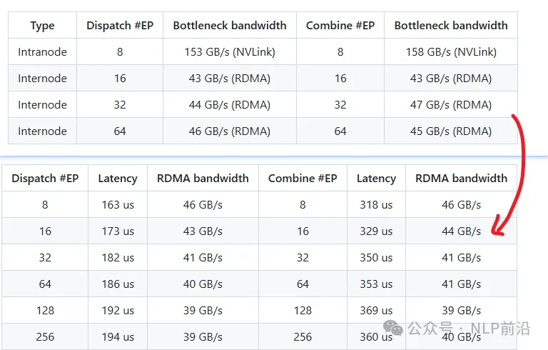

项目地址：https://github.com/deepseek-ai/DeepEP

一个针对 MoE 和专家并行通信的库。支持低精度操作，包括 FP8，在训练和推理阶段都能发挥出色性能。

DeepEP 提供了一套优化的内核，用于不对称域带宽转发，例如从 NVLink 域到 RDMA 域的数据转发。不仅提供了高吞吐量，还支持 SM（Streaming Multiprocessors）数量控制

NVLink 和 RDMA 转发 内核 对比 纯 RDMA 内核在H800上的表现。

DeepEP 已经在 InfiniBand 网络上进行了全面测试，理论上也兼容 RDMA over Converged Ethernet (RoCE)。

网络配置方面的优化和建议：

DeepEP 建议将不同类型的工作负载分配到不同的虚拟车道中。例如：

- 使用常规内核（normal kernels）的工作负载；
- 使用低延迟内核（low-latency kernels）的工作负载；
- 其他类型的工作负载。

DeepEP 的低延迟内核（low-latency kernels）支持自适应路由。常规内核（normal kernels）目前不支持自适应路由。

在生产环境中未观察到显著的网络拥塞问题，因此默认禁用了拥塞控制。

# 参考

[1] DeepSeek开源周，第二弹， DeepEP来袭~https://mp.weixin.qq.com/s/0IM3kc36eUOIhmJQ5eOf0g