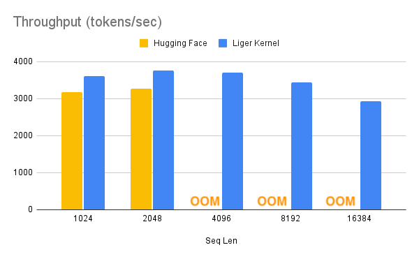
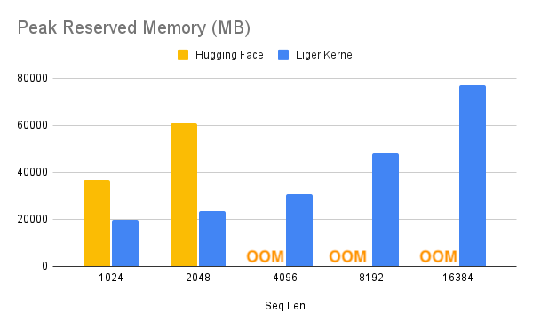

- Github (2.9k stars): https://github.com/linkedin/Liger-Kernel
- Liger Kernel can increase throughput by more than 20% and reduce memory usage by 60%, thereby enabling longer context lengths, larger batch sizes, and massive vocabularies.

主要特点：
- 易于使用：只需用一行代码使用Liger Kernel SDK加速内核来增强模型。
- 时间和内存效率高：与 Flash-Attn 秉承同样的精神，但适用于RMNSNorm、RoPE、SwiGLU和CrossEntropy等层！通过内核融合、In-place 替换和分块技术，可将多 GPU 训练吞吐量提高 20%，并将内存使用量降低多达 60% 。
- 精确：计算精确——无近似值！前向和后向传递均通过严格的单元测试实现，并在没有 Liger Kernel 的情况下针对训练运行进行收敛测试，以确保准确性。
- 轻量级：Liger Kernel 的依赖性极小，只需要 Torch 和 Triton — 无需额外的库！告别依赖性烦恼！
- 支持多 GPU：兼容多 GPU 设置（PyTorch FSDP、DeepSpeed、DDP 等）。
- 训练器框架集成：Axolotl、LLaMa-Factory、SFTTrainer、Hugging Face Trainer、MS-Swift。

