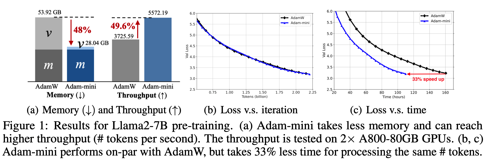
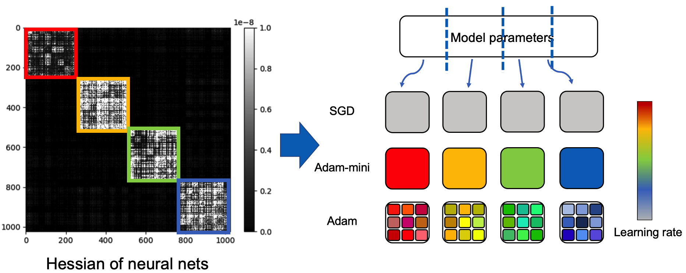
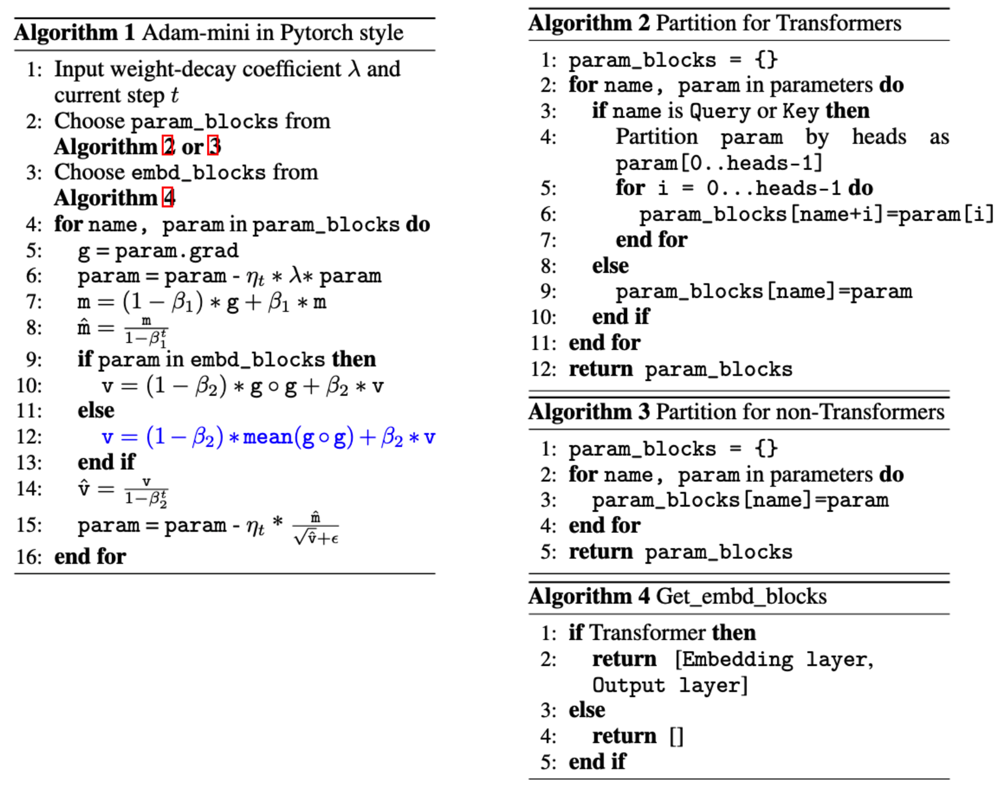

- Github (283): https://github.com/zyushun/Adam-mini
- 论文：Code for Adam-mini: Use Fewer Learning Rates To Gain More https://arxiv.org/abs/2406.16793
- a mini-version of Adam that achieves on-par or better performance than AdamW with 45% to 50% less memory footprint.

Adam-mini reduces memory by cutting down the learning rate (lr) resources in Adam (i.e., 
1/sqrt(v)): we argue that >90% of these lr in v
 could be harmlessly removed if we:

(1) carefully partition the parameters into blocks following our proposed principle related to Hessian structure.

(2) assign a single but good lr to each parameter block.

