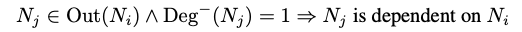
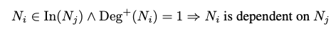
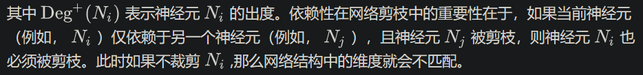

# 1. 简介

论文标题：

LLM-Pruner: On the Structural Pruning of Large Language Models

论文作者：

Xinyin Ma, Gongfan Fang, Xinchao Wang

单位：

新加坡国立大学

- 剪枝+少量数据+少量训练 = 高效的Large Language Models压缩
- 优点：剪枝后仅需3小时微调训练
- 缺点：20%以下的剪枝才能保证性能基本无损耗
- Github: https://github.com/horseee/LLM-Pruner
- Paper: https://arxiv.org/abs/2305.11627

网络剪枝包括【结构化剪枝】和【非结构化剪枝两类】，非结构化剪枝通常以掩码（Mask）的方式实现，
其特点是对模型性能损伤小，但是加速依赖硬件支持，且通常不改变实际的参数量。相对地，
结构化剪枝物理地移除网络中的【子结构】，从而降低网络参数量以及推理成本。本文主要介绍基于结构化剪枝的LLM压缩方法。

# 2. 方法

在本节中，我们提供了LLM-Pruner的详细解释。遵循常规的剪枝流程，LLM-Pruner包含三个步骤：发现阶段，估计阶段，恢复阶段。

(1) 发现阶段：这一步聚焦于识别LLM内部相互依赖的结构，这些相互依赖的结构需要被同时移除已确保剪枝后结构的正确性。

(2) 估计阶段：一旦耦合结构被分组，第二步就包含估计每个组对模型总体性能的贡献，并决定要剪枝的组。

(3) 恢复阶段：这一步涉及到快速的后训练，用于缓解由于结构删除而可能引起的性能降级。

## 2.1 发现阶段：识别结构依赖

类似于之前的研究[4]，剪枝开始于为LLM的内部结构建立依赖性。假设Ni和Nj是模型中的两个神经元，
ln(Ni)和Out(Ni)表示Ni输入、输出所指向的所有神经元。结构之间的依赖性可以定义为：

公式1:结构间的依赖性

其中Deg-(Nj)表示神经元Nj的入度。注意到这种依赖性是方向性的，我们因此可以得到另一种依赖性

公式2:与公式1对称的反向依赖关系

图2: LLaMA中耦合结构的示例。我们简化了每层的神经元以清晰地展示依赖组。
剪枝的起始神经元被铃图案所标记，这一操作会导致具有依赖性的权重被剪枝（虚线），并继续传播到耦合神经元（虚线圆圈）

图2展示了LLaMA模型中存在的层耦合关系，主要包含三种存在内部依赖的结构，即MLP内部的耦合、MHA内部的耦合
（主要为QKVO对应的Linear层）与整个网络中的维度耦合。我们将上述耦合利用公式1和公式2整合成一个Dependency Graph[4]，
就能利用递归搜索快速在图中寻找到耦合结构了。

## 2.2 估计阶段：参数重要性估计

##  2.3 低秩近似快速恢复

## 2.4 算法总结
上述过程给出了LLM模型的依赖分析、重要性评估以及后训练的完整方案，通过集成一阶和二阶泰勒展开，
我们可以得到更加鲁棒的重要性评估策略。对于大模型而言，重要性评估指标是尤其重要的，
因为剪枝造成的性能损失越大，后训练恢复所需要的数据量、训练时间也就越多。

# 3. 实验

本文对三种开源的LLM进行剪枝实验，包括LLaMA-7B, Vicuna-7B和ChatGLM，剪枝前后的模型参数量、
MACs和内存占用如表所示。原始的LLaMA-7B模型在不使用额外量化等技术的情况下，
在24GB单卡上仅能执行推理操作，而剪枝后的小模型我们可以使用单卡24GB完成微调。

# 参考

[1] NeurIPS 2023 | LLM-Pruner: 大语言模型的结构化剪枝，https://zhuanlan.zhihu.com/p/630902012
[2] LLM-Pruner: 剪枝+少量数据+少量训练 = 高效的LLM压缩，https://blog.csdn.net/c9Yv2cf9I06K2A9E/article/details/131078602
