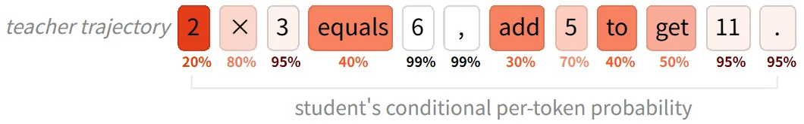
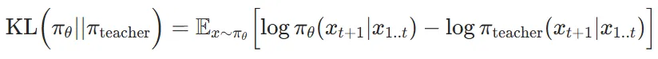
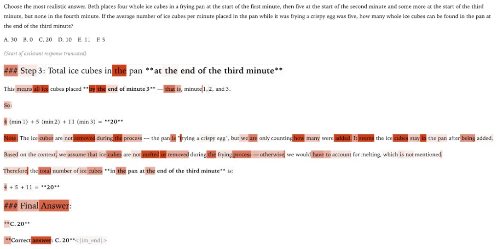
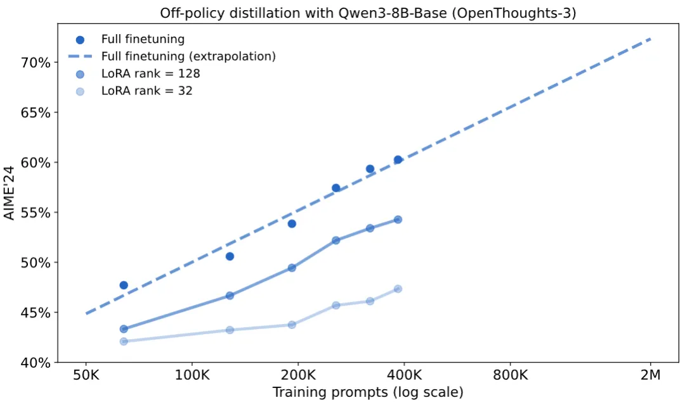
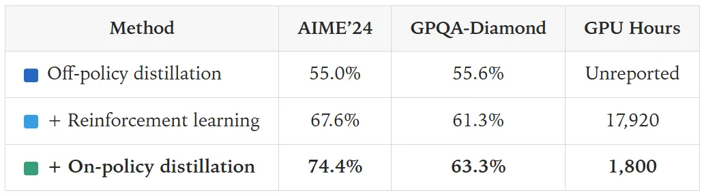
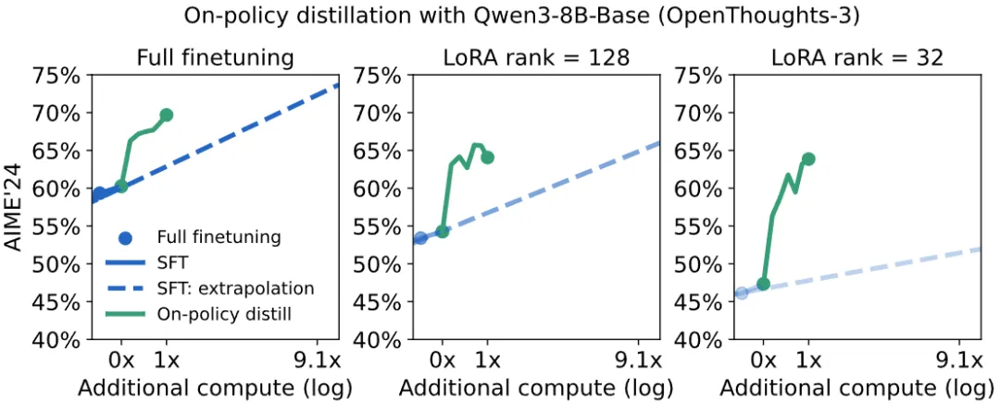
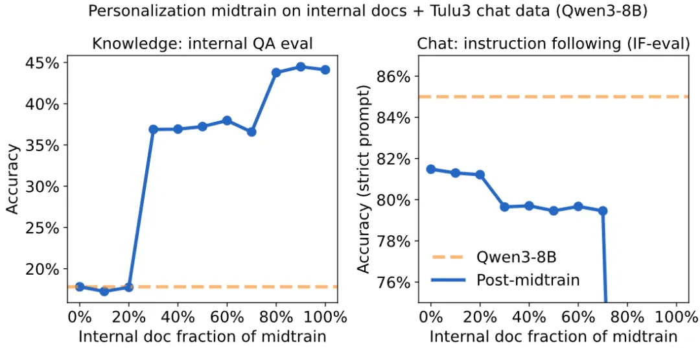
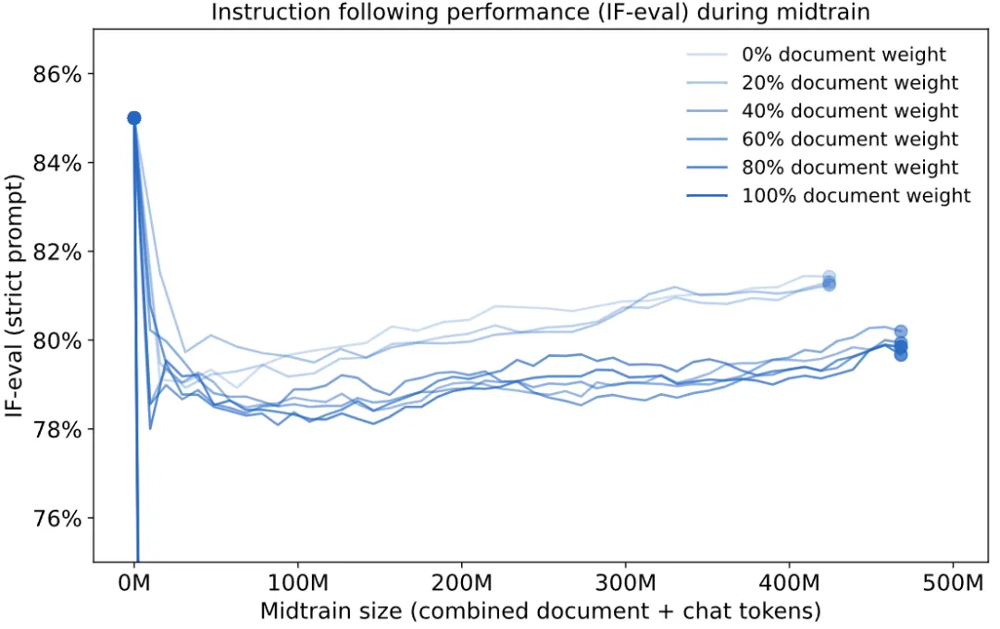
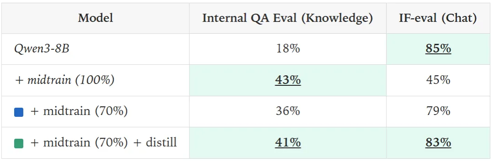

# 1. 资源

- 博客地址：https://thinkingmachines.ai/blog/on-policy-distillation/
- 你可以在这个 Tinker cookbook 中跟着学习实现的每一步：https://github.com/thinking-machines-lab/tinker-cookbook/tree/main/tinker_cookbook/recipes/distillation
- 伪代码地址：https://thinkingmachines.ai/blog/on-policy-distillation/(https://github.com/thinking-machines-lab/tinker-cookbook/blob/main/tinker_cookbook/rl/train.py

# 2. 原理

后训练「学生」模型的方法可以分为两种：

- 在策略（On-policy）训练：从学生模型自身采样轨迹（rollouts），并为这些轨迹分配某种奖励。
- 离策略（Off-policy）训练：依赖于某个外部来源的目标输出，学生模型需要学习模仿这些输出。

但 RL 有一个主要缺点：它提供的反馈非常稀疏（sparse feedback）。无论使用多少 token，它在每个训练回合（episode）中教授的比特数是固定的。

在我们上面的例子中，学生只知道「21」是错误答案，并更新模型以避免产生这个轨迹。但它并没有学到究竟错在哪里 —— 是搞错了运算顺序，还是算术本身出了错。这种反馈的稀疏性使得 RL 在许多应用中效率低下。

离策略训练通常通过监督微调（SFT）来完成，即在一组精心策划的、针对特定任务的有标注示例上进行训练。这些有标注示例的来源可以是一个在当前任务上表现出色的教师模型。

我们可以使用一种称为蒸馏（distillation）的机制：训练学生模型来匹配教师模型的输出分布。我们在教师的轨迹上进行训练，这些轨迹是生成的 token 的完整序列，包括中间的思考步骤。

在每一步，我们既可以使用教师完整的「下一个 token 分布」（常被称为 「logit 蒸馏」），也可以只采样给定的序列。实践证明，采样序列提供了对教师分布的无偏估计，并能达到相同的目标。学生模型会根据自己生成该 token 的概率有多低，来相应地更新对序列中每个 token 的学习（在下例中用深色表示）：

离策略训练的缺点是，学生是在教师经常遇到的上下文中学习，而不是在学生自己将来会经常遇到的上下文中学习。

这可能会导致复合错误（compounding error）：如果学生早期犯了一个教师从未犯过的错误，它会发现自己越来越偏离在训练中观察到的状态。

当我们关心学生在长序列上的表现时，这个问题变得尤为突出。为了避免这种偏离，学生必须学会从自己的错误中恢复。

离策略蒸馏观察到的另一个问题是，学生可以学会模仿教师的风格和自信，但不一定能学会其事实的准确性。

损失函数：反向 KL

在策略蒸馏可以使用多种损失函数来为学生的轨迹评分。为简单起见，我们选择逐 token 的反向 KL（reverse KL）—— 即在给定相同先前轨迹的条件下，学生（π_θ）和教师（π_teacher）在每个 token 上的分布之间的散度：

们的奖励函数会最小化反向 KL，这会促使学生在自己所处的每种状态下都去近似教师的行为。当学生的行为与教师完全一致时，反向 KL 为零。为简单起见，我们使用的折扣因子为零：在任何给定的时间步，学生只优化眼前的下一个 token，不考虑未来的 token。

反向 KL 与 RL 有着天然的协同作用，RL 通常优化由奖励模型引导的某种序列级反向 KL。然而，与实践中的大多数奖励模型不同，反向 KL 是「不可破解的」（unhackable），因为从教师模型的角度来看，低 KL 总是对应着高概率的期望行为。反向 KL 的另一个有用特性是它是「寻找众数（mode seeking）」的 —— 它学习一种特定行为（教师的行为），而不是将其分布分散在几个次优选项上。

这种方法可节省大量计算资源。因为它不需要等待一个轨迹完成采样才能计算奖励，所以我们可以使用更短或部分的轨迹进行训练。查询教师的对数概率也只需要大型模型进行一次前向传播，而轨迹则是由更小、更廉价的学生模型生成的。

我们也不需要单独的奖励或标注模型。将基于蒸馏的逐 token 奖励与序列级的环境奖励结合起来可能会有好处；这是未来一个有趣的潜在研究领域。

图解

下面我们来看一个真实的例子，这是一个错误的学生轨迹，由教师模型进行评分。这个例子来自 SimpleBench，它要求模型做出一个关键观察：问题的前提很重要。正确答案是 「B. 0」，因为冰块在煎锅里会融化。而学生模型（Qwen3-4B-Instruct-2507）错误地将其视为一个纯粹的数学问题，没有考虑物理背景。

颜色越深，代表该 token 受到教师模型（Qwen3-235B-A22B-Instruct-2507）的惩罚越高（教师模型正确解决了这个问题）。

我们看到，它惩罚了那些引导学生误入歧途的短语的起始 token，这直观上对应了引导推理的重要「分叉 token」（forking tokens）。最终答案（虽然是错的）并没有受到惩罚 —— 因为在给定前面所有序列的条件下，这个答案是完全可预测的。

初始化教师客户端：Tinker API 可以轻松地为不同模型创建不同的客户端。我们使用采样客户端，因为我们不需要通过教师模型传播对数概率。

采样轨迹：我们像在 RL 中一样从学生模型中采样轨迹。在采样期间，RL 已经计算了学生的对数概率 log π_θ(x），用作重要性采样损失的一部分。

计算奖励：我们用 compute_logprobs 函数在采样出的轨迹上查询教师客户端，它会返回教师在学生采样的 token x 上的对数概率 log π_teacher (x）。然后我们用这个来计算反向 KL。

使用 RL 进行训练：我们将逐 token 的优势（advantage）设置为负的反向 KL，并调用 RL 的重要性采样损失函数来对学生模型执行训练更新。

伪代码如下：

在下面的实验中，我们通常将在策略蒸馏应用于已经过特定领域知识中训练的模型。这种训练提高了学生生成教师分布范围内的 token 的概率，尽管这通常远不足以复刻教师的性能。通常，正如我们将在个性化示例中看到的，生成相关 token 的概率开始时为零，因为学生缺乏任何相关的领域知识。

我们将使用在策略蒸馏进行后训练，并将其与训练专家模型的其他最后关键阶段的方法进行比较。

蒸馏以获得推理能力

我们使用蒸馏来训练 Qwen3-8B-Base 模型的数学推理能力，并使用 Qwen3-32B 作为教师模型。教师（Qwen3-32B）和学生（Qwen3-8B-Base）都是目前 Tinker 上支持的模型，因此你可以使用 Tinker cookbook 复现我们的实验。

离策略蒸馏

如前所述，我们所有的实验都以离策略蒸馏（即在教师生成的示例数据集上进行监督微调）的形式作为中训练的起点。用于数学推理的数据集是 OpenThoughts-3，这是一个由 QwQ-32B（一个类似于 Qwen3-32B 的推理模型）生成的推理提示和响应的集合。

在 40 万个提示上对学生模型（Qwen3-8B-Base）进行全参数微调（full fine-tuning），在 AIME'24（一个数学问题基准测试）上获得了 60% 的分数。我们也可以使用 LoRA 进行训练，但在高容量数据集上训练时，它落后于全参数微调。在所有情况下，我们都看到性能呈对数线性增长 —— 最初的性能提升很廉价，但后期的提升成本高昂。

强化学习

Qwen3 技术报告称，在类似的 SFT 初始化基础上，通过 17,920 个 GPU 小时的 RL，在基准测试上达到了 67.6% 的性能。这很难与蒸馏的成本直接比较，但基于对 SFT 训练堆栈的一些合理假设，这与在 200 万个离策略蒸馏提示上训练的成本相似。

Qwen 团队还报告称，使用在策略蒸馏，能以 RL 成本的十分之一，在 AIME’24 上达到了 74.4% 的更高分数。这也启发了我们的工作。

在策略蒸馏

作为替代方案，我们运行了在策略蒸馏。从 40 万 SFT 检查点开始，在策略蒸馏在大约 150 个步骤内就达到了 AIME’24 70% 的成绩。

跨方法比较计算成本并非易事。下面，我们用 FLOPs（浮点运算次数）来计算成本。

我们发现，当 SFT 数据集是现成的（如我们的 OpenThoughts-3 示例）或在多次训练中被摊销时，基线成本降低了 9 倍。

然而，我们经常希望在一个没有现成离策略蒸馏数据集的新任务上训练一个小模型。如果我们将教师模型的全部成本（即包括从教师模型采样的额外成本）计算在离策略蒸馏中，那么总成本可降低约 30 倍。

为了减少这种灾难性遗忘（catastrophic forgetting），中训练中一种常见的做法是混入来自模型原始预训练分布的「背景数据」。

在这种情况下，我们无法访问 Qwen3 的预训练分布。因此，我们考虑一个更强、成本更高的基线：我们获取 Tulu3 提示（一个广泛的聊天和指令遵循数据集），并使用 Qwen3-8B 重新采样它们，以充当聊天背景数据。

然后，我们在内部文档和聊天数据的不同混合比例上微调 Qwen3-8B。提高文档数据比例会直接提升模型的知识水平。然而，尽管混入至少 30% 的聊天数据有助于保留大部分指令遵循能力，但没有任何一种权重配比能维持在 IF-eval 上的原始性能。

在策略蒸馏恢复后训练行为

接下来，我们试图在对内部文档进行微调后，恢复指令遵循行为。这种行为最初是用 RL 训练的，成本高昂，而且正如我们所见，很脆弱。

取而代之的是，我们在 Tulu3 提示上，使用模型的早期版本 Qwen3-8B 作为教师，来进行在策略蒸馏。请注意，这个训练阶段与内部文档数据无关，其唯一目的是恢复指令遵循能力。

使用模型的早期版本作为教师来「重新唤起」在微调过程中丢失的能力，这使得在策略蒸馏在持续学习（continuous learning）方面非常有前景。我们可以交替进行「在新数据上微调」和「蒸馏以恢复行为」这两个阶段，使我们的模型能够随着时间的推移学习并保持知识的最新状态。

在 70-30 混合的内部文档数据和聊天数据上微调后，在策略蒸馏几乎完全恢复了在 IF-eval 上的性能，且没有损失任何知识；我们还观察到聊天能力和模型在内部 QA 评估中的「知识」性能之间存在一些正向迁移。

从本质上讲，我们将语言模型本身视为一个奖励模型，高概率的行为会受到奖励。这与逆向 RL（inverse RL）有关：高概率的行为对应于假定的潜在偏好模型中的有利奖励。任何经过指令调优的开源权重模型都可以在这个意义上用作奖励模型；我们只需要能访问 compute_logprobs 函数。

# 参考

[1] 刚刚，Thinking Machines Lab博客提出在策略蒸馏，Qwen被cue 38次, https://mp.weixin.qq.com/s/sYfocBo60XzO04LQA-Gq9A
