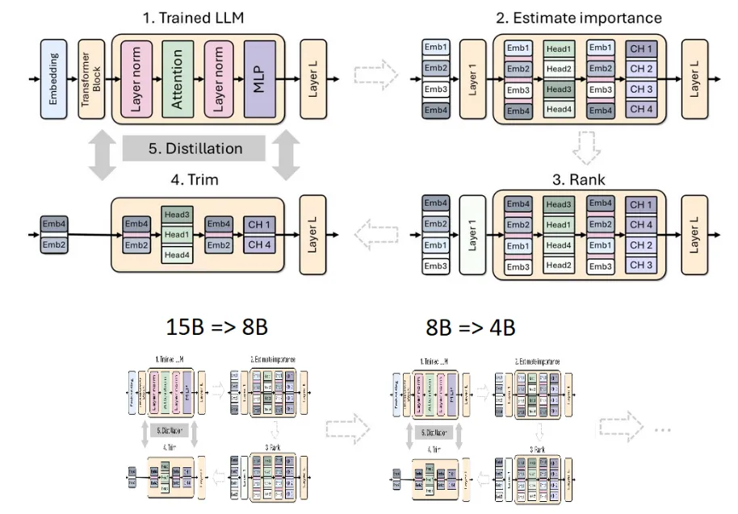
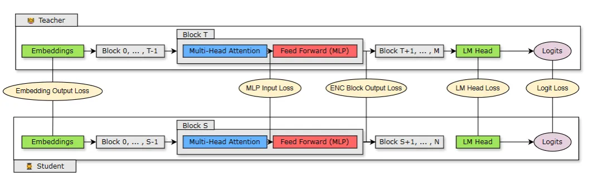
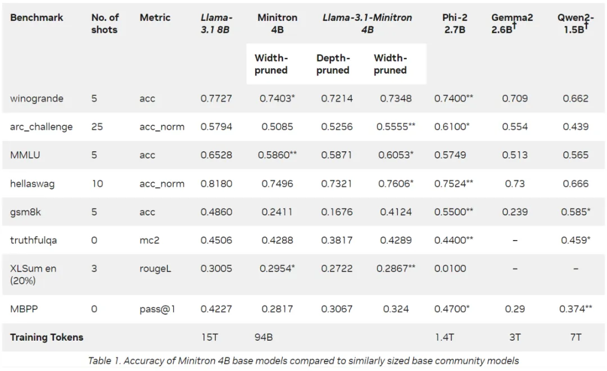

# 1. 资源
论文标题：

Compact Language Models via Pruning and Knowledge Distillation

论文地址：

https://arxiv.org/pdf/2407.14679.pdf

# 2. 原理

蒸馏方式主要包括两种：SDG 微调与经典知识蒸馏，这两种蒸馏方式互补。本文主要关注经典知识蒸馏方法。

英伟达采用将剪枝与经典知识蒸馏相结合的方式来构造大模型，下图展示了单个模型的剪枝和蒸馏过程（上）以及模型剪枝和蒸馏的链条（下）。具体过程如下：

1. 英伟达从 15B 模型开始，评估每个组件（层、神经元、头和嵌入通道）的重要性，然后对模型进行排序和剪枝，使其达到目标大小：8B 模型。
2. 接着使用模型蒸馏进行了轻度再训练，原始模型作为老师，剪枝后的模型作为学生。
3. 训练结束后，以小模型（8B）为起点，剪枝和蒸馏为更小的 4B 模型。

需要注意的点是，在对模型剪枝之前，需要先了解模型的哪部分是重要的。英伟达提出了一种基于激活的纯重要性评估策略，该策略可以同时计算所有相关维度（深度、神经元、头和嵌入通道）的信息，使用一个包含 1024 个样本的小型校准数据集，并且只需要前向传播。这种方法相比依赖梯度信息并需要反向传播的策略更加简单且具有成本效益。 

在剪枝过程中，你可以针对给定轴或轴组合在剪枝和重要性估计之间进行迭代交替。实证研究显示，使用单次重要性估计就足够了，迭代估计不会带来额外的好处。

凭借 Nemotron 蒸馏的经验，英伟达着手将 Llama 3.1 8B 模型蒸馏为更小、更高效的 4B 模型，采取以下措施：

- 教师微调

- Depth-only 剪枝

- Width-only 剪枝

- 准确率基准

- 性能基准

# 参考

[1] 小模型崛起！Llama 3.1 8B参数减半性能更强，英伟达把剪枝和蒸馏玩明白了，https://mp.weixin.qq.com/s/7VIzvoex0FEO_xyUcRs-xw
