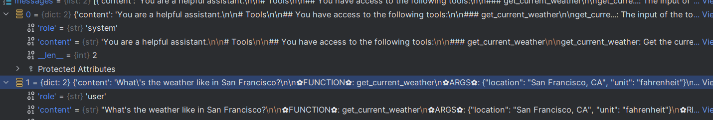

外部展示会分为，system user, assistant, function四个角色


但内部会转换数据结构样式，只有system, user和assistant 三个角色。function call和observation会揉到assistant中

输出function call时，通过assistant输出


当返回function的结果时，user问题和function结果拼接放在user中，然后通过assistant输出回答结果



```text
# user内容

"What's the weather like in San Francisco?

✿FUNCTION✿: get_current_weather
✿ARGS✿: {"location": "San Francisco, CA", "unit": "fahrenheit"}
✿RESULT✿: {"location": "San Francisco", "temperature": "72", "unit": "fahrenheit"}
✿RETURN✿"
```

结束符也得换

```text
['✿RESULT✿', '✿RESULT✿:', '✿RESULT✿:\n']
```
