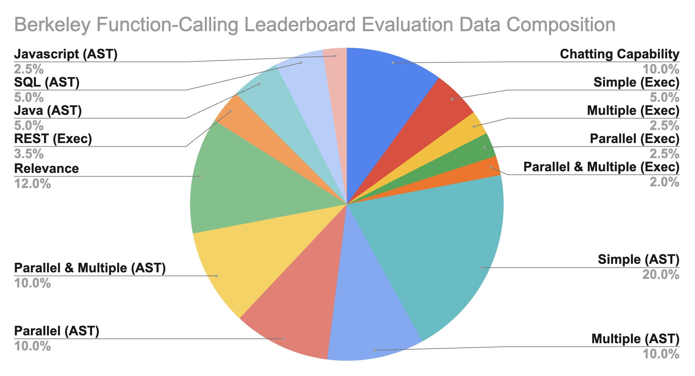
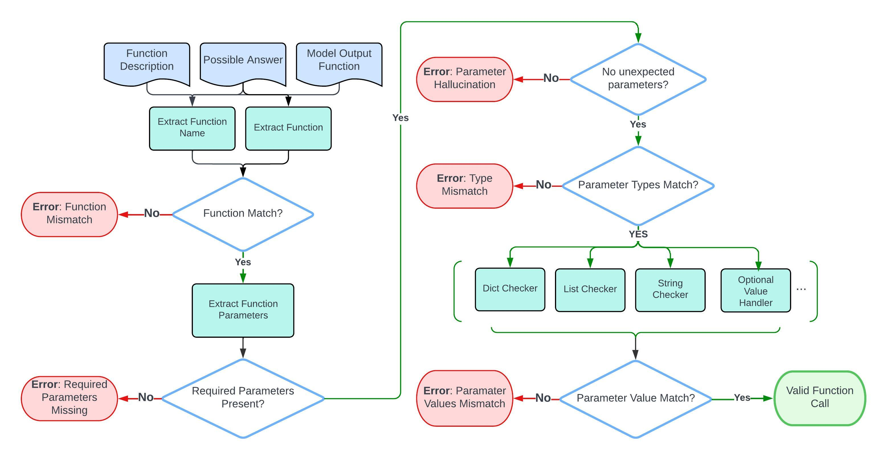

https://gorilla.cs.berkeley.edu/blogs/8_berkeley_function_calling_leaderboard.html#benchmarking

支持的数据类型：

For bool:

The procedure checks the direct matching of boolean values, and doesn't allow leniency on the string versions of boolean values.

For integer, float:

If the function documentation specifies that it's a float, then it should be a float in the model output (such as 5.0); an int (such as 5) will not be correct.

For List, Tuple:

Order matters and the elements must match exactly. For example, [1,2,3] is not equal to [2,3,1]. So for questions where the order in the list doesn't matter, permutations of the possible answer are used to accommodate this situation.
Note that the type match extends recursively for nested data structures (List or Tuple), where both the outer type and the inner types of elements must match the specified requirements.

For String:

- The evaluation process is case-insensitive.
- All strings will be standardized before checking. This applies to both the model output and the possible answers.
- All white space is removed.
  - A subset of punctuations ,./-_*^ are removed to make the evaluation more robust and accurate.
  - Possible date ["20th June", "2023-06-20", "06/20/2023", "Jun.20, 2023"]
- Possible Location ["New York City", "NYC"]
- Possible Anything ["Manchester United", "Man United", "Man U", "MUFC"]

For Dict:

The evaluation focuses on the key presence and the accuracy of associated values as per the possible answers.
Ordering within dictionaries is not considered due to they are inherently unordered.

For lists of dictionaries:

While the ordering of dictionaries is considered (since it's a List), the order of key-value pairs within each dictionary is not.