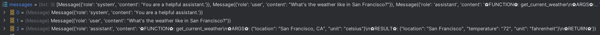

# 1. 简介

- 每个模型实现funtion call的模式都略有差异，实现方式在标准openAI接口里都不支持，需要自己实现。
- 主要实现方式有2中
  - 通过React方式实现，该方式不影响接口，function call及observation全部作为assistant的一部分，
    每当流式推理遇到observation关键字(会作为stop words)时，停止输出，调用function call，并将结果拼接并加上observation，
    然后继续推理。实际流程还是user,assistant的交替
  - 目前的主流方案：增加function的角色，function call的结果作为assistant的一部分返回给user，
    这种方式需要修改接口，但是更符合实际场景。对外一般是有system, user, assistant, function, observation
    共5个角色，但内部会把function call及observation作为assistant的一部分处理。另外，目前主流方案和数据，
    如果在调function时，都是直接输出function，不像react会先思考以下 (可能觉得对性能提升不大，且做结果解析时不方便)

注意：
- 标准openAI接口、vllm及langchain的接口都不支持qwen的function call
- 需要自己其中的处理对话格式修改的逻辑，或者采用react方式实现

以下对不同框架的模型进行介绍

# 2. Qwen

主要采用React方式。

提示词使用如下模板：

```py
TOOL_DESC = """{name_for_model}: Call this tool to interact with the {name_for_human} API. What is the {name_for_human} API useful for? {description_for_model} Parameters: {parameters} Format the arguments as a JSON object."""

REACT_PROMPT = """Answer the following questions as best you can. You have access to the following tools:

{tool_descs}

Use the following format:

Question: the input question you must answer
Thought: you should always think about what to do
Action: the action to take, should be one of [{tool_names}]
Action Input: the input to the action
Observation: the result of the action
... (this Thought/Action/Action Input/Observation can be repeated zero or more times)
Thought: I now know the final answer
Final Answer: the final answer to the original input question

Begin!

Question: {query}"""
```

通过React方式实现，该方式不影响接口，function call及observation全部作为assistant的一部分，
    每当流式推理遇到function call时，assistant会调用function call，将结果拼接并加上observation，
    然后继续推理。实际流程还是user,assistant的交替

训练数据样例如下：
```python
# This example has multiple actions in one single response.
    example_train_samples.append(
        [
            {
                "role": "user",
                "content": f"{example_instruction}\n\nQuestion: Who is jay chou? And who is his wife?",
            },
            {
                "role": "assistant",
                "content": """
Thought: I need to google Jay Chou.
Action: google_search
Action Input: {"search_query": "Jay Chou"}
Observation: Jay Chou is ...
Thought: I need to google Jay's wife.
Action: google_search
Action Input: {"search_query": "Jay Chou's wife"}
Observation: Jay Chou's wife is ...
Thought: I now know the final answer
Final Answer: Jay Chou is ... His wife is ...
                """.strip(),
            },
        ]
    )
```

# 3. Qwen2

以下是从Qwen-Agent截取的数据结构样式：

增加function的角色，function call的结果作为assistant的一部分返回给user，
    这种方式需要修改接口，但是更符合实际场景。对外一般是有system, user, function
    共5个角色，但内部会把function call及observation作为assistant的一部分处理。

可能由于让模型输出json个人容易导致解析问题，模型使用特殊字符输出，如下：



但对外展示，进行了整理，按照json格式输出，并与assistant的输出进行拼接，需要主义的是assistant均没有思考，而是直接出function的结果。


Qwen-Agent中针对Qwen2的提示词如下：

```python
FN_NAME = '✿FUNCTION✿'
FN_ARGS = '✿ARGS✿'
FN_RESULT = '✿RESULT✿'
FN_EXIT = '✿RETURN✿'
FN_STOP_WORDS = [FN_RESULT, f'{FN_RESULT}:', f'{FN_RESULT}:\n']

FN_CALL_TEMPLATE_INFO_ZH = """# 工具

## 你拥有如下工具：

{tool_descs}"""

FN_CALL_TEMPLATE_INFO_EN = """# Tools

## You have access to the following tools:

{tool_descs}"""

FN_CALL_TEMPLATE_FMT_ZH = """## 你可以在回复中插入零次、一次或多次以下命令以调用工具：

%s: 工具名称，必须是[{tool_names}]之一。
%s: 工具输入
%s: 工具结果
%s: 根据工具结果进行回复，需将图片用渲染出来""" % (
    FN_NAME,
    FN_ARGS,
    FN_RESULT,
    FN_EXIT,
)

FN_CALL_TEMPLATE_FMT_EN = """## When you need to call a tool, please insert the following command in your reply, which can be called zero or multiple times according to your needs:

%s: The tool to use, should be one of [{tool_names}]
%s: The input of the tool
%s: Tool results
%s: Reply based on tool results. Images need to be rendered as """ % (
    FN_NAME,
    FN_ARGS,
    FN_RESULT,
    FN_EXIT,
)

FN_CALL_TEMPLATE_FMT_PARA_ZH = """## 你可以在回复中插入以下命令以并行调用N个工具：

%s: 工具1的名称，必须是[{tool_names}]之一
%s: 工具1的输入
%s: 工具2的名称
%s: 工具2的输入
...
%s: 工具N的名称
%s: 工具N的输入
%s: 工具1的结果
%s: 工具2的结果
...
%s: 工具N的结果
%s: 根据工具结果进行回复，需将图片用渲染出来""" % (
    FN_NAME,
    FN_ARGS,
    FN_NAME,
    FN_ARGS,
    FN_NAME,
    FN_ARGS,
    FN_RESULT,
    FN_RESULT,
    FN_RESULT,
    FN_EXIT,
)

FN_CALL_TEMPLATE_FMT_PARA_EN = """## Insert the following command in your reply when you need to call N tools in parallel:

%s: The name of tool 1, should be one of [{tool_names}]
%s: The input of tool 1
%s: The name of tool 2
%s: The input of tool 2
...
%s: The name of tool N
%s: The input of tool N
%s: The result of tool 1
%s: The result of tool 2
...
%s: The result of tool N
%s: Reply based on tool results. Images need to be rendered as """ % (
    FN_NAME,
    FN_ARGS,
    FN_NAME,
    FN_ARGS,
    FN_NAME,
    FN_ARGS,
    FN_RESULT,
    FN_RESULT,
    FN_RESULT,
    FN_EXIT,
)
```

# 4. ChatGLM3

该流程任然借鉴了React模式，该方式不影响接口，function call及observation全部作为assistant的一部分，
    每当流式推理遇到function call时，assistant会调用function call，将结果拼接并加上observation，
    然后继续推理。实际流程还是user,assistant的交替。

如下数据中虽然使用了system, user, assistant, function, observation
    共5个角色，但内部会把function call及observation作为assistant的一部分处理。但计算loss时，会特别处理
去只计算assistant和function的loss。

如果您希望微调模型的对话和工具能力，您应该按照以下格式整理数据。

```json
[
  {
    "tools": [
      // available tools, format is not restricted
    ],
    "conversations": [
      {
        "role": "system",
        "content": "<system prompt text>"
      },
      {
        "role": "user",
        "content": "<user prompt text>"
      },
      {
        "role": "assistant",
        "content": "<assistant thought to text>"
      },
      {
        "role": "tool",
        "name": "<name of the tool to be called",
        "parameters": {
          "<parameter_name>": "<parameter_value>"
        },
        "observation": "<observation>"
        // don't have to be string
      },
      {
        "role": "assistant",
        "content": "<assistant response to observation>"
      },
      // ... Muti Turn
      {
        "role": "user",
        "content": "<user prompt text>"
      },
      {
        "role": "assistant",
        "content": "<assistant response text>"
      }
    ]
  }
  // ...
]
```

- 关于工具描述的 system prompt 无需手动插入，预处理时会将 `tools` 字段使用 `json.dumps(..., ensure_ascii=False)`
  格式化后插入为首条 system prompt。

- 每种角色可以附带一个 `bool` 类型的 `loss` 字段，表示该字段所预测的内容是否参与 `loss`
  计算。若没有该字段，样例实现中默认对 `system`, `user` 不计算 `loss`，其余角色则计算 `loss`。

- `tool` 并不是 ChatGLM3 中的原生角色，这里的 `tool` 在预处理阶段将被自动转化为一个具有工具调用 `metadata` 的 `assistant`
  角色（默认计算 `loss`）和一个表示工具返回值的 `observation` 角色（不计算 `loss`）。

- 目前暂未实现 `Code interpreter` 的微调任务。

- `system` 角色为可选角色，但若存在 `system` 角色，其必须出现在 `user`
  角色之前，且一个完整的对话数据（无论单轮或者多轮对话）只能出现一次 `system` 角色。

# 5. Llama-Factory

注意：工具提示词模板只有2个，通用的（英文的）和GLM4的中文提示词。

代码会自动把tools的描述拼接到system中。

数据格式采用shareGPT格式：

```json
[
  {
    "conversations": [
      {
        "from": "human",
        "value": "你好，我需要在我的日历中创建一个新的活动。"
      },
      {
        "from": "gpt",
        "value": "当然可以，我可以帮助您。您能告诉我活动的标题、开始时间和结束时间吗？"
      },
      {
        "from": "human",
        "value": "项目会议\n2022-04-15T10:00:00 开始\n2022-04-15T11:00:00 结束"
      },
      {
        "from": "function_call",
        "value": "{\"name\": \"create_calendar_event\", \"arguments\": {\"title\": \"项目会议\", \"start_time\": \"2022年4月15日 10:00:00\", \"end_time\": \"2022年4月15日11:00:00\"}}"
      },
      {
        "from": "observation",
        "value": "{\"status\": \"成功\", \"message\": \"项目会议\"}"
      },
      {
        "from": "gpt",
        "value": "项目会议'事件已成功创建，时间为2022年4月15日10:00至11:00。"
      }
    ],
    "tools": "[{\"name\": \"create_calendar_event\", \"description\": \"在日历中创建新事件\", \"parameters\": {\"type\": \"object\", \"properties\": {\"title\": {\"type\": \"string\", \"description\": \"活动的标题\"}, \"start_time\": {\"type\": \"string\", \"description\": \"活动的开始时间\"}, \"end_time\": {\"type\": \"string\", \"description\": \"活动结束时间\"}}, \"required\": [\"title\", \"start_time\", \"end_time\"]}}]"
  }
]
```

对于qwen只增加了tool的角色

```python
_register_template(
    name="qwen",
    format_user=StringFormatter(slots=["<|im_start|>user\n{{content}}<|im_end|>\n<|im_start|>assistant\n"]),
    format_system=StringFormatter(slots=["<|im_start|>system\n{{content}}<|im_end|>\n"]),
    format_observation=StringFormatter(slots=["<|im_start|>tool\n{{content}}<|im_end|>\n<|im_start|>assistant\n"]),
    format_separator=EmptyFormatter(slots=["\n"]),
    default_system="You are a helpful assistant.",
    stop_words=["<|im_end|>"],
    replace_eos=True,
)
```

偶数和奇数位角色：

```python
odd_tags = (dataset_attr.user_tag, dataset_attr.observation_tag)
even_tags = (dataset_attr.assistant_tag, dataset_attr.function_tag)
```