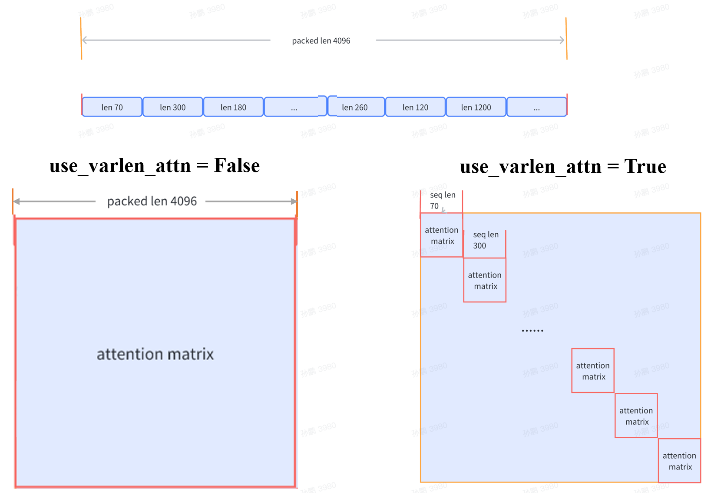

# Varlen Attention

数据集拼接 一节中，我们讨论了“数据集拼接”策略对模型训练效率的显著提升。 理论上，数据集拼接可能会对注意力（Attention）机制的计算过程产生影响。这是因为，在未采用数据拼接策略的情况下， 每条数据在计算注意力时仅与自身相关联。然而，当采用数据拼接策略后，由多条短数据拼接成的长数据在计算注意力时会相互关联。 以一个由若干短数据拼接成长度为 4096 的数据为例，如果不采用变长注意力机制，在注意力计算阶段，每个 token 将会关注全部 4096 个 tokens ，如图左侧所示。

相反，在使用变长注意力机制的情况下，每个 token 在注意力计算阶段仅会关注其所在短数据中的所有 tokens ，如图右侧所示。因此， 变长注意力机制确保了无论是否采用“数据集拼接”策略，模型训练的行为保持一致性。



变长注意力计算原理（拷贝自 https://github.com/InternLM/InternEvo/blob/develop/doc/usage.md）

安装

```bash
MAX_JOBS=4 pip install flash-attn --no-build-isolation
```

# 参考

[1] DeepSpeed, https://xtuner.readthedocs.io/zh-cn/latest/acceleration/deepspeed.html
