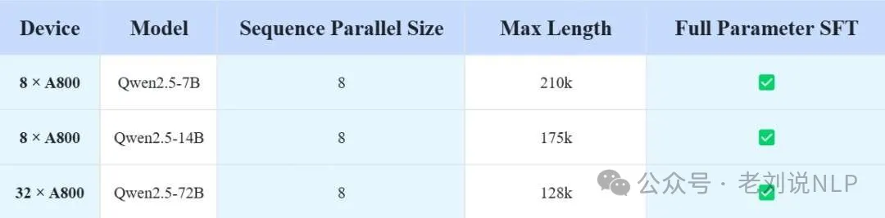
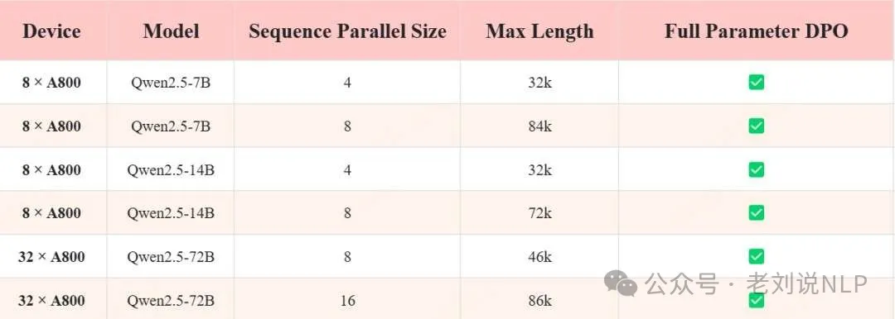
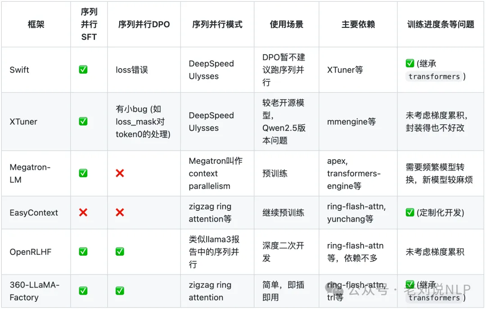

# 1. 资源

https://github.com/Qihoo360/360-LLaMA-Factory

# 2. 介绍

在开源大模型的后训练（Post-Train）框架中，LLaMA-Factory无疑是最受欢迎的工具之一。截至目前，LLaMA-Factory在GitHub上的star数已接近38k，反映了其在开发者社区中的广泛认可，也证明了其在大模型后训练上的强大能力。然而，随着大模型技术的快速发展，尤其是OpenAI的o1、o3系列模型的发布以及多模态大模型的兴起，大模型需要处理的token数（输入+输出的总token数）急剧增加，长序列处理能力的重要性愈发凸显。

老刘有位专门做强化的朋友邹昊晟(清华的本科和清华CS PhD，现在在360做长文本和强化学习等工作)。最近他做了一个比较有趣的工作，针对LLaMA-Factory在360-LLaMA-Factory之前尚不支持序列并行的问题，做了360-LLaMA-Factory（https://github.com/Qihoo360/360-LLaMA-Factory），给LLaMA-Factory加了序列并行功能，用来训超长文本非常方便，SFT和DPO都支持，在原来用LLaMA-Factory的基础上加一个sequence_parallel_size参数就行了，已收获了100多个star。

1、长序列处理的挑战与序列并行是很必要的

在大模型的应用场景中，长序列处理一直是一个棘手的问题。随着模型规模的扩大和任务复杂度的提升，输入和输出序列的长度不断增加，传统的单GPU数据并行的计算模式已经无法满足需求。尤其是在处理超长序列时，显存溢出成为主要瓶颈。为了解决这一问题，序列并行技术应运而生。

序列并行的核心思想是将一条长序列均匀切分到多张GPU上分别计算，仅在需要计算attention时进行通信。这种设计使得理论上增加GPU数量即可处理更长的序列，而不会出现显存溢出的问题。

然而，在360-LLaMA-Factory推出之前，LLaMA-Factory并不支持序列并行。尽管LLaMA-Factory在其他方面表现出色，但在处理超长序列任务时，其局限性逐渐显现。序列并行作为长序列问题的通解，能够有效解决显存不足和计算效率低下的问题，因此，支持序列并行成为了LLaMA-Factory进一步发展的关键。

2、360-LLaMA-Factory：无缝支持序列并行的LLaMA-Factory版本

作为无缝支持序列并行的LLaMA-Factory版本，360-LLaMA-Factory不仅继承了LLaMA-Factory原有的强大功能，还通过引入序列并行技术，显著提升了其在长序列任务中的表现。用户只需在训练过程中额外指定sequence_parallel_size参数，即可轻松启用序列并行功能，无需进行复杂的配置或代码修改。

图1：项目主页https://github.com/Qihoo360/360-LLaMA-Factory

从项目的README来看，作者们对比了SFT和DPO训练，相同数据下开vs不开训练并行，loss曲线几乎一致，严格确保了正确性。而且已经可以看到在LLaMA-Factory主仓库的pull request流程中。

作者们也压测了典型场景下可训练的最大长度。全参微调，只开zero3-offload和gradient checkpointing，SFT的最大长度至少可以达到210k (7B) / 128k (72B) ，DPO则是 DPO 84k (7B) / 46k (72B)。

表1：Qwen2.5多尺寸SFT长度压测

表2：Qwen2.5多尺寸DPO长度压测

3、360-LLaMA-Factory的优势是什么？

表3：部分支持序列并行的开源后训练框架对比 与其他部分支持序列并行的开源后训练框架相比，360-LLaMA-Factory的优势主要体现在以下几个方面：

一个是简单易用，360-LLaMA-Factory继承了LLaMA-Factory的易用性，用户只需准备好数据和指定参数，即可快速启动训练。

一个是庞大的用户群体和完善的社区支持，LLaMA-Factory本身拥有庞大的用户群体和活跃的开发者社区，这意味着360-LLaMA-Factory在潜在bug的修复和功能更新方面具有显著优势。用户在使用过程中遇到问题时，可以快速获得社区的帮助和支持。

一个是完整的后训练流程支持，360-LLaMA-Factory不仅支持序列并行，还对整个后训练流程（包括SFT和DPO）提供了完整的支持。相比之下，其他大部分框架在后训练流程的支持上不够完整、更新维护不及时或存在训练进度条未考虑梯度累积等问题。

此外，与OpenRLHF的对比，OpenRLHF是另一个较为优秀的支持序列并行的开源后训练框架，其主要优势在于继承依赖少，代码结构干净，适合深度用户进行定制化二次开发。然而，OpenRLHF在各种后训练的功能支持上相对LLaMA-Factory较少。对于大多数用户而言，360-LLaMA-Factory的简单易用和功能完整性更具吸引力。两者各自适合不同的使用场景。

# 参考

[1] 值得一用的长文本训练框架360-LLaMA-Factory及多模态VideoRAG实现思路，https://mp.weixin.qq.com/s/0T29CaajdTmHopRgoiofIA
