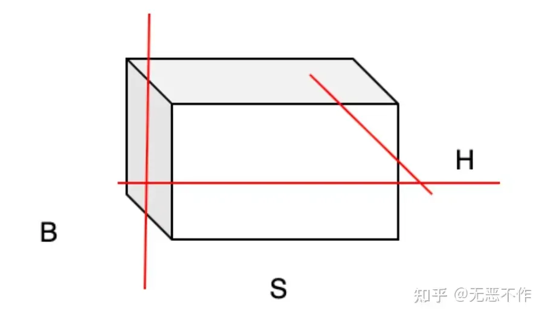
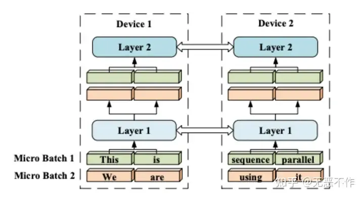
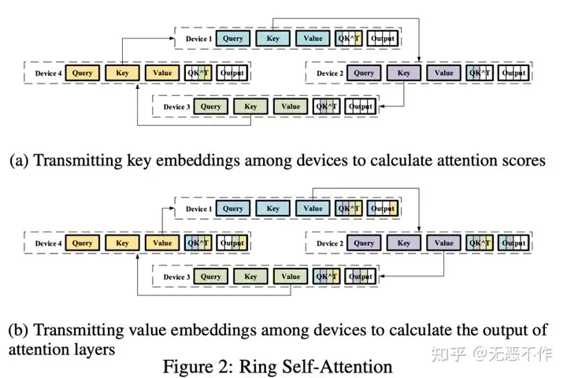
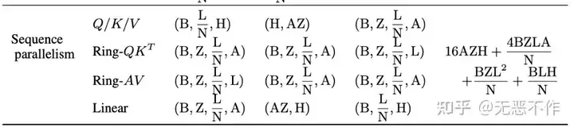
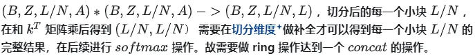
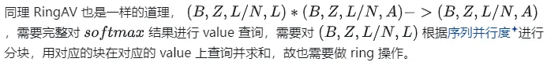
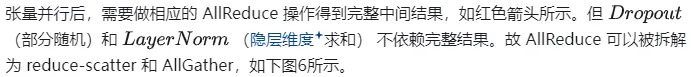
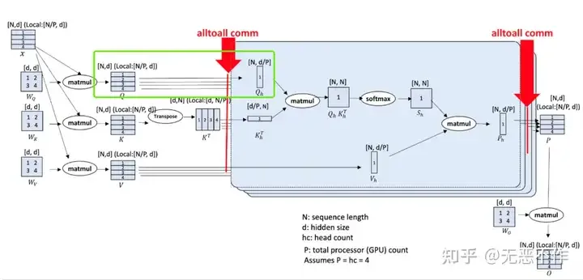
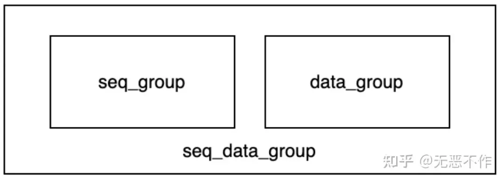

# 1. 简介 

原文：https://zhuanlan.zhihu.com/p/653067104

随着大语言模型的发展，大模型的相关技术日益细化，在生成式 AI、蛋白质结构预测等多个领域开花结果。由此产生的技术痛点也越发明显，特别是在蛋白质预测、多模态基础模型、语音图像处理模型等需要前后文推理的模型，对长序列训练有明显的需求。与此同时，现有的分布式训练技术，主要分为：数据并行、张量并行、流水线并行等在数据维度正交切分的分布式训练技术。如下图0所示，分别对应对于 batch size，hidden_size 维度进行切分。对于长序列模型训练，由于 transformer 类模型 self-attention 部分序列长度和显存消耗呈现平方关系，上述三种均不能提供较为高效、稳定的训练支持。而对于长序列模型采用序列并行可以很好的解决显存溢出等问题，由此大模型训练技术在序列并行技术逐渐开始迭代，下面针对主流的三种不同架构的序列并行进行介绍。



# 2. ColossalAI
ColossalAI 在 2022 年将序列并行技术集成到自己的代码库（https://github.com/hpcaitech/ColossalAI），细节可以参考：Sequence Parallelism: Long Sequence Training from System Perspective （https://arxiv.org/pdf/2105.13120）论文。其主要聚焦于 transformer 结构的 self-attention 和 mlp 两个结构，通过将序列切分到多个计算设备，并行计算，解决长序列训练的问题。在 self-attention 部分，由图片 三者是互相交互的关系，如下图1所示。



所以在实现上 ColossalA 借鉴了 Ring-Allreduce 算法实现，实现了 RingQK 和 RingAV 两种计算方式，如下图2所示。



这里为了方便理解我贴一下论文中的计算推导，方便理解为什么需要做 ring 操作。如下图3所示。（其实就是线性代数中的分块矩阵乘，这部分可以推理下）



(1) B: batch size; (2) L: sequence length; (3) H: hidden size of linear layers; (4) A: attention head size; (5) Z: number of attention heads; (6) N: number of GPUs.

RingQK：



RingAV：



上述实现也可以使用 AllGather 和 AllReduce 实现，或者 AlltoAll实现，只要保证计算加集合通信的分解结果保持唯一性，有太多种解法，类似因式分解。当然也要考虑通信和计算的代价是否合理。

MLP 部分贴一下公式，很好理解。如下图4。


# 3. Megatron-LM
Megatron-LM 也在 2022 年的第三遍论文中实现了序列并行，但是这个序列并行和我之前介绍的序列维度切分不同，我的理解是在 张量并行维度的再优化。具体可以参考论文：Reducing Activation Recomputation in Large Transformer Models 。（https://arxiv.org/pdf/2205.05198）

其主要的想法比较好理解，如下图5所示。





# 4. DeepSpeed Ulysses
DeepSpeed-Ulysses 是 DeepSpeed 最近提出的针对长序列模型训练的解决方案。官方博客：deepspeed-ulysse（https://github.com/microsoft/DeepSpeed/tree/master/blogs/deepspeed-ulysses）。DeepSpeed-Ulysses 将各个样本在序列维度上分割给序列并行需要的的 GPU 上。然后，在 self-attention 计算之前，它对已分割的Q,K,V 图片执行 all-to-all 通信操作，以使每个 GPU 接收完整的序列，即通过 all-to-all 通信操作将Q,K,V图片矩阵进行转置，把序列切分转移到转移头的均分。这使得参与的 GPU 可以并行计算不同的注意力头，等价转换计算序列切分。如下图7所示。



如上图7绿框部分所示，在序列并行组中，原本图片 维度在 all-to-all 通信后被转化为图片。由于计算分解性的转移，原本处理序列并行需要类似 ColossalAI 一样需要通过 ring 的方式保持结果唯一性，现在只需要分别计算注意力头就可以了。同时对于一个注意力头而言 序列并行与原计算无异，其他优秀的第三方优化库依旧可以使用，原文中也提到了可以与 FlashAttention v2 一起使用。这一点真的是最得我意，在大模型技术蓬勃发展的今天，开源、合作才是茁壮成长的要素。如果你的优化好，但是不能和别人玩到一起去，真的是只能孤芳自赏，易用度和成长性会受到制约。

引用下原文的一些其他优点：

- 与现有系统相比，序列长度增加了 4 倍，支持训练超过百万个token的序列。

- 与现有系统相比，通信减少了超过 10 倍，导致吞吐量提高了高达2.5倍，并且每个 GPU 的持续吞吐量超过 175 TFlops（超过硬件峰值的54%）。

- 完全通用的 attention：DeepSpeed 序列并行支持密集和稀疏的注意力，并可与高效的注意力实现（如FlashAttention v2）一起工作。

- 支持大规模模型训练：DeepSpeed 序列并行不仅支持大序列长度，还可以与 ZeRO-3 并用支持大模型尺寸。

- 易于使用和迁移，最小化对现有训练框架的代码更改要求。

缺点：注意力头的个数需要能整除序列并行数。

这里再介绍下与 ZeRO-3 的结合（这里没有特别细致看，有问题可以私聊我），DeepSpeed-Ulysses 这里使用了正交通信，参考 Megatron-DeepSpeed 中通信组建立的的代码：

```bash
num_sequence_data_parallel_groups: int = world_size // sequence_parallel_size // data_parallel_size
```

即将序列并行和数据并行做成正交的两个通信组。如下图8所示。



seq_data_group 就是数据序列并行通信组，可以看到 ZeRO-3 是在全局维度做切分，seq_group 是在 seq_data_group 其中的部分 rank 组成。在 seq_group 组内，数据是相同的，只不过是取了序列的不同维度，在数据并行组（ZeRO-3）数据是不同的。

这里再补充下，DeepSpeed 从 DeepSpeed powers 8x larger MoE model training with high performance （https://www.microsoft.com/en-us/research/blog/deepspeed-powers-8x-larger-moe-model-training-with-high-performance/）开始，许多通信的重点都在向 all-to-all 靠拢，包括最近发的 ZeRO++ 也是在用层次 all-to-all 去代替 AllReduce。谷歌提出的 Switch Transformer 可能在 MoE 中不是最优的解决方案，但是由此大规模使用的 all-to-all 通信，确实给分布式训练带来了更多的优化可能。


# 参考

[1] 聊聊序列并行Sequence parallelism, https://mp.weixin.qq.com/s?__biz=MzkxOTcxNjk2Mw==&mid=2247485718&idx=1&sn=04ff9db344a9ba2f1842227c38e3cb0e&chksm=c19c9c1af6eb150c7d8dc5c2e73c0e64b30d793e66ed7cb697961ded34d92e419e76acc5be4d&scene=21#wechat_redirect