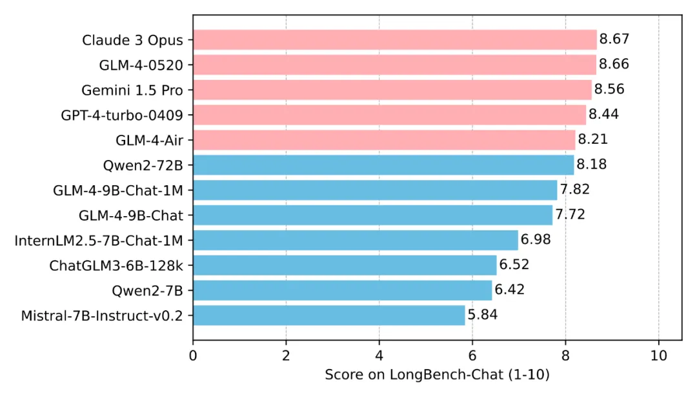
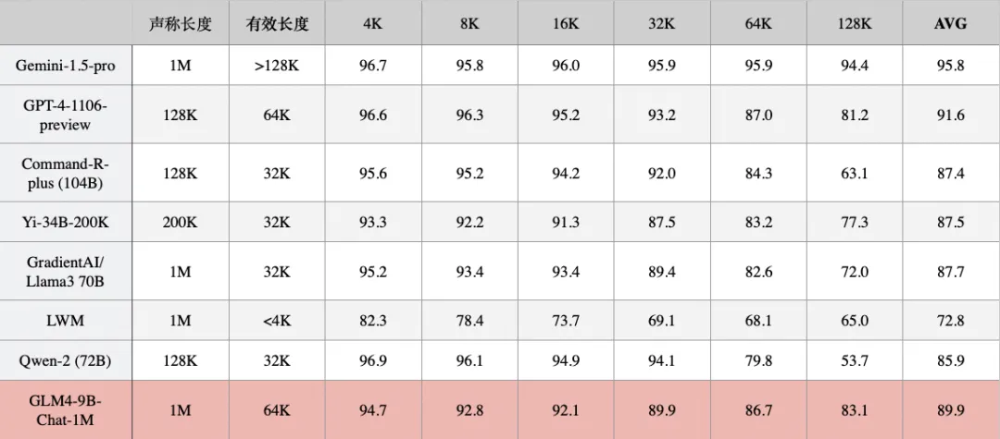
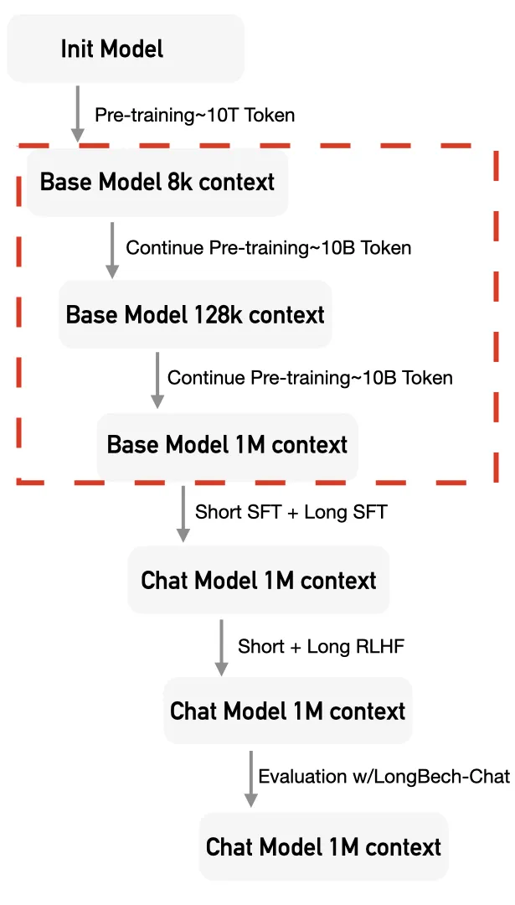

# 1. 简介

如果把 LLM 比作新时代的操作系统，上下文窗口便是它的「内存」。一个现代的操作系统需要足够大的内存才能完成各种各样的复杂任务。与之类似，一个优秀的 LLM 也需要足够长的上下文长度来完成各种复杂的任务。
基于此种观念，GLM 技术团队经过不断的技术迭代，从最初的仅支持2K上下文的ChatGLM-6B，发展到ChatGLM2-6B（32K）、ChatGLM3-6B（128K），直至现在的GLM4-9B（1M），始终在追求最领先的上下文技术能力。特别是GLM4-9B-Chat-1M，它集成了我们在长文本领域的大量研究成果。
本文将以 GLM4-9B 系列模型为例，详细介绍 GLM 团队将预训练模型的上下文扩展至百万量级的相关技术。

# 2. 评测
我们先看 GLM4-9B 在四个评测中的效果：

## 2.1 LongBench-Chat 评测

这是一个 128K 长度的评测集，由人工标注问题和答案，更偏实际场景。GLM4-9B-Chat-1M 可以取得与更大参数模型接近的性能。

## 2.2 InfiniteBench

该评测是一个主要针对 100K-200K 长度的评测集，包含 12 类任务。在该评测中， GLM4-9B-Chat-1M 效果仅次于 GPT-4。

数据来自 InfiniteBench官方和 MInference 论文

## 2.3 Ruler

该评测主要用来评估模型真实的上下文长度。可以看出 GLM4-9B-Chat-1M 模型即使在 128K 依然有着良好的表现。

数据来自Ruler官方，有效长度指分数 >85 时的长度

## 2.4 大海捞针

大海捞针实验，作为评估 LLM 长文本信息处理能力最著名的实验，核心思想为在长文本中随机插入一个与文本内容不相关的句子，然后观察模型是否能够准确地从文本中提取出这个隐藏的句子。从下图可以看出，GLM-4-9B-Chat-1M 模型在 1M 的上下文长度下进行了“大海捞针”实验，达到了无损信息处理的能力。

# 3. 训练流程

1M 的上下文能力，并非一蹴而就，需要经过多个阶段，来逐步激活和保持模型的长文本能力。

此外，在继续预训练、SFT和RLHF阶段，我们进行了小心地混合训练，来保持模型在短文本上的通用能力。

## 3.1 继续预训练

经过海量 Token 的预训练（Pre-Training）之后，Base Model 具备了卓越的信息捕获和推理能力。为了将这种能力泛化到长文本上，我们需要用少量长文本的 Token 对 Base Model 进行继续预训练（Continue Pre-Training）。

这一步对于激发模型处理长文本的能力至关重要。

具体来说，针对 GLM4-9B-Chat-1M 模型，考虑到从 8K 上下文直接跃升至 1M 的跨度过于庞大，我们采用了分两阶段的继续预训练策略。

首先，在第一阶段，我们将上下文长度扩展至128K；随后，在第二阶段，再将上下文长度扩展至1M。

当然对于 GLM4-9B-Chat模型，则仅需进行第一阶段的训练即可。

数据

为了在激活模型处理长文本能力的同时，维持其现有的通用处理能力，我们对继续预训练的数据进行了精心的混合采样策略。

具体而言，针对第一阶段扩展至128K的训练数据，其构成主要包括以下几部分：
- 原始分布的预训练数据，大约包含4B Token；
- 基于预训练数据，对超过8K长度的数据进行上采样，这部分数据大约有3B Token；
- 同样基于预训练数据，对超过32K长度的数据进行上采样，这部分数据也大约有3B Token。

在处理这两类上采样数据时，我们尽量确保每个长度区间内的Token总量保持一致。例如，28K至36K区间与60K至68K区间内的总Token数应当相近。在这种均衡原则下，60K至68K区间内的数据条数大约是28K至36K区间数据条数的一半。

在构建扩展至 1M 的第二阶段训练数据时，我们遇到了一个挑战：预训练语料库中，原始文本长度超过 1M 的数据非常稀少，且分布极为狭窄，主要来源于书籍类资料。若直接沿用第一阶段训练数据的方法，将对模型性能产生不利影响。

针对这一问题，我们引入了一种新型的数据——人造长文本数据。这类数据是通过拼接现有数据而生成的，包括预训练语料中的数据和公开可获取的文档类数据。为了确保拼接数据的合理性，我们设计了一个两阶段的聚类策略：

首先，我们采样文档数据，利用语言模型对其进行分类；

然后，在各个分类下，我们使用Embedding模型获取数据的向量表示。

通过这种方法，我们在8K至1M的长度区间内，确保了每个区间内Token总量的均衡，从而生成了所需的人造长文本数据。

最终的训练数据分布如下：
- 原始分布的预训练数据，大约包含3.5B Token；
- 基于预训练数据，对超过8K长度的数据进行上采样，这部分数据大约有1.5B Token；
- 基于预训练数据，对超过32K长度的数据进行上采样，这部分数据也大约有1.5B Token；
- 基于预训练数据，对超过128K长度的数据进行上采样，这部分数据同样大约有1.5B Token；
- 人造长文本数据，大约包含2B Token。

训练

在继续预训练阶段，我们沿用了与预训练相同的方法，但针对位置编码进行了调整和优化。

自2023年起，针对位置编码的外推研究有许多，这些研究在无需训练即可直接外推的应用场景中表现有较大的差异。然而，经过充分的继续预训练后，这些方法之间的性能差异变得相对较小。

基于这一观察，我们选择了更为简洁的一种方法，即通过调整 Rope 位置编码的 Base，对其进行扩展，以提高在处理长文本时的位置编码分辨率。

此外，类似于 Llama 3的预训练阶段，我们实施了带有 Attention 分隔的 Packing 训练策略。以第一阶段 128K 上下文窗口为例，每个训练样本可能由多个不同长度的独立文本组成，这些文本在 Attention 计算过程中互不干扰（采用基于Flash Attention的 Varlen 实现）。这种 Attention 分隔对于激活模型处理长文本的能力至关重要。与直接应用 128K 全注意力相比，它有效避免了建立许多无效的长距离依赖关系。

## 3.2 SFT

在 SFT 阶段，我们同样为长文本专门搜集了相应的 SFT 数据，并将这些数据与通用 SFT 数据进行了恰当的混合，以实现训练，确保模型在提升长文本处理能力的同时，保持其通用性。

数据

长文本SFT数据的质量对于提升模型处理长文本的能力极为关键。

相较于仅需从文档中抽取片段信息即可回答的简单问答问题，那些需要综合文档多处事实才能作答的复杂问题更能有效激发模型的长文本推理能力。

针对这一点，我们根据长文本的实际应用场景，筛选并区分了相应的数据来源和任务类型，并指导标注人员标注出尽可能复杂的问题及其对应答案，从而构建了我们的长文本SFT数据集。鉴于标注的难度和成本，我们仅对128K长度以内的数据进行标注。

对于GLM4-9B-Chat模型，我们可以直接使用这些标注的128K以内的长文本SFT数据。然而，对于GLM4-9B-Chat-1M模型，这些数据在长度上显然不足。因此，我们提出了三种方法，利用短窗口语言模型（SCM）来构建更长的SFT数据：
- 单片段自我指导（Single chunk self-instruct，SCI）：在给定的文本中随机选取一个片段，其长度与SCM模型的上下文窗口相匹配。从多种长文本任务模板中选择一个，让SCM模型生成一个具有挑战性的问题及其答案。最终的SFT数据由原始文本、问题和答案拼接而成。
- 多片段自我指导（Multi-chunk self-instruct，MCI）：在给定的文本中随机选取多个片段，这些片段的总长度与SCM模型的上下文窗口相当，且若文本由多个文档组成，片段应均匀分布在各个文档中。然后，从长文本任务模板中选择一个，让SCM模型生成一个需要综合多个片段信息的问题及其答案。最终的SFT数据同样由原始文本、问题和答案拼接而成。
- 多级摘要：在给定的文本中，根据摘要总结类任务模板选择一个，将文本分割成多个短于SCM上下文窗口的片段，并要求SCM模型为每个片段生成摘要。最后，将摘要汇总，并根据任务模板的提示生成答案。最终的SFT数据由原始文本、问题和答案拼接组成。

为了验证这些方法的有效性，我们使用标注的128K长度以内的SFT数据训练了一个16K上下文窗口的模型，作为SCM模型，自动生成了新的128K长度的SFT数据。

在LongBench-Chat等下游评测集上的实验结果显示，使用新的128K长度SFT数据训练得到的模型与使用标注的128K长度SFT数据训练得到的模型性能相近，这证明了我们基于SCM模型的方法可以几乎无损地构建更长的SFT数据。

在最终的数据构建过程中，我们采用GLM4-128K作为SCM模型，生成了最大长度为1M，最小长度为128K的SFT数据。这些数据与标注的128K长度以内的SFT数据共同构成了GLM4-9B-Chat-1M模型的长文本SFT数据集。

训练

在训练过程中，我们将通用 SFT 数据与长文本 SFT 数据进行了混合训练，并采纳了一种创新的训练方法 —— Sorted Packing。正如 LongAlign 论文所述，长短文本混合 SFT 的高效训练方法主要有两种：Packing 和 Sorted Batching。Sorted Batching 可能会引入某些先验知识，即同一批次内的数据长度趋于一致，这有可能导致不良的训练效果。相比之下，Packing 策略能够直接利用 Flash Attention 的 Varlen 实现，效率较高，因此被 Megatron-LM 等主流训练框架所采用。

然而，在长文本 SFT 阶段，Packing 内部的不均匀复杂性可能导致大量的 GPU 空闲时间，即所谓的“气泡时间”。以下图为例，两个均为 128K 的 Pack 序列，一个由四个 32K 的序列组成，另一个由一个 110K 和一个 18K 的序列组成，它们的计算量（图中深色部分）差异显著。这导致两个 Pack 序列的计算时间存在较大差异，即计算速度快的副本需等待计算速度慢的副本完成梯度同步，从而产生了显著的 GPU 气泡时间。

从下图中可以看出，如果直接采用 Packing 训练，训练时间的波动较大。

这种现象在短文本的 Packing SFT 训练中并不明显，原因在于计算量的差异较小，且 Attention 计算在总计算量中所占比例不高。但在超长文本的训练中，这一现象就比较明显了。为了解决这一问题，我们融合了 Packing 和 Sorted Batching 的优点，提出了 Sorted Packing 训练方法。我们根据计算量来构建同一批次内的 Pack，确保同一批次中各个 Pack 数据的计算量相近，从而减少了气泡时间。此外，我们还引入了梯度累积技术，以避免排序带来的偏差。

最后，正如 LongAlign 论文所指出的，不同 Pack 包含的数据量不同，可能会导致 loss 计算的不均衡。因此，我们也采用了 Loss Reweighting 策略，对 loss 进行重新平衡。

## 3.3 RLHF（DPO）

在 RLHF 阶段，我们采用 DPO 来尽可能降低训练 Infra 所面临的挑战。在此阶段，我们主要需要解决的问题是如何构建长文本 DPO 数据。

我们沿用与短文本相同的 Reward 模型来对长文本的答案进行评分。为了防止超出 Reward 模型的上下文限制，我们仅保留了问题和答案，而舍弃了文档等长输入。我们还尝试了使用 GLM4-128K 等语言模型作为长文本的 Reward 模型，以便基于所有输入自动生成最终的回答排序。

然而，实验结果显示，长文本语言模型直接作为 Reward 模型时，结果波动较大，并未产生预期的效果，不如直接使用短文本的 Reward 模型。

我们认为，对于长文本 RLHF 而言，训练长文本 Reward 模型至关重要。但目前，长文本 Reward 模型的数据标注极具挑战性，我们仍需持续探索，以寻找合理的训练长文本 Reward 模型的途径。

# 4. 训练 Infra

在大型模型的长文本训练中，Infra 层面面临的主要挑战是中间变量 Activation 的显存占用显著增加。然而，我们对现有主流的 3D 并行策略进行分析后发现，它们在解决这一问题上均存在一定的不足之处：

张量并行 TP：能够降低 Activation 的显存占用，但由于通信量过大，通常不适合跨机使用，且并行度一般不超过 8；

流水线并行 PP：为了保持效率，通常需要增加 micro batch，但在保证效率的同时，对减少 Activation 的显存占用并无显著效果；

数据并行 DP：并不能减少单个数据样本的显存占用。

此外，还有一些方法可以直接减少 Activation 的显存占用，例如 Activation Checkpointing。然而，这种方法的帮助是有限的，为了确保效率，通常不会将所有的 Activation 都释放后重新计算。另外，当输入序列过长时，可能在 Forward 阶段就已经出现了显存不足的问题，这是 Activation Checkpointing 技术也无法解决的。

## 4.1 序列并行

为了解决这个问题，一种新的并行方法——序列并行（Sequence Parallelism）被提了出来。其核心动机在于：在 Transformer 架构中，只有进行 Attention 计算时，token 之间才需要进行交互，而在其他部分，token 之间是相互独立的。基于这一观察，序列并行仅在 Attention 部分进行并行处理，而在其他模块中，则将一个长序列视为多条数据，类似于数据并行 DP 进行处理。

目前，序列并行主要有两种主流实现方式，即 Ring Attention 和 DeepSpeed Ulysses。其中，Ring Attention 在 Megatron-LM 中得到了优化实现，并被命名为 Context Parallel。这两种主流的序列并行方法各有其优势和不足之处。

Ring Attention：
- 优点：并行度的扩展性较好，没有明显的限制；在使用 GQA 时，通信仅限于 Group 内的 kv，通信量相对较小；
- 缺点：需要计算和通信之间有较好的掩盖才能达到较高的效率；对 Sparse Attention 及其他 Attention 变种的改动不够友好，它侵入式地修改了 Attention 的实现。

DeepSpeed Ulysses：
- 优点：没有侵入式地修改 Attention 的实现，对各种 Sparse Attention 及相关改动较为友好；通信次数较少。
- 缺点：所有并行副本都需要完整的模型参数，对 ZeRO 之外的并行分切策略不太友好；并行度相对有限，一般不超过 GQA 的 Group 数量，否则需要额外的通信。

## 4.2 变长序列并行

为了与主流的 Megatron-LM 训练框架兼容，GLM4-9B-Chat-1M 在训练中采用了 Context Parallel，即 Ring Attention 的序列并行方式。然而，正如前文所述，模型在多数阶段都需要采用 Packing 的变长训练，而这一点在 Ring Attention 中并非原生支持。为了实现变长训练，我们使用了以下三种解决策略。

循环变长

对于包含多个序列的 Pack 数据，我们可以将每个序列单独拆分，并循环应用 Ring Attention 来计算每个序列的 Attention 结果。最后，将输出结果按顺序拼接即可。当 Pack 中的序列数量较少时（例如，128K 的 Pack 中包含 4 个 32K 的序列），这种方法的效率较高，因为无需引入额外计算，循环的时间开销相对较小，且每个子序列都能充分利用 GPU 的并行计算能力。然而，当 Pack 中的序列数量较多时（例如，128K 的 Pack 中包含 128 个 1K 的序列），这种方法效率会显著下降。由于每个子序列较短，无法充分利用 GPU 的并行计算能力，循环引入的开销变得不容忽视。

原生变长

原生变长序列并行是指对 Ring Attention 进行相应修改，使其能够原生支持变长序列的 Ring Attention 计算。与循环变长相比，这种方法在效率上有了显著提升，无论是 Pack 中包含的子序列多还是少，都能保持高效的计算效率。然而，当上下文长度极长（如 1M）且 Pack 内的子序列长度差异较大时，这种方法的显存占用会大幅增加，显著高于循环变长的实现。因此，我们无法直接使用原生变长的 Ring Attention 来训练具有超长上下文的大语言模型（如 GLM4-9B-Chat-1M）。

分治变长

为了克服超长上下文训练的挑战，我们结合了上述两种变长策略，提出了一种新的分治变长序列并行方法。对于包含 128 个子序列的 Pack，我们将其分为若干个子 Pack，例如分为 4 个子 Pack，每个子 Pack 包含若干子序列。在这里，我们会尽量均匀地将子序列分配到各个子 Pack 中。然后，我们分别对每个子 Pack 使用原生变长循环计算输出，最后将 Attention 的输出拼接在一起。分治变长序列并行在充分利用 GPU 并行计算能力的同时，降低了显存的峰值使用，使得变长训练能够扩展到超长上下文的训练中。

# 参考

[1] GLM Long：如何将 LLM 的上下文扩展至百万级，https://mp.weixin.qq.com/s/Rs2o8K3Hb-I103eDgNBhVQ
