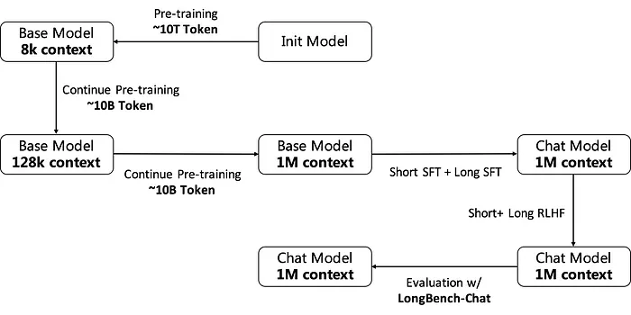

# 原理

Training Process：逐步激活并维持模型的长文本能力。

## Pretrain Data

对于第一阶段扩充到128K的训练数据，其组成主要包括以下几个部分：

- 原始分布的预训练数据包含大约 4B 个 token。
- 基于预训练数据，上采样长度超过8K的数据，大约是3B个token。
- 基于预训练数据，对长度超过 32K 的数据进行上采样，其中也包含约 3B 个 token。
- 在处理这两类上采样数据时，我们尽量保证每个长度区间内的token总数是一致的。

对于第二阶段扩充到 1M 的训练数据， 人工构造长文本数据：

这种类型的数据是通过拼接现有数据(包括来自预训练语料库和公开可用文档数据)，进行生成的。为了保证拼接数据的合理性，设计了两阶段聚类策略。

首先，我们对文档数据进行采样并使用语言模型对其进行分类。然后，在每个分类下，我们利用Embedding模型来得到数据的向量表示。

通过这种方法，我们确保了8K到1M长度范围内的总令牌数量平衡，从而生成所需的人工长文本数据。

- 原始分布的预训练数据包含大约 3.5B 个 token。

- 基于预训练数据，上采样长度超过8K的数据，约为1.5B个token。

- 基于预训练数据，上采样长度超过32K的数据，约为1.5B个token。

- 基于预训练数据，对长度超过128K的数据进行上采样，这也约为1.5B个token。

- 人工长文本数据，大约包含2B个token。

## Training

上文packing 策略：packing training strategy with Attention separation

## Sft Data

人工标注：与仅需从文档中提取信息片段以回答的问题相比，复杂问题需要从文档中提取多个事实来回答，能够更有效地激发模型的长文本推理能力。对此，我们根据长文本的实际应用场景筛选并区分了相应的数据源和任务类型，并指导标注员尽可能标注复杂的问题及其相应的答案，从而构建了我们的长文本SFT数据集。考虑到标注的难度和成本，我们仅标注长度在128K以内的数据。

## 短窗口模型标注(SCM)：

Single chunk self-instruct, SCI: 从给定的文本中随机选择一个片段，其长度与SCM模型的上下文窗口匹配。从多个长文本任务模板中选择一个，并让SCM模型生成一个具有挑战性的问题及其答案。最终的SFT数据由原始文本、问题和答案连接而成。

Multi- chunk self-instruct ( MCI):从给定的文本中随机选择多个片段。这些片段的总长度相当于SCM模型的上下文窗口，如果文本由多个文档组成，则这些片段应在每个文档中均匀分布。然后，从长文本任务模板中选择一个，并让SCM模型生成一个需要综合多个片段信息的问题及其答案。最终的SFT数据也由原始文本、问题和答案组成。

Multi-level summary: 在给定的文本中，根据摘要任务模板选择一个，将文本分成多个短于SCM上下文窗口的片段，并要求SCM模型为每个片段生成摘要。最后，对这些摘要进行总结，并根据任务模板中的提示生成答案。最终的SFT数据由原始文本、问题和答案连接而成。

为了验证这些方法的有效性，我们使用长度为128K的标注SFT数据训练了一个具有16K上下文窗口的模型作为SCM模型，并自动生成了新的128K长度的SFT数据。在LongBench-Chat等下游评估集上的实验结果表明，使用新的128K长度SFT数据训练的模型与使用标注的128K长度SFT数据训练的模型性能相似，证明了我们基于SCM模型的方法可以几乎无损地构建更长的SFT数据。

## Training

结合了Packing和Sorted Batching的优势，提出了Sorted Packing训练方法。根据计算复杂度, 在同一个批次内构建包，以确保同一个批次中每个包的计算复杂度相似，从而减少气泡时间。此外，我们引入了层累积技术以避免排序带来的偏差。

RLHF(DPO)

我们使用与短文本相同的奖励模型对长文本的答案进行评分。为了避免超过奖励模型的上下文限制，我们只保留问题和答案，并丢弃等长的输入。我们还尝试使用GLM4–128K等语言模型作为长文本的奖励模型，根据所有输入自动生成最终答案的排名。然而，实验结果表明，当直接使用长文本语言模型作为奖励模型时，结果波动很大，并未产生预期的效果，因此最好直接使用短文本的奖励模型。我们认为，训练长文本奖励模型对于长文本RLHF至关重要。然而，目前长文本奖励模型的数据标注极其困难，我们仍需继续探索，以找到一种合理的方式来训练长文本奖励模型。

Training of the Infra

在长文本训练大型模型的过程中，基础设施面临的主要挑战是中间变量激活（Activation）的内存使用量显著增加。然而，在分析现有的主流3D并行策略后，我们发现它们在解决这个问题上都存在一定的不足。

张量并行（Tensor Parallel, TP）：这种方法可以减少激活内存的使用，但由于通信量巨大，通常不适合跨机器使用，并且并行度一般不超过8。

管道并行（Pipeline Parallel, PP）：为了保持效率，通常需要增加微批次大小，但这样做虽然能确保效率，却对降低激活内存使用量没有明显效果。

数据并行（Data Parallelism, DP）：无法减少单个数据样本的激活内存使用量。

为了解决这个问题，一种名为序列并行（Sequence Parallelism）的新并行方法被提出。其核心动机在于，在Transformer架构中，令牌（tokens）仅在执行注意力计算时需要相互交互，而在其他部分，令牌是相互独立的。基于这一观察，序列并行仅在注意力部分进行并行处理，而在其他模块中，将长序列视为多个数据片段，类似于数据并行DP进行处理。

序列并行的主流实现有两种，分别是 Ring Attention 和 DeepSpeed Ulysses

Ring Attention：

优点：并行扩展性好，没有明显的限制；在使用GQA（Grouped Query Attention）时，通信仅限于组内的kv（key-value），通信量相对较小。、缺点：需要良好的计算与通信掩码（masking）来实现高效率；对稀疏注意力（Sparse Attention）和其他注意力变体的修改不够友好，侵入性地修改了注意力的实现。

DeepSpeed Ulysses：

优点：对注意力实现的修改不具有侵入性，对各种稀疏注意力（Sparse Attention）及相关变化相对友好；通信频率较低。

缺点：所有并行副本需要完整的模型参数，对ZeRO（Zero Redundancy Optimizer）之外的并行切片策略不够友好；并行度相对有限，一般不超过GQA（Grouped Query Attention）组的数量，否则需要额外的通信。
# 参考

[1] 一网打尽长文本训练技术，https://mp.weixin.qq.com/s/7vr-JalvF94fxevOIcZDYQ
