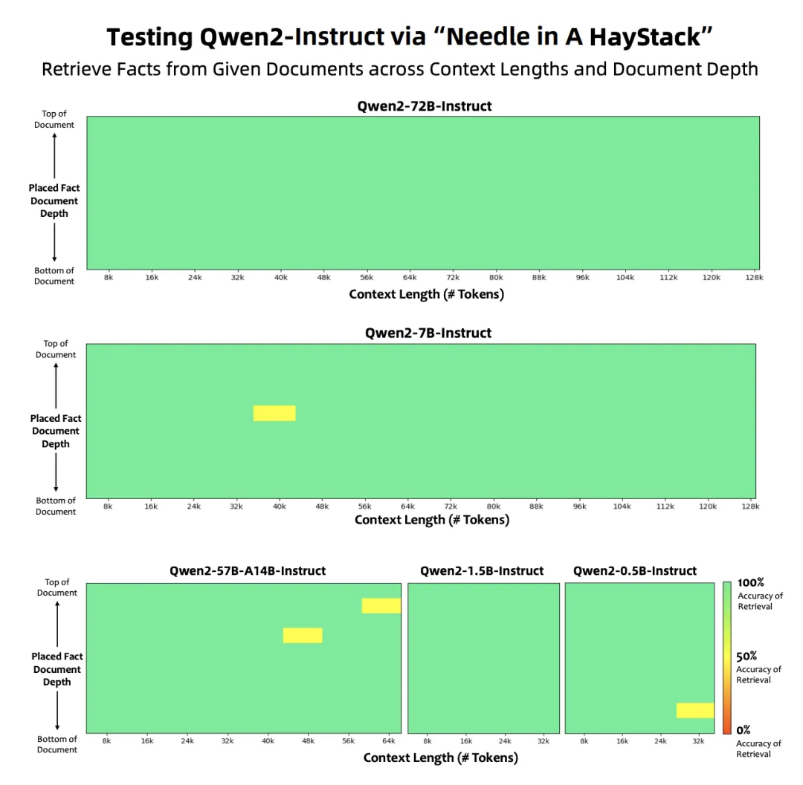

# 0. 相关链接
- QWEN2 TECHNICAL REPORT：https://arxiv.org/pdf/2407.10671

- Qwen2 代码库：https://github.com/QwenLM/Qwen2

- Qwen2 模型权重：https://huggingface.co/Qwen

- Qwen2 项目主页：https://qwenlm.github.io/

# 1. 简介

- 阿里巴巴开源了全新的 Qwen2 系列大语言模型，参数量高达 72B，包含密集模型和专家混合模型 (MoE)。

- Qwen2 在语言理解、生成、多语言能力、编码、数学和推理等多个基准测试中均取得了卓越的表现，超越了 Llama-3 等现有开源模型，甚至超越了部分专有模型。

- Qwen2 支持 30 多种语言，并拥有强大的长文本处理能力，最高可支持 128K Tokens 的上下文长度。

- Qwen2 系列包含多种规模的模型，包括专为便携设备设计的轻量级模型。

# 2. 模型架构

模型架构：精雕细琢，性能更上一层楼
Qwen2 系列模型基于 Transformer 架构，并采用了一系列先进的技术，例如分组查询注意力（GQA）、双块注意力机制（DCA）、YARN 机制等，有效地提高了模型的性能和效率。

分组查询注意力（GQA）：优化推理效率
Qwen2 采用了 GQA 来代替传统的 multi-head attention (MHA)。GQA 优化了推理过程中的 KV 缓存使用，显著提高了吞吐量，使得模型在处理长文本时更加高效。

双块注意力机制（DCA）：提升长文本理解能力
为了提升长文本理解能力，Qwen2 采用了 DCA 机制，将长序列分割成可管理长度的块，有效捕获块内和块间标记之间的相对位置信息，提高了长上下文性能。如果输入文本可以在一个块内处理，DCA 的结果与原始注意力机制相同。而当输入文本长度超过一个块时，DCA 则能够有效地捕捉块之间的相对位置信息，从而提升长文本理解能力。

YARN 机制：更强大的长度外推能力
为了获得更好的长度外推能力，Qwen2 采用了 YARN 机制，重新缩放注意力权重，使得模型能够处理更长的上下文信息。YARN 通过对注意力权重进行重新缩放，使得模型在处理超出预训练长度的文本时，依然能够保持较高的性能，从而提升了模型的长度外推能力。

专家混合模型 (MoE)：以一当十，更高效更灵活

Qwen2 不仅包含了传统的密集模型，还包含了专家混合模型 (MoE)。MoE 模型通过将模型划分为多个专家，并根据输入文本的特性选择性地激活部分专家，从而在保证性能的同时，显著降低了计算成本。

Qwen2-57B-A14B 作为一个 MoE 模型，总参数量为 57B，但在每次前向传播过程中，只激活 14B 的参数，却能够达到与 30B 参数密集模型相当的性能，在编码和数学任务上表现尤为出色。这得益于其独特的细粒度专家机制。与传统的 MoE 模型不同，Qwen2-57B-A14B 采用了更细粒度的专家划分方式，创建了规模更小的专家，并同时激活更多专家，使得模型能够更灵活地利用专家，从而提高整体性能和适应性。此外，Qwen2-57B-A14B 还引入了共享专家机制，部分专家可以被所有任务共享，而其他专家则专门用于特定的路由场景，进一步提升了模型的效率和灵活性。

# 3. 数据

Qwen2 系列模型在超过 7 万亿个标记的大规模高质量数据集上进行训练，涵盖了广泛的领域和语言

与 Qwen1.5 相比，Qwen2 的训练数据规模更大，质量更高，多样性更丰富。Qwen2 团队开发了一个全新的多语言数据集，包含了更大规模的高质量代码、数学和多语言数据，以增强模型在各个领域的能力。为了保证训练数据的质量，Qwen2 团队采用了更加严格的数据过滤算法，并利用 Qwen 模型本身来识别和过滤低质量的数据。此外，Qwen2 团队还利用 Qwen 模型合成了部分高质量的训练数据，进一步提升了训练数据的规模和质量。

# 4. 长文本

与 Qwen1.5 相比，Qwen2 的训练数据规模更大，质量更高，多样性更丰富。Qwen2 团队开发了一个全新的多语言数据集，包含了更大规模的高质量代码、数学和多语言数据，以增强模型在各个领域的能力。为了保证训练数据的质量，Qwen2 团队采用了更加严格的数据过滤算法，并利用 Qwen 模型本身来识别和过滤低质量的数据。此外，Qwen2 团队还利用 Qwen 模型合成了部分高质量的训练数据，进一步提升了训练数据的规模和质量。

图 1: Qwen2 指令微调模型在 "Needle in a Haystack" 测试中的表现。

# 5. 多语言支持：30 多种语言，无缝切换

更令人惊喜的是，Qwen2 还支持 30 多种语言，并在多语言基准测试中取得了优异的成绩，展现出强大的跨语言理解和生成能力。这意味着 Qwen2 可以为全球用户提供更加便捷、高效的 AI 服务。

Qwen2 的多语言能力得益于其训练数据的覆盖范围和质量。Qwen2 的训练数据涵盖了 30 多种语言，并经过了严格的筛选和清洗，保证了数据的质量和一致性。此外，Qwen2 团队还采用了多语言联合训练的方式，使得模型能够更好地学习不同语言之间的共性和差异性，从而提升了模型的多语言理解和生成能力。

# 参考

[1] Qwen2 技术报告：阿里巴巴开源全新一代大语言模型，性能超越 Llama-3!，https://mp.weixin.qq.com/s/uIifp77Uof4MuY0t9QozRg