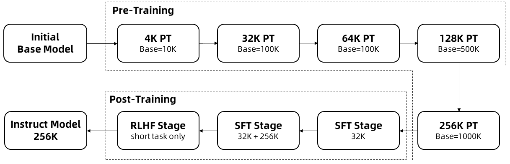
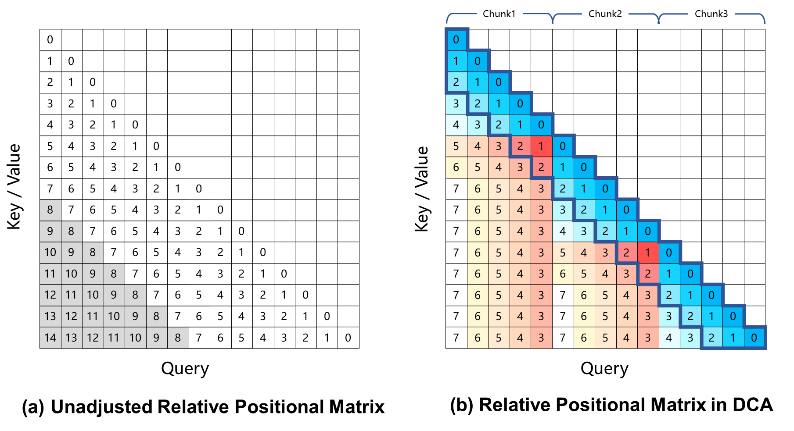
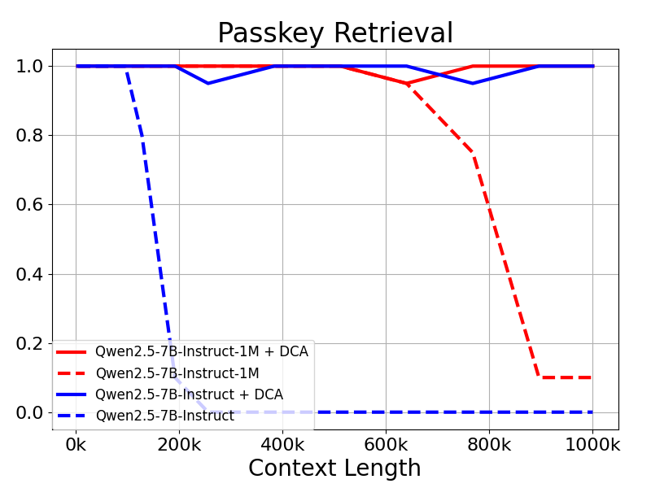
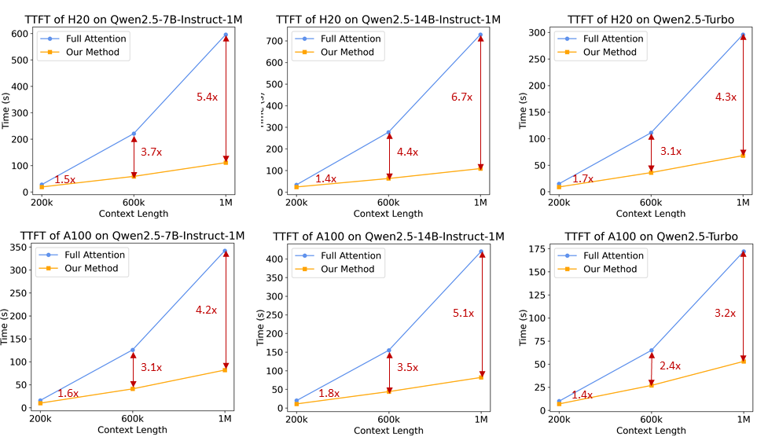
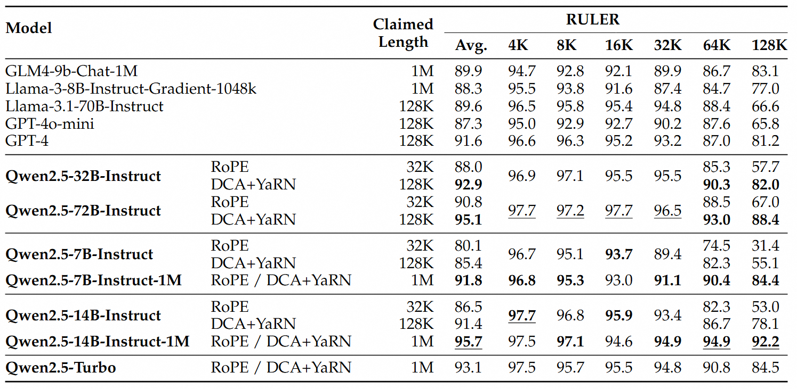
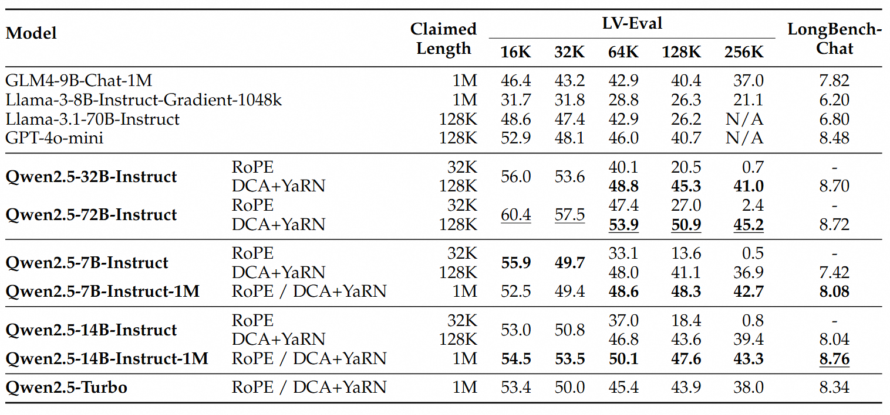
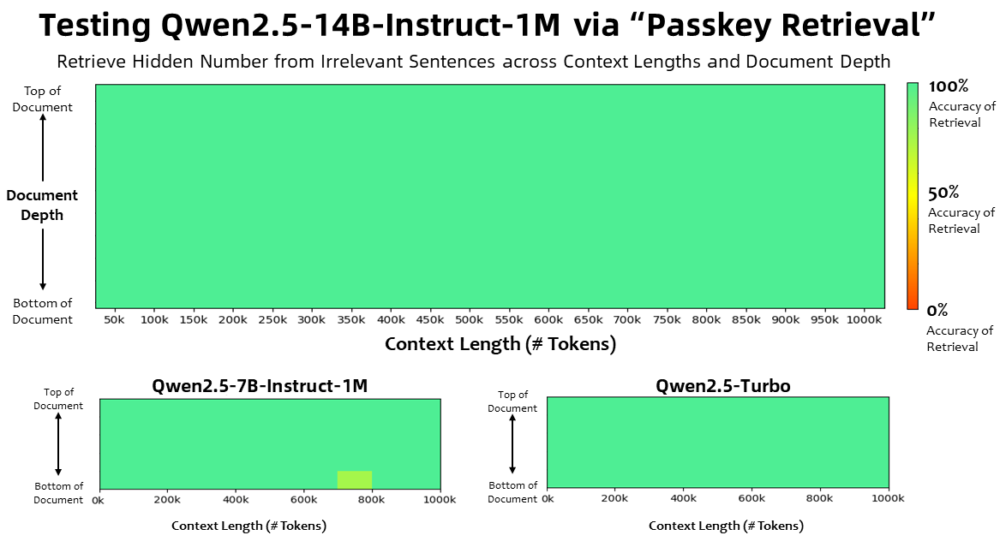
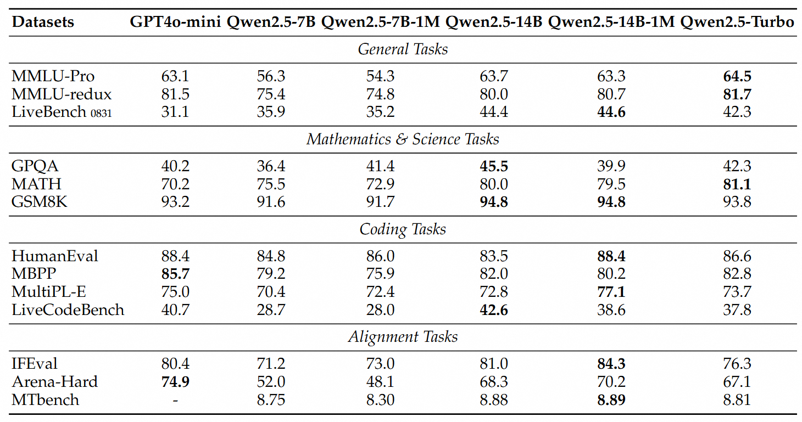
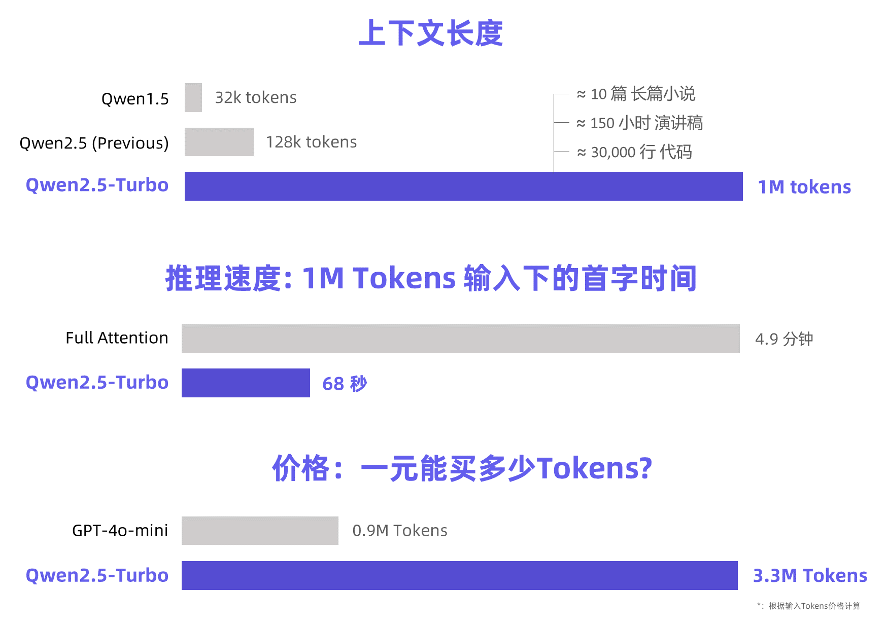

# 1. 资源

**论文及技术报告**
- Qwen2.5-1M: Deploy Your Own Qwen with Context Length up to 1M Tokens
  - https://qwenlm.github.io/blog/qwen2.5-1m/
- Qwen2.5-1M Technical Report
  - arXiv: https://qianwen-res.oss-cn-beijing.aliyuncs.com/Qwen2.5-1M/Qwen2_5_1M_Technical_Report.pdf

**代码**
- Github (15.6k stars):https://github.com/QwenLM/Qwen2.5
- 千问使用文档：https://qwen.readthedocs.io/en/latest/deployment/vllm.html

**相关技术论文**
- MInference 1.0: Accelerating Pre-filling for Long-Context LLMs via Dynamic Sparse Attention
  - https://arxiv.org/abs/2407.02490
  - NeurIPS 2024, Microsoft
- Training-Free Long-Context Scaling of Large Language Models
  - https://arxiv.org/abs/2402.17463
  - 2024.2.27, Alibaba
- Effective Long-Context Scaling of Foundation Models
  - https://arxiv.org/abs/2309.16039
  - 2023.9.27, GenAI, Meta

# 2. 原理

**长上下文训练**

长序列的训练需要大量的计算资源，因此我们采用了逐步扩展长度的方法，在多个阶段将 Qwen2.5-1M 的上下文长度从 4K 扩展到 256K：

- 我们从预训练的Qwen2.5的一个中间检查点开始，此时上下文长度为4K。
- 在预训练阶段，我们逐步将上下文长度从 4K 增加到 256K，同时使用Adjusted Base Frequency的方案，将 RoPE 基础频率从 10,000 提高到 10,000,000。
- 在监督微调阶段，我们分两个阶段进行以保持短序列上的性能：
  - 第一阶段： 仅在短指令（最多 32K 长度）上进行微调，这里我们使用与 Qwen2.5 的 128K 版本相同的数据和步骤数，以获得类似的短任务性能。
  - 第二阶段： 混合短指令（最多 32K）和长指令（最多 256K）进行训练，以实现在增强长任务的性能的同时，保持短任务上的准确率。
- 在强化学习阶段，我们在短文本（最多 8K 长度）上训练模型。我们发现，即使在短文本上进行训练，也能很好地将人类偏好对齐性能泛化到长上下文任务中。

通过以上训练，我们最终获得了 256K 上下文长度的指令微调模型。

**长度外推**

在上述训练过程中，模型的上下文长度仅为 256K 个 Tokens。为了将其扩展到 1M ，我们采用了长度外推的技术。

当前，基于旋转位置编码的大型语言模型会在长上下文任务中产生性能下降，这主要是由于在计算注意力权重时，Query 和 Key 之间的相对位置距离过大，在训练过程中未曾见过。为了解决这一问题，我们引入了Dual Chunk Attention (DCA)，该方法通过将过大的相对位置，重新映射为较小的值，从而解决了这一难题。

我们对 Qwen2.5-1M 模型及之前 128K 的版本进行了评估，分别测试了使用和不使用长度外推方法的情况。

结果表明：即使是仅在 32K 长度上训练的 Qwen2.5-7B-Instruct，在处理 1M 上下文的 Passkey Retrieval 任务中也能达到近乎完美的准确率。这充分展示了 DCA 在无需额外训练的情况下，也可显著扩展支持的上下文长度的强大能力。

**稀疏注意力机制**

对于长上下文的语言模型，推理速度对用户体验至关重要。为了加速预填充阶段，我们引入了基于 MInference 的稀疏注意力优化。在此基础上，我们还提出了一系列改进：

分块预填充： 如果直接使用模型处理长度100万的序列，其中 MLP 层的激活权重会产生巨大的显存开销。以Qwen2.5-7B 为例，这部分开销高达 71GB。通过将分块预填充（Chunked Prefill）与稀疏注意力适配，可以将输入序列以 32768 长度分块，逐块进行预填充，MLP 层激活权重的显存使用量可减少 96.7%，因而显著降低了设备的显存需求。

集成长度外推方案： 我们在稀疏注意力机制中进一步集成了基于 DCA 的长度外推方案，这使我们的推理框架能够同时享受更高的推理效率和长序列任务的准确性。

稀疏性优化： 原始的 MInference 方法需要进行离线搜索以确定每个注意力头的最佳稀疏化配置。由于全注意力权重对内存的要求太大，这种搜索通常在短序列上进行，不一定能在更长序列下起到很好的效果。我们提出了一种能够在100万长度的序列上优化稀疏化配置的方法，从而显著减少了稀疏注意力带来的精度损失。

其他优化： 我们还引入了其他优化措施，如优化算子效率和动态分块流水线并行，以充分发挥整个框架的潜力。

通过这些改进，我们的推理框架在不同模型大小和 GPU 设备上，处理 1M 长度输入序列的预填充速度提升了 3.2 倍到 6.7 倍。

# 3. 测试

对于更复杂的长上下文理解任务，我们选择了RULER、LV-Eval 和 LongbenchChat，这些测试集也在此博客中进行了介绍。

我们选取了若干长文本任务数据集对模型进行了测试，包括：

- RULER：在大海捞针基础上的扩展基准，任务包括在无关上下文中查找多“针”或回答多个问题，或找到上下文中出现最多或最少的词。数据的上下文长度最长为 128K。
- LV-Eval：要求同时理解众多证据片段的基准测试。我们对 LV-Eval 原始版本中的评估指标进行了调整，避免因为过于严苛的匹配规则所导致的假阴性结果。数据的上下文长度最长为 256K。
- LongbenchChat：一个评价长文本任务中人类偏好对齐的数据集。数据的上下文长度最长为 100K。

短序列任务

我们可以发现：

- Qwen2.5-7B-Instruct-1M 和 Qwen2.5-14B-Instruct-1M 在短文本任务上的表现与其128K版本相当，确保了基本能力没有因为增加了长序列处理能力而受到影响。
- 与 GPT-4o-mini 相比，Qwen2.5-14B-Instruct-1M 和 Qwen2.5-Turbo 在短文本任务上实现了相近的性能，同时上下文长度是 GPT-4o-mini 的八倍。

# 4. 推理引擎

Qwen2.5-Turbo （可能未开源，或者指的其VLLM版本，其vllm版本未合入主线）

- 更长的上下文支持: 我们首次将模型的上下文长度从 128k 扩展到 1M，该长度约为 100 万个英文单词或 150 万个汉字，相当于 10 本长篇小说，150 小时的演讲稿，3 万行代码。该模型能在 1M 长度的大海捞针 (Passkey Retrieval) 任务中实现 100% 的准确率，在长文本评测集 RULER 上获得 93.1 分，超越 GPT-4 的 91.6 分，GLM4-9B-1M 的 89.9 分。此外，在短序列能力上，该模型仍然保持了非常强的竞争力，与 GPT-4o-mini 持平。
- 更快的推理速度: 利用稀疏注意力机制，我们成功将处理 1M tokens 上下文时的首字返回时间从 4.9 分钟降低到68秒，实现 4.3 倍加速比。
- 更低的价格：价格仍为 0.3元 / 1M tokens。在相同成本下，Qwen2.5-Turbo 相比 GPT-4o-mini 能够处理 3.6 倍的 Token。

# 参考

[1] Qwen2.5-1M: 支持100万Token上下文的开源Qwen模型, https://qwenlm.github.io/zh/blog/qwen2.5-1m/