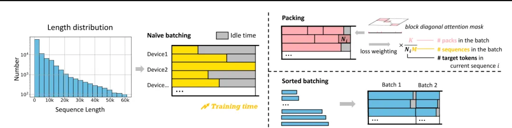
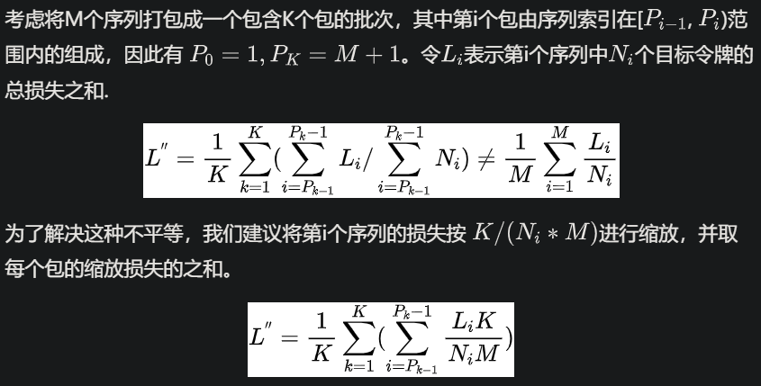
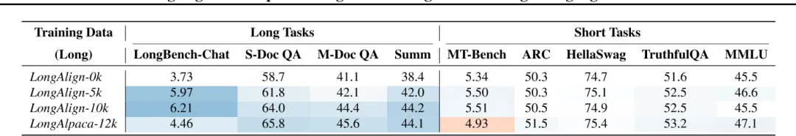
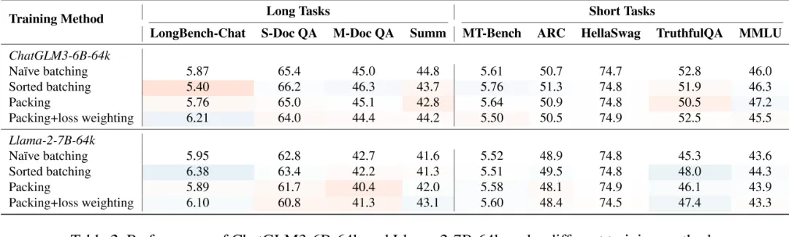
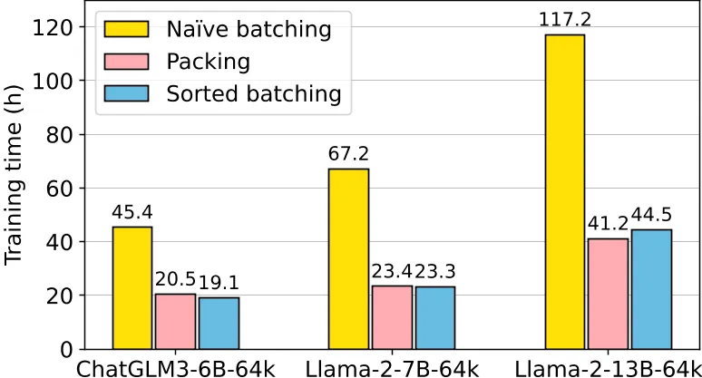

# 1. 资源

论文解读：LongAlign: A Recipe for Long Context Alignment of Large Language Models

# 2. 摘要：

扩展大型语言模型以有效地处理长上下文需要对相似长度的输入序列进行指令微调。为了解决这个问题，我们提出了 LongAlign——一种用于长上下文对齐的指令数据、训练和评估的配方。首先，我们使用 Self-Instruct 构建了一个长指令跟踪数据集。为了确保数据的多样性，它涵盖了来自各种长上下文源的广泛任务。其次，我们采用packing和sorted batching策略来加速对不同长度分布的数据的监督微调。此外，我们开发了一种loss weighting方法来平衡打包训练期间不同序列损失的贡献。第三，我们介绍了 LongBench-Chat 基准，用于评估长度为 10k-100k 的查询上的指令跟踪能力。实验表明，LongAlign 在长上下文任务中的表现优于现有的 LLM 配方高达 30%，同时还保持了它们在处理短文本 ， 通用任务的熟练程度。

Introduction

- 长指令数据的数量和多样性都显着影响对齐模型处理长上下文的能力。
- 长指令数据量对长上下文任务的性能产生积极影响，而不会影响模型的一般能力。
- 采用的packing和sorted batching策略可以在不损害性能的情况下将训练速度提高了 100% 以上。所提出的loss weighting技术将长上下文性能提高了 10%
- 数据：从 9 种数据源收集长句子，采用 Self-Instruct  方法，生成 10K 指令数据(长度区间 8k - 64k )。
- 计算效率：将序列打包在一起，直到最大长度。当包含不同数量的序列的包被分配相同的权重时，会引入bias.  即：含有 target token越多的序列包 ，对梯度贡献就越大，因此提出    loss weighting 平衡策略，来平衡不同序列的贡献。
- 评估：LongBench-Chat 它涵盖了指令跟随能力的不同方面，例如长上下文中的推理、编码、摘要和多语言翻译。
- 数据：缺乏用于长指令跟随监督微调的数据集，缺乏构建此类数据的方法。
- 计算效率：长上下文数据的长度分布差异显著降低了传统批处理方法在多 GPU 设置下的训练效率，因为处理较短输入的 GPU 必须在等待处理较长输入的 GPU 完成任务，在此期间保持空闲。
- 评估：迫切需要一个强大的基准来评估llm对现实世界查询的长上下文能力。

# 3. 长文本训练挑战：

解决方案：

- 数据：从 9 种数据源收集长句子，采用 Self-Instruct 方法，生成 10K 指令数据(长度区间 8k - 64k )。
- 计算效率：将序列打包在一起，直到最大长度。当包含不同数量的序列的包被分配相同的权重时，会引入bias. 即：含有 target token越多的序列包 ，对梯度贡献就越大，因此提出 loss weighting 平衡策略，来平衡不同序列的贡献。
- 评估：LongBench-Chat 它涵盖了指令跟随能力的不同方面，例如长上下文中的推理、编码、摘要和多语言翻译。

发现：

- 长指令数据的数量和多样性都显着影响对齐模型处理长上下文的能力。
- 长指令数据量对长上下文任务的性能产生积极影响，而不会影响模型的一般能力。
- 采用的packing和sorted batching策略可以在不损害性能的情况下将训练速度提高了 100% 以上。所提出的loss weighting技术将长上下文性能提高了 10%

LongAlign

数据构造：

采用四种类型的任务提示来鼓励 Claude 产生更多样化的指令数据。General 、 Summary 、Reasoning 、Information extraction。例如：

```text
User:In my younger and more vulnerable years my father gave mesome advice that I've been turning over in my mind ever since....

Given the above text, please propose 5 English questions thatrequire summarization or integration from multiple parts,make sure they are diverse and cover all parts of the text, inthe following format: "1: ", "2: ", ...

Assistant:1. Summarize the plots between Gatsby and Daisy...
```

训练策略：

混合训练：长指令数据与通用指令数据集混合进行训练。

Packing：



Figure 3. Under a long-tailed data length distribution, packing or sorted batching can reduce idle time and speed up the training process. Loss weighting is required during packing to balance the loss contribution across sequences.
图 3. 在长尾数据长度分布下，打包或排序批处理可以减少空闲时间并加快训练过程。打包期间需要进行损失加权，以平衡序列之间的损失贡献。

为了防止自注意计算过程中同一包内不同序列之间的交叉污染，我们通过一个包含不同序列的开始和结束位置的列表，并利用FlashAttention 2中的flash_attn_varlen_func，支持块对角注意的高效计算。与传统的使用 2D 注意掩码相比，它需要更少的计算和 IO 时间。（在打包训练期间，对于每批数据，我们传递一个特殊的一维注意掩码。在这个掩码中，第 i 个元素表示批次中第 i 个序列的起始索引。掩码的第一个元素为 0，最后一个元素等于 batch_size×seq_len。在注意力计算过程中，我们使用来自 FlashAttention 2 的 flash_attn_varlen_func 函数，并将注意力掩码传递给函数的 cu_seqlens_q 和 cu_seqlens_k 参数。该函数在掩码中相邻元素的开始和结束索引之间的序列中执行注意力计算）

loss weighting：

原因：在计算每个批次的平均损失时，包含较少序列的包（通常是较长的序列）或包含更多目标令牌的序列，对最终损失的影响更大。



Sorted batching:

为了确保每批中的序列长度相似，我们按长度对数据进行排序，并为每个批次选择一个随机连续的数据组，没有重复.然而，这种策略不可避免地会在不同批次的数据分布中引入偏差，其中批次由所有长序列或所有短序列组成。

解决方法: 梯度累积

LongBench-Chat

50 个长上下文真实世界查询，长度从 10k 到 100k. 涵盖各种关键的用户密集型场景，例如文档 QA、摘要和编码。避免在预训练期间使用模型可能看到和记忆的流行长文本。

实验：

Q1 :  在SFT期间，长指令数据的数量和多样性如何影响模型在下游任务中的性能。

Q2 : 在训练期间结合长指令数据是否会影响模型在短上下文场景中的通用能力及其指令跟随/会话能力。



Table 1. Performance of ChatGLM3-6B-64k after training on different quantities and types of long instruction data. The blue-to-red color transition indicates the level of performance, i.e., deeper blue signifies higher performance, while deeper red indicates lower performance, compared to the baseline method (LongAlign-0k).
结论：较长的指令数据提高了长任务的性能，而不影响短任务的性能，长指令数据的多样性有利于模型的指令跟随能力。

Q3 :  打包和排序批处理训练方法对模型的训练效率和模型最终性能的影响。





结论：打包和排序批处理使训练效率加倍，同时表现出良好的性能。损失加权显著提高了打包训练中长指令任务的表现。

# 参考

[1] 一网打尽长文本训练技术，https://mp.weixin.qq.com/s/7vr-JalvF94fxevOIcZDYQ
