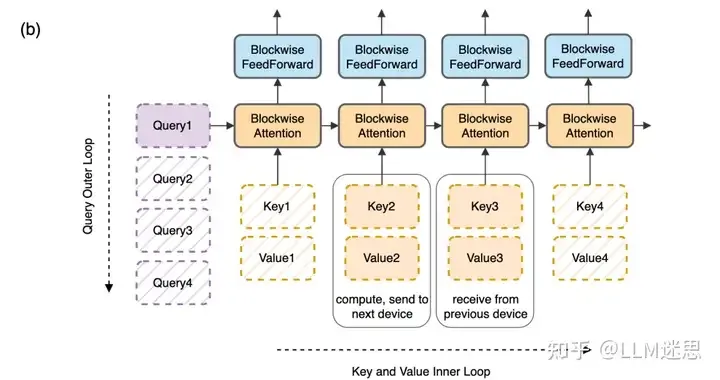
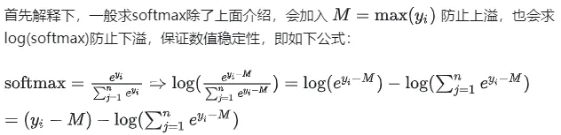
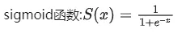

# 1. 原理解释

Ring Attention 的主体思想很简单，就是将QKV三个矩阵在sequence维度切分，再通过ring的方式进行计算。



不同于Colossal-AI的序列并行，Colossal-AI序列并行使用两次ring通信使中间结果还是未切分状态，可以正常进行softmax的计算。但 Ring Attention 是通过一次ring通信，故在实现softmax的方式上借鉴了flash-attention的实现需要进行修正操作，从而达到正确的self-attention的计算。


# 公式推导
## 2.1 Ring Attention公式推导

这里主体参考：https://zhuanlan.zhihu.com/p/683714620，增加细节推导过程。
一般的self-attention为：


同理得到


## 2.2 Ring Attention + Flash Attention 公式推导
flash attention 在算_flash_attn_forward 时会返回 softmax_lse_per_step（此部分为transformer_engine中间结果的名称），而softmax_lse_per_step就是 。

逻辑有些突兀，下面细致串联下逻辑。



这里再说明下为什么flash attention会返回softmax_lse。


列举下面的公式：


这里有个疑问，为什么需要如此繁重的化简？答案是化简后可以在实现上相对使用更大的kernel（但也不一定，也有可能调度api是小kernel的组合）。

注意:



```python
# new_lse = lse + torch.log(1 + torch.exp(block_lse - lse))
    # out = torch.exp(lse - new_lse) * out + torch.exp(block_lse - new_lse) * block_out
  
    # out = out - F.sigmoid(block_lse - lse) * (out - block_out) # 实现1
    out = block_out + F.sigmoid(lse - block_lse) * (out - block_out)# 实现2 #attn1...n
    lse = lse - F.logsigmoid(lse - block_lse) #B1...n
```

从上面的实现可以看到化简后，调用的kernel更少，效率更高。至此Ring Attention + Flash Attention的前向实现推导圆满结束。在transformer_engine中，Ring Attention + Flash Attention实现采用了上面的整体思路，但是其未对kernel进行化简，使用了类似上面注释部分的逻辑，有兴趣可以参考https://link.zhihu.com/?target=https%3A//github.com/zhuzilin/ring-flash-attentiong-flash-attention的实现。


实现1和实现2的证明：

利用性质：


给定两个表达式：

```python
out=out−F.sigmoid(block_lse−lse)⋅(out−block_out)
out1=block_out+F.sigmoid(lse−block_lse)⋅(out−block_out)
```

我们可以通过代数操作来分析它们是否相等。

首先定义：

```text
σ(x)=F.sigmoid(x)
```

那么，第一个表达式可以写成：

```text
out=out−σ(block_lse−lse)⋅(out−block_out)
```

将其展开：

```text
out=out−σ(block_lse−lse)⋅out+σ(block_lse−lse)⋅block_out
```

重组：

```text
out=out⋅(1−σ(block_lse−lse))+block_out⋅σ(block_lse−lse)
```

第二个表达式：

```text
out1=block_out+σ(lse−block_lse)⋅(out−block_out)
```

将其展开：

```text
out1=block_out+σ(lse−block_lse)⋅out−σ(lse−block_lse)⋅block_out
```

重组：
    
```text
out1=block_out⋅(1−σ(lse−block_lse))+out⋅σ(lse−block_lse)
```

因此， (block_lse−lse)=1− (lse−block_lse)σ(block_lse−lse)=1−σ(lse−block_lse)。

将 σ(x)+σ(−x)=1代入，即：

```text
σ(block_lse−lse)=1−σ(lse−block_lse)
```

将这个性质代入第一个表达式的重组形式：

```text
out=out⋅σ(lse−block_lse)+block_out⋅(1−σ(lse−block_lse))
```

这与第二个表达式的重组形式相同：

```text
out1=block_out⋅(1−σ(lse−block_lse))+out⋅σ(lse−block_lse)
```

因此，两个表达式表示的是相同的结果，只是形式不同。

# 参考

[1] 聊聊Ring Attention + Flash Attention前向推导细节，https://mp.weixin.qq.com/s/GN4TNme2JAK6FHFGWIkOMQ
[2] 原文：https://zhuanlan.zhihu.com/p/709402194

https://blog.csdn.net/u014665013/article/details/1293006223/article/details/129300622

https://blog.csdn.net/qq_41475067/article/details/11713151667/article/details/117131516

https://zhuanlan.zhihu.com/p/6837146203714620

https://link.zhihu.com/?target=https%3A//github.com/zhuzilin/ring-flash-attention

https://arxiv.org/pdf/2310.01889

htthttps://arxiv.org/pdf/2105.13120