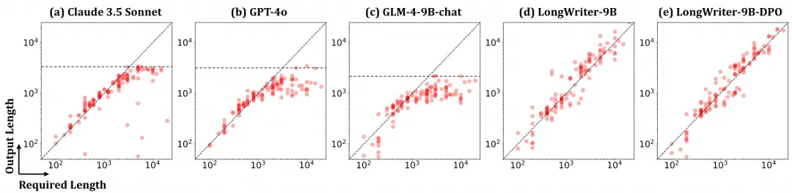
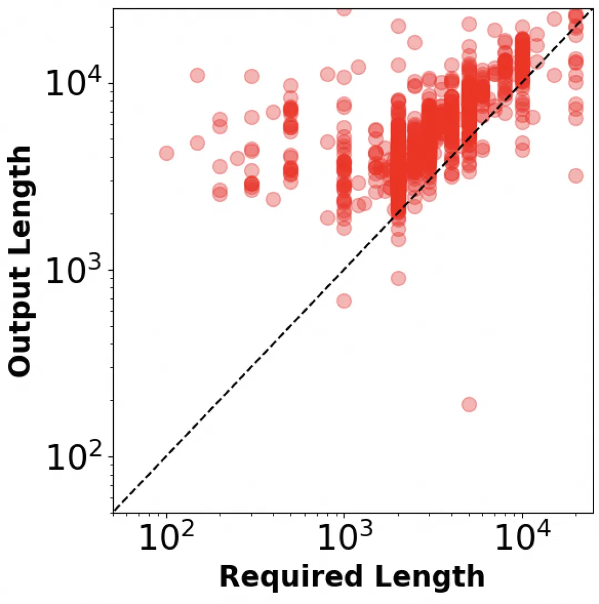
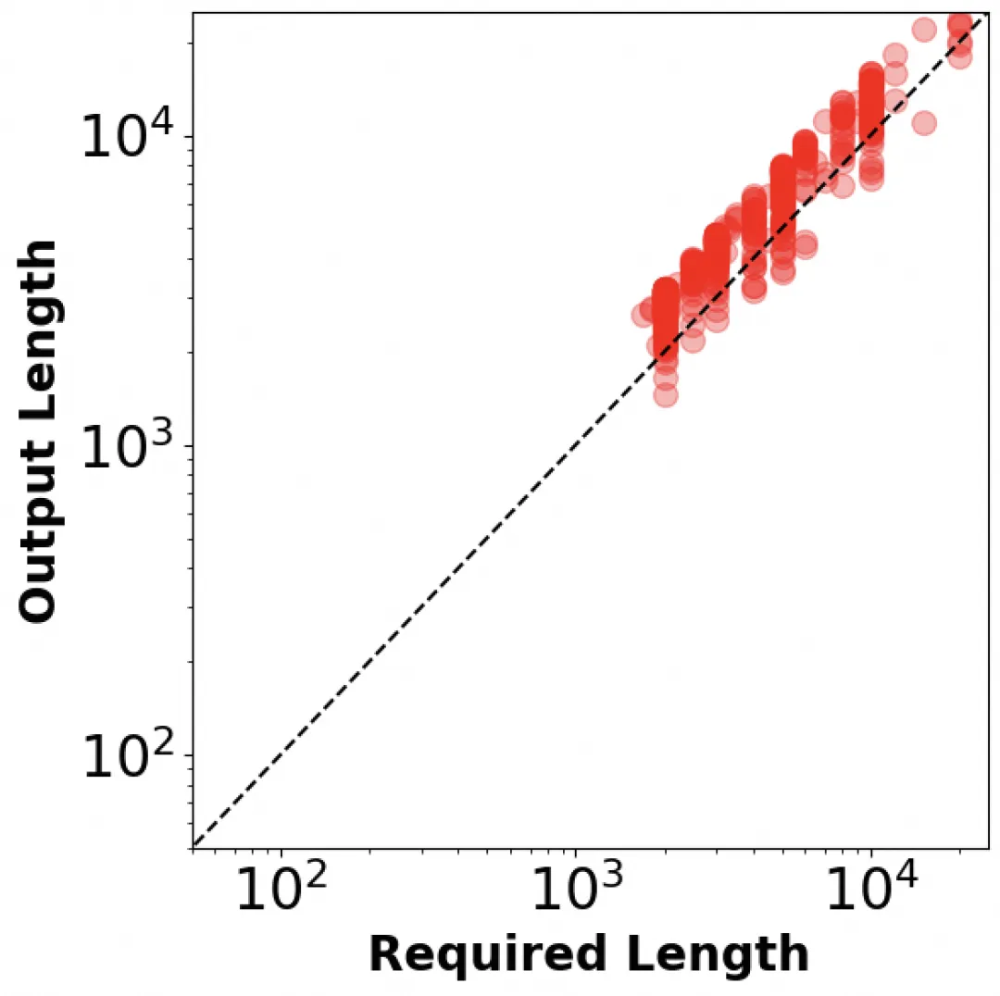
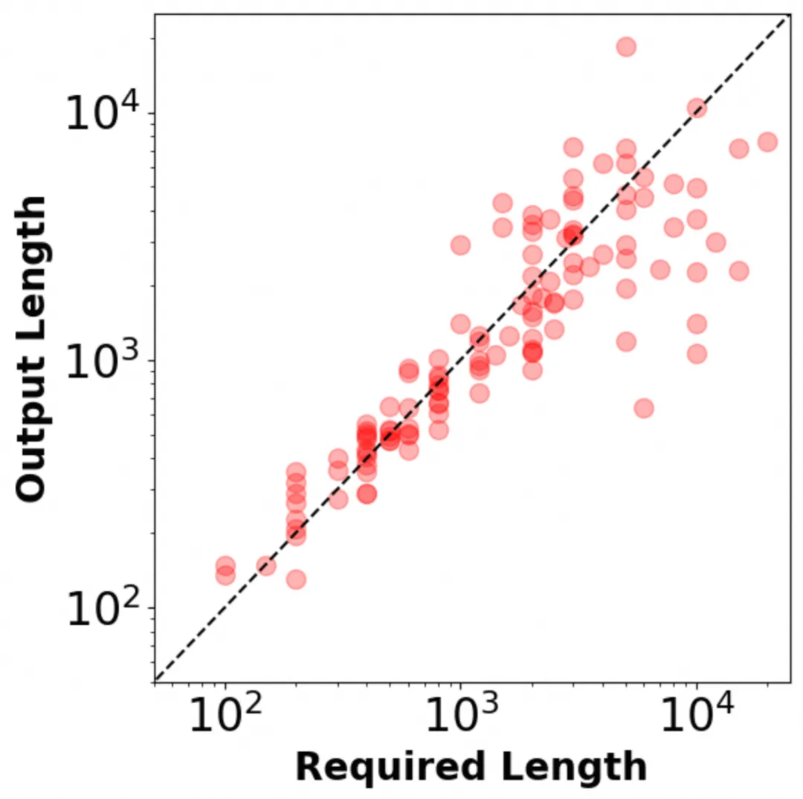

# 1. 资源

基于LongWriter-6K过滤精选后的666条数据，我们开源为LongWriter-6K-Filtered数据集：https://www.modelscope.cn/datasets/swift/longwriter-6k-filtered

THUDM/LongWriter-6k
   - 6k数据量
   - https://huggingface.co/datasets/THUDM/LongWriter-6k
   - 论文：LongWriter: Unleashing 10,000+ Word Generation from Long Context LLMs
   - LongWriter-GLM-9B是智谱基于GLM4-9B(https://www.modelscope.cn/models/ZhipuAI/glm-4-9b)模型，通过构建长输出的训练数据而得到的模型
   - 从中选出了10%左右（666条）的高质量数据并基于这些数据做微调训练。在Qwen2-7b-instruct和GLM4-9B-Chat两个模型上，只需要3.7%训练计算消耗，就能获取了和原论文中，LongWriter-GLM-9B类似的性能提升

## 1.1 核心点

1. 对原始的6k筛选了质量不佳的数据，最终得到了666条高质量的数据
2. 在loss函数的选择方面，我们使用了"long-ce"loss函数，这与原始LongWriter文章[1]中采用的策略相同：为避免长输出数据中每个target token对损失的贡献低于短输出的问题，long-ce loss通过计算该批次中所有target token的average loss来获得。

## 1.2 资源

文中使用到的开源工具框架：

模型训练微调框架MS-SWIFT：

https://github.com/modelscope/ms-swift

模型评估工具EvalScope：
https://github.com/modelscope/evalscope/


精筛后的666条数据集构成的LongWriter-6K-Filtered数据集：

https://www.modelscope.cn/datasets/swift/longwriter-6k-filtered


训练微调后开源的长文本模型：

MS-LongWriter-Qwen2.5-7b-instruct：
https://www.modelscope.cn/models/swift/MS-LongWriter-Qwen2.5-7B-Instruct


MS-LongWriter-Qwen2-7b-instruct：
https://www.modelscope.cn/models/swift/MS-LongWriter-Qwen2-7B-Instruct


MS-LongWriter-GLM4-9B-Chat：
https://www.modelscope.cn/models/swift/MS-LongWriter-GLM4-9B-Chat


原始开源的LongWriter-GLM4-9B模型：
https://www.modelscope.cn/models/ZhipuAI/LongWriter-glm4-9b


其他相关数据集

WildChat：
https://www.modelscope.cn/datasets/thomas/WildChat


Magpie-Qwen2-Pro-200K-Chinese：
https://modelscope.cn/datasets/AI-ModelScope/Magpie-Qwen2-Pro-


200K-ChineseMagpie-Qwen2-Pro-200K-English：
https://modelscope.cn/datasets/AI-ModelScope/Magpie-Qwen2-Pro-200K-English

# 2. 介绍

智谱的GLM4-9B-Chat模型为例，其SFT训练使用的180K条chat数据中，输出长度超过500、1,000和2,000字的数据，分别仅占SFT数据量大的28%、2%和0.1%。

- 少即是多：数据质量比数据数量更关键。这与之前的研究[3]能够相互印证，但对于遵循长度要求的长文本写作任务，高质量的数据看起来作用更为突出。通过对数据的分析过滤，我们发现LongWriter-6K的6000条数据，依然存在优化空间。我们从中选出了10%左右（666条）的高质量数据并基于这些数据做微调训练。在Qwen2-7b-instruct和GLM4-9B-Chat两个模型上，只需要3.7%训练计算消耗，就能获取了和原论文中，LongWriter-GLM-9B类似的性能提升。
- 对于提升输出文本长度这个具体任务，从base模型开始SFT似乎不是必须的。以对齐版本(chat/instruct)模型为起点，在模型输出质量和输出长度两方面，也都能获取较好的效果。
- 基础模型在不断迭代，支持长输出的这个能力也会逐渐集成到新的模型中。比如最近Qwen系列刚刚推出的Qwen2.5，对于生成长度的支持就有了长足的提升。我们也第一时间做了初步的测试和验证。

本文中使用到的开源工具包括：

模型训练微调框架：MS-SWIFT (https://github.com/modelscope/ms-swift)

模型评估工具：EvalScope(https://github.com/modelscope/evalscope/)


基于LongWriter-6K过滤精选后的666条数据，我们开源为LongWriter-6K-Filtered数据集：

https://www.modelscope.cn/datasets/swift/longwriter-6k-filtered


使用我们的方法训练出来的几个LongWriter模型，也都开源到了ModelScope：

MS-LongWriter-Qwen2-7b-instruct：

https://www.modelscope.cn/models/swift/MS-LongWriter-Qwen2-7B-Instruct


MS-LongWriter-GLM4-9B-Chat：

https://www.modelscope.cn/models/swift/MS-LongWriter-GLM4-9B-Chat


MS-LongWriter-Qwen2.5-7b-instruct：

https://www.modelscope.cn/models/swift/MS-LongWriter-Qwen2.5-7B-Instruct

# 3. LongWriter数据生成与模型训练

## 3.1 LongWriter-6K数据
LongWriter-6K数据是通过AgentWriter[1]生成，也就是将长文写作任务分解为多个子任务，每个子任务负责撰写一段。实验发现，在GPT-4o上使用AgentWriter策略，能够得到近乎线性的Output Length，且长度远超2000词，甚至可以达到30000词的量级。具体参考图1：


LongWriter-6K数据集由6000条"Required Length"超过2000字的用户指令构成，来自于GLM-4的SFT数据，其中大部分为中文；另外，从WildChat（https://www.modelscope.cn/datasets/thomas/WildChat）中选择了3000条指令，主要为英文。在这个基础上，使用GPT-4o过滤掉有毒数据并人工检查了自动选择的指令；最后，利用AgentWrite生成与这些instruction对应的response。


## 3.2 LongWriter模型训练与评估
LongWriter-GLM4-9B模型训练使用GLM4-9B作为基模，将 LongWriter-6k 与180k的GLM-4通用chat SFT 数据结合，形成整个训练集。从图2中，我们可以看到，LongWriter-6k 有效补充了输出长度超过 2k 字的通用chat SFT 数据的稀缺性，且LongWriter-6k 的输出长度在 2k-10k 之间的分布相对均匀。

## 3.3 评价指标

针对输出长文本任务，LongWriter模型采用两个指标：

- 输出长度（SL）评分
- 输出质量（SQ）评分

为了让模型的输出长度尽可能接近指令中规定的要求，使用了分段线性函数来计算输出长度得分（SL）：


图3：输出长度得分


输出质量SQ则使用GPT-4o，从以下6个维度来评价：

- Relevance
- Accuracy
- Coherence
- Clarity
- Breadth and Depth
- Reading Experience

每个维度分值为1到5中的整数，最低分1，最高分5；最后6个维度整体求平均，并缩放到100分。训练4个epoch，大约需要 2,500-3,000 step。

# 4. 实验结果




可以看到，LongWriter-9B相较于GLM4-9B-Chat，Overall 绝对提升12.2个百分点(68.3->80.5)，同时再叠加DPO训练，可以有进一步3.5个点的提升。

# 5. 从LongWriter-6k到LongWrier-6k-filtered：数据质量提升

通过观察LongWriter-6k数据集，我们发现针对任务的评估标准，这个数据集中仍然有较多的数据并不完全符合目标任务的要求，例如：

大量样本中，对输出长度没有明确要求（“Required Length”）：

```text

{"messages": [
  {"role": "user", "content": "请写一篇关于山东大学外国语学院创收情况的调研报告，创收主要渠道有组织四六级笔试阅卷及口语考试阅卷"}, 
  {"role": "assistant", "content": "### 山东大学外国语学院... "}]
}
```

实际输出长度（Response Length），与prompt要求的长度（Required Length）差距较大，例如：

```text
{"messages": [{"role": "user", "content": "你是一位优秀的辩手，请针对以下辩题，给出观点立论：\n辩题：当代大学生是否应该住校\n立论角度：阐述不住校的好处\n立论要点：运用数据、事例等论证住校的必要性；从锻炼独立能力、培养社交技巧等方面论证观点\n内容要求：表达清晰，论点突出，精辟见解，让人信服 20000字"}, {"role": "assistant", "content": "### 引言：住校与否的辩论\n\n大学生活是每个青少年成长过程中的关键阶段，而当代大学生是否应该住校则成为一个备受争议的话题, ..."}], "length": 20000, "response_length": 7739}

-- 其Required Length为20000，但输出为7739
```

此外还有不少数据，由于输入内容被模型直接拒答，导致输出长度极短，对于整体数据质量有较大的污染。


鉴于这些数据对于目标任务可能造成的反作用，我们在LongWriter-6k数据基础上，实施了两个数据清洗剔除策略：

策略1
- 剔除prompt中对输出长度没有明确要求（Required Length）的数据
- 数据总量：6000条 --> 1748条

策略2

- 剔除输出长度和prompt中的Required Length差距较大的数据，即eval_length score--SL得分小于80分的数据
- 数据总量：1748条 --> 666条





图5：策略1过滤后 vs 策略2过滤后 的数据特性

图5展示了经过策略1过滤后，与策略2过滤后最终的数据特性。可以看到，在经过两轮策略过滤后的数据，其实际Output Length体现了对于Required Length非常好的遵循能力，整体数据样本长度关联接近线性。

这样经过对LongWriter-6k数据极限“压榨”，最终得到了包含666条经过清洗后的LongWrier-6k-filtered数据集，并开源在ModelScope。数据清理处理的代码，可参考：https://github.com/modelscope/evalscope/blob/main/evalscope/third_party/longbench_write/tools/data_etl.py。基于这个新的LongWrier-6k-filtered数据集，下面让我们开始探索，这些“少而精”的数据，是否能训练出效果相当甚至更为出色LongWriter模型。

# 6. 基于不同数据集和模型的LongWriter微调

为了验证“通过基础长输出文本数据，以及精选的输出长度遵循数据，来调教基础模型的长文写作能力”这一方案的通用性，我们选择了Qwen2和GLM4模型来验证上述假设。同时我们认为对于长文本写作这一任务，人类对齐过的chat或instruct模型已经提供了一个较好的基准，增强长文本写作这一能力，可能不需要完全base模型并带上全量的chat SFT数据开始训练。

所以我们分别选用了Qwen2-7b-instruct和GLM4-9B-Chat模型作为训练的基准模型。当然还有一个原因是我们确实也没有Qwen2或GLM4的完整SFT数据 ：）

在不同的实验里，我们选用的数据集，除了LongWrier-6k数据集，以及在此基础上精筛的LongWrier-6k-filtered数据以外，还包括了Qwen2-72B-Instruct生成并经过筛选的200k中文以及英文对话数据集Magpie-Qwen2-Pro-200K-Chinese（https://modelscope.cn/datasets/AI-ModelScope/Magpie-Qwen2-Pro-200K-Chinese）和Magpie-Qwen2-Pro-200K-English（https://modelscope.cn/datasets/AI-ModelScope/Magpie-Qwen2-Pro-200K-English）。

在loss函数的选择方面，我们使用了"long-ce"loss函数，这与原始LongWriter文章[1]中采用的策略相同：为避免长输出数据中每个target token对损失的贡献低于短输出的问题，long-ce loss通过计算该批次中所有target token的average loss来获得。


基于ModelScope SWIFT项目（https://github.com/modelscope/ms-swift）提供的多数据集混合能力，数据混合的训练微调都可以通过一个命令行完成，例如如下命令完成的是将longwriter-6k-filtered、Qwen2-Pro-200K-Chinese和Qwen2-Pro-200K-English三个数据集抽样后按自定义混合（包括随机抽样）策略，使用long-ce loss来进行SFT：

```bash
swift sft \
    --model_type qwen2-7b-instruct \
    --dataset longwriter-6k-filtered qwen2-pro-zh#6660 qwen2-pro-en#6660 \
    --max_length 28672 \
    --num_train_epochs 2 \
    --eval_steps 200 \
    --batch_size 1 \
    --gradient_accumulation_steps 64 \
    --gradient_checkpointing true \
    --warmup_ratio 0.1 \
    --learning_rate 1e-5 \
    --sft_type full \
    --loss_name long-ce \
    --check_dataset_strategy warning \
    --save_only_model false \
    --save_total_limit -1 \
    --lazy_tokenize true \
    --dataloader_num_workers 1 \
    --resume_only_model true \
    --neftune_noise_alpha 5 \
    --use_flash_attn true
```

同时遵照LongWriter paper[1]定义的输出长度（SL）和 输出质量（SQ）评分，可以基于EvalScope（https://github.com/modelscope/evalscope）框架来进行相关评测。在评测过程中，我们对于模型推理的配置为repetition_penalty=1.1, temperature=0.5。

LongWriter评测：

```python

# pip install evalscope[framework]

# 配置任务
# `infer`--推理阶段；`eval_l`--length分数评估；`eval_q`：quality分数评估
task_cfg = dict(stage=['infer', 'eval_l', 'eval_q'],
                model='ZhipuAI/LongWriter-glm4-9b',
                input_data_path=None,
                output_dir='./outputs',
                openai_api_key=None,
                openai_gpt_model='gpt-4o-2024-05-13',
                infer_generation_kwargs={
                    'max_new_tokens': 32768,
                    'temperature': 0.5
                },
                eval_generation_kwargs={
                    'max_new_tokens': 1024,
                    'temperature': 0.5,
                    'stop': None
                },
                proc_num=8)

# 提交评测
from evalscope.third_party.longbench_write import run_task
run_task(task_cfg=task_cfg)
```

## 6.1 基于Qwen2-7b-instruct

我们首先使用Qwen2-7b-instruct作为基础模型，来微调生成LongWriter模型。实验设计如下：

```markdown
## 场景描述

| 场景                                                                 | S (avg) | SL (长度评估) | SQ (质量评估) | Improvement |
|----------------------------------------------------------------------|---------|----------------|----------------|-------------|
| **基准**                                                             | 67.4    | 48.92          | 85.87          | -           |
| **实验1** LongWriter-6k vs 通用数据集混合比1:1，即6k vs 6k，训练2个epoch | 66.38   | 52.76          | 80.00          | -1.02 pt    |
| **实验2** LongWriter-6k vs 通用数据集混合比1:30，即6k vs 180k。训练1个epoch | 72.02   | 64.59          | 79.44          | +4.62 pt    |
| **实验3** 仅有 LongWriter-6k-filtered 数据 666 个样本。训练 4 个 epoch   | 76.62   | 70.44          | 82.8           | +9.22 pt    |
| **实验4** LongWriter-6k-filtered vs 通用数据集混合比1:20，即666 vs 13k。训练2个epoch | 79.51   | 75.61          | 83.4           | +12.1 pt    |

```

通过上述实验可以看出，针对遵循指令进行长文本写作这个任务，使用“少而精”的数据，对于模型最终的性能至关重要。

事实上，在实验3中，只通过LongWriter-6k-filtered数据集4个epoch训练，总共2.6K条数据，其训练出来的模型，无论在写作长度，还是写作质量上，都显著优于LongWriter-6k + 180k的通用数据混合训练的模型。


同时，在实验3使用的LongWriter-6k-filtered数据集基础上，实验4再添加1:20混合的通用数据集，总共13.6K数据训练2个epoch，能进一步获得更好的结果。


Qwen2-7b-instruct的这个结果，也验证了使用LongWriter-6k-filtered数据集来微调长文本写作能力，具有一定的通用性，不只局限于GLM4系列模型。此外，如同LongWriter论文里展示的一样[1]（图3），在写作质量方面，增强了长文本能力的模型，在质量上有小幅度的波动(-1.47点)。


在这些实验里，我们最终选择了实验4产出的模型作为MS-LongWriter-Qwen2-7b-instruct,并开源到ModelScope。




图6：输出文本遵循指定长度能力对比，Qwen2-7b-instruct(左) vs MS-LongWriter-Qwen2-7b-instruct (右)

图6展示了训练定制前后的模型，在输出文本遵循指定长度方面的对比。可以看到，训练后的模型的文本输出长度，能更好的贴合prompt的要求，特别是在要求输出的文本长度较长的时候。

## 6.2 基于GLM4-9b-Chat


我们把LongWriter-6k-filtered数据集，以及对应微调定制模型的方法（也就是上述实验4的配置），也以GLM4-9b-Chat模型作为基座进行了定制训练，并且与LongWriter-GLM4-9B结果做了对比，如下表所示：

```markdown
## 场景描述

| 场景                                       | S (avg) | SL (长度评估) | SL (质量评估) | Improvement |
|--------------------------------------------|---------|----------------|----------------|-------------|
| **基准**                                   | 67.8    | 52.8           | 82.78          | -           |
| **LongWriter-GLM4-9B**                    | 80.5    | 78.6           | 82.3           | +12.7 pt    |
| 原始 LongWriter 模型，使用 LongWrite-6k + GLM chat SFT 数据集 180K，训练 4 个 epoch。 |         |                |                |             |
| **实验4**                                  | 79.88   | 77.42          | 82.33          | +12.08 pt   |
| LongWriter-6k-filtered vs 通用数据集混合比 1:20，即 666 vs 13k。训练 2 个 epoch。 |         |                |                |             |
```

表2: 基于GLM4-9b-Chat的长文本输出定制微调实验

可以看到基于实验4的配置，使用GLM4-9b-Chat作为基础，总共使用了13.6K数据，训练2 epoch；而原始LongWriter-GLM4-9B使用186K数据，训练4 epoch。

实验4训练用的总数据量在仅为原始LongWriter-GLM4-9B训练使用数据量7.5%（实际消耗计算资源为3.7%）的情况下，获取了类似的效果。

当然这里一个显著的区分点，是我们是以GLM4-9b-Chat作为训练的基础。

考虑到原始论文[1]中使用的是GLM4-9b base模型作为基座，客观上确实需要更多通用对齐数据集。

但如同我们之前讨论的，对于遵循指令进行长文本写作这个具体任务，从base模型开始训练可能并不必要。

在这些实验里，我们最终选择了实验4产出的模型作为MS-LongWriter-GLM4-9B-Chat，并开源到ModelScope。

## 6.3 基于Qwen2.5-7b-instruct

在团队的这个探索接近尾声之时之时，Qwen模型家族正式推出Qwen2.5系列。

相比Qwen2系列，Qwen2.5支持的输出长度有了较大的提升。我们也在第一时间基于Qwen2.5-7B-Instruct模型做了初步的实验，结果如下：

```markdown
## 场景描述

| 场景                               | S (avg) | SL (长度评估) | SL (质量评估) | Improvement |
|------------------------------------|---------|----------------|----------------|-------------|
| **基准**                           | 75.79   | 66.4           | 85.17          | -           |
| **实验4**                          | 80.54   | 77.49          | 83.58          | +4.75 pt    |
| LongWriter-6k-filtered vs 通用数据集混合比 1:20，即 666 vs 13k。训练 2 个 epoch。 |         |                |                |             |
| **实验5 (实验4 + Annealing)**     | 82.84   | 81.24          | 84.44          | +7.05 pt    |
| 实验 4 基础上，基于 LongWriter-6k-filtered 的 666 条数据做 Annealing：用 2e-6 的 learning rate，额外训练 2 个 epoch。 |         |                |                |             |
```

表3: 基于Qwen2.5-7B-Instruct的长文本输出定制微调实验

如果我们对比表1，表2，表3 的数据，可以清晰的看到，未经定制的Qwen2.5-7B-Instruct模型在遵循指令进行长文本写作的输出长度（SL）方面的评分，无论是对比Qwen2-7B-Instruct，还是GLM4-9b-Chat，都已经有了较大的提升。

而通过实验4的13.6K条数据2个epoch的定制训练，模型综合指标（S-avg）就已经达到达到最佳。在这个基础上，额外进行了基于LongWriter-6k-filtered 666 条数据的2个epoch退火训练，则在SL, SQ和S-avg几个指标上都全面超越了其他测试模型。

其中具体实验5的退火(annealing)训练的命令行如下：

```bash

CUDA_VISIBLE_DEVICES=0,1,2,3 nohup swift sft \
    --model_type qwen2_5-7b-instruct \
    --dataset longwriter-6k-filtered#666 \
    --max_length 28672 \
    --num_train_epochs 2 \
    --eval_steps 200 \
    --batch_size 1 \
    --gradient_accumulation_steps 64 \
    --gradient_checkpointing true \
    --warmup_ratio 0.1 \
    --learning_rate 2e-6 \
    --sft_type full \
    --loss_name long-ce \
    --check_dataset_strategy warning \
    --save_only_model false \
    --save_total_limit -1 \
    --lazy_tokenize true \
    --dataloader_num_workers 1 \
    --resume_only_model true \
    --neftune_noise_alpha 5 \
    --use_flash_attn true \
    --resume_from_checkpoint {previous-checkpoint-path} > {output-checkpoint-path}
```

## 6.4 微调对于基础能力的影响

最后，为评估针对遵循指令进行长文本写作任务定制的模型，在基础能力上是否存在退化，我们在mmlu、ceval、ARC_c、gsm8k上，使用EvalScope对于MS-LongWriter-Qwen2-7b-instruct进行了评估。通过SWIFT接口与EvalScope的对接，可以一键完成模型部署，推理和评估流程。例如我们可以通过如下命令，完成对于Qwen2-7b-instruct的基础能力评估：

```bash
CUDA_VISIBLE_DEVCIES=0 swift eval --model_type qwen2-7b-instruct --eval_dataset mmlu ceval ARC_c gsm8k
```

比较几个模型在基础benchamrk上的得分，结果如下：

```markdown
## 模型评估

| 模型                             | MMLU   | C-Eval | ARC (challenge) | GSM8K  |
|----------------------------------|--------|--------|-----------------|--------|
| **Qwen2-7b-Instruct**           | 69.24  | 65.05  | 83.73           | 73.69  |
| **MS-LongWriter-Qwen2-7B-Instruct** | 60.38  | 67.96  | 83.39           | 70.74  |
| **GLM4-9b-Chat**                | 63.52  | 60.48  | 89.83           | 69.90  |
| **MS-LongWriter-GLM4-9B-Chat**  | 59.57  | 69.46  | 89.83           | 77.71  |
```

可以看到，针对遵循指令进行长文本写作任务定制微调的模型，除了在ceval上有一些提升，在其他通用任务，尤其是偏逻辑推理的benchmark上，能力还是会有一定的regression，例如在MMLU上的掉点是较为明显的。

# 7. 结论

总体来看，多种证据表明，针对遵循指令进行长文本写作这个任务，要来训练定制模型，训练数据的质量，会比数量更加重要。

且在这个任务上，可能从对齐的chat或instruct模型开始训练，会比从未对齐的base模型开始训练更加经济。在这个最佳实践中，得益于ModelScope SWIFT训练工具和EvalScope评估工具，我们很方便的进行了各种不同的对比实验。

并且通过基于chat和instruct模型作为起点，只使用相比原始LongWrite训练所需的3.7%的数据和计算消耗，就在Qwen2-7b-instruct和GLM4-9b-Chat上，在长文本撰写任务上都获得了和原paper里几乎一致的效果提升（12pt左右）。而在Qwen2.5-7b-instruct本身提供了较好长文本输出能力的基础上，通过同样少量高质量数据的训练定制，在这个任务上，能全方位获得最佳的效果。

我们训练使用的数据，以及最后输出的模型，都开源到了ModelScope，也邀请大家利用SWIFT和EvalScope等工具，对自己感兴趣的模型和领域，都可以进行针对性的定制微调，把大模型真正玩起来。

# 参考

[1] 666条数据，训练LongWriter模型，写万字长文！模型&数据集均开源！https://mp.weixin.qq.com/s/5doiYNo_fq1UBNsUQc9ZFQ