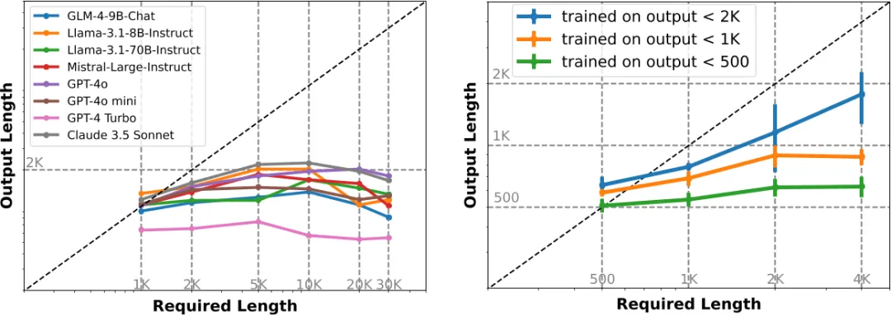
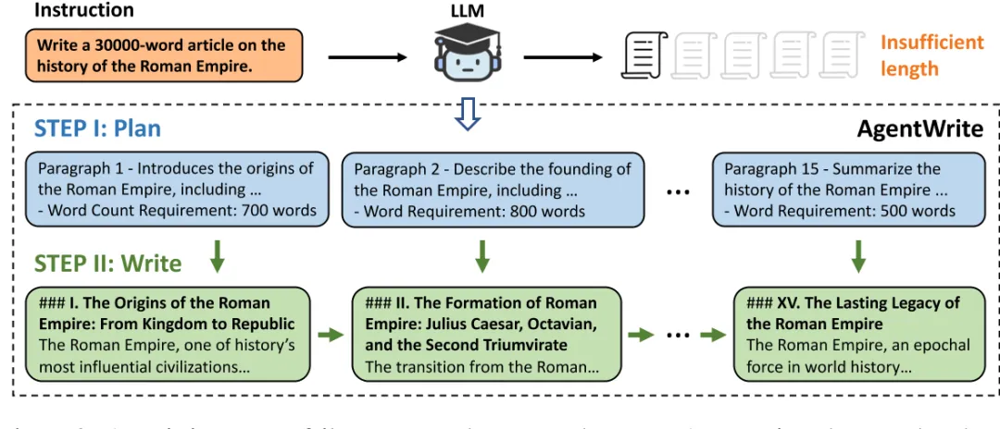
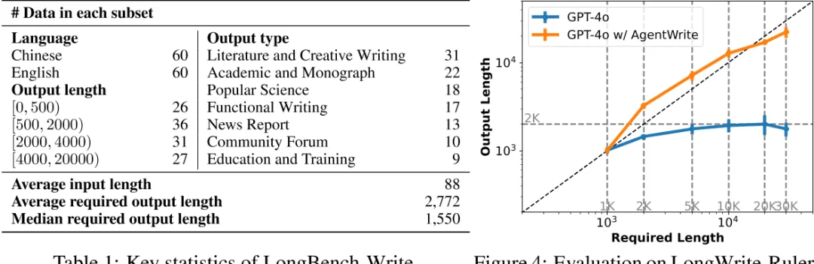
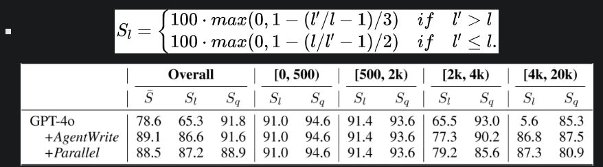
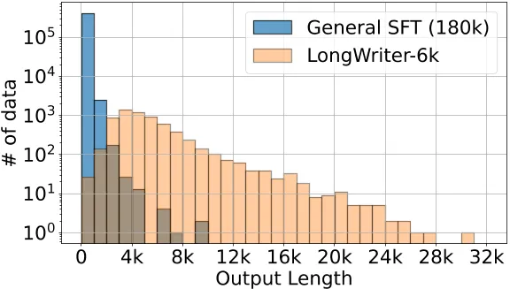
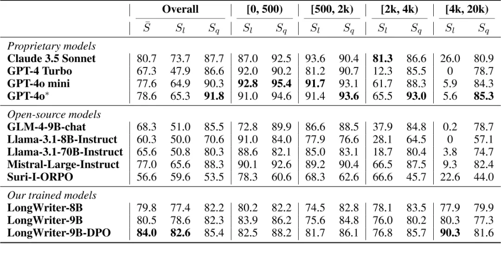
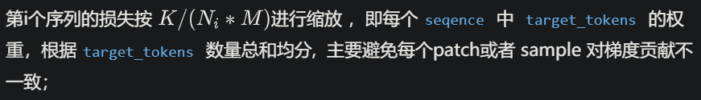

# 1. 资源

论文解读：LONGWRITER: UNLEASHING 10,000+ WORD GENERATION FROM LONG CONTEXT LLMS

Github：https://github.com/THUDM/LongWriter

```text
LongWriter/
├── agentwrite/                 # 与代理写入相关的文件夹
├── data/                       # 数据文件夹
├── evaluation/                 # 评估文件夹
├── train/                      # 训练文件夹
│   ├── ds_config/              # deepspeed 配置文件
│   └── output/glm4/longwriter/ # 输出结果文件夹
│   ├── patch/                      # 补丁或更新文件夹
│      ├── modeling_chatglm.py     # ChatGLM 模型相关脚本
│      ├── modeling_llama.py       # Llama 模型相关脚本
│      ├── tokenization_chatglm.py # ChatGLM 分词器相关脚本
│    ├── scripts/                    # 脚本文件夹
│      ├── glm4_longwriter.sh     #  glm4_longwriter 模型启动脚本
│      ├── llama3_longwriter.sh
│   ├── dataset.py              # 数据集处理脚本
│   ├── main.py                 # 主程序入口脚本
│   ├── pre_tokenize_glm4.py    # GLM4 预分词脚本
│   ├── pre_tokenize_llama3.py  # Llama3 预分词脚本
│   ├── sort_and_group.py       # 排序和分组脚本
│   └── trainer.py              # 训练器脚本
└── __init__.py                 # Python 包初始化文件（可选）
```

# 2. 摘要

当前的长上下文大型语言模型（LLMs）可以处理输入高达100,000个token，但在生成超过2,000个单词的输出时仍然面临困难。通过控制实验，我们发现模型所能生成的最大长度本质上受限于其SFT数据中存在的输出长度上限。为了解决这个问题，我们引入了AgentWrite，一个基于代理的流水线，将超长生成任务分解为子任务，使现成的LLMs能够生成超过20,000个单词的连贯输出。利用AgentWrite，我们构建了LongWriter-6k，一个包含6,000个SFT数据的数据集，输出长度从2k到32k个单词不等。通过将这个数据集纳入模型训练，我们成功地将现有模型的输出长度扩展到超过10,000个单词，同时保持输出质量。我们还开发了LongBench-Write，一个用于评估超长生成能力的综合基准。我们的9B参数模型通过DPO（Direct Preference Optimization）进一步改进，在这个基准上达到了最先进的性能，甚至超过了更大规模的专有模型。总的来说，我们的工作表明，现有的长上下文LLM已经具备了更大的输出窗口的潜力——你所需要的只是在模型对齐过程中使用扩展输出的数据来解锁这种能力。

# 3. 主要工作

LongWrite-Ruler：验证模型所能生成的最大长度本质上受限于其SFT数据中存在的输出长度上限。创建了8个不同的指令，每个指令在中文和英语中，并在指令中改变输出长度要求“L”。



结论：

1. 左图：现有长文本模型输出长度上限为2000字左右；
2. 左图：对于要求输出更长的测试样例，拒绝回复率增高，导致平均输出长度反而下降；
3. 右图：模型所能生成的最大长度 与 SFT数据中存在的输出长度 呈正相关；

AgentWrite：将长文写作任务分解为多个子任务，每个子任务负责撰写一段；最终将各个子任务拼接，得到长输出；



LongBench-Write ：

在长度和写作质量方面，对AgentWrite方法合理性进行评估验证；



评测：质量指标（SQ） + 长度指标（SL）

输出质量SQ则使用GPT-4o，从以下6个维度来评价：

- Relevance
- Accuracy
- Coherence
- Clarity
- Breadth and Depth
- Reading Experience

输出质量SL 由下述公式计算：



注：Parallel 是指 plan_write中，write是并行输出所有段的内容，不依赖前文已生长的章节段落。

LongWriter-6K数据：选择了6,000个需要长输出（超过2,000字）的用户指令；

GLM-4的SFT数据中选择了3,000个指令(中文)；WildChat-1M 中选择了3,000个指令(英文)

进一步应用基于规则的匹配来过滤掉有毒指令和用于数据抓取的指令。并手动检查了自动选择的指令，并验证了超过95%的指令确实需要数千字的响应。

对于这6,000个指令，我们随后使用AgentWrite流水线与GPT-4o来获取响应。我们对获取的数据进行了进一步的后处理，包括过滤掉过短的输出和由于AgentWrite第一步中获取的规划步骤过多而导致模型输出崩溃的情况。大约0.2%的数据被过滤掉。同时，清理了模型可能在每个输出部分开头添加的不相关标识符，如“段落1”、“段落2”等。我们将最终获得的长输出数据集称为“LongWriter-6k”。

将 LongWriter-6k 与180k的GLM-4通用chat SFT 数据结合，形成整个训练集。从下图中，LongWriter-6k 有效补充了输出长度超过 2k 字的通用chat SFT 数据的稀缺性，且LongWriter-6k 的输出长度在 2k-10k 之间的分布相对均匀。



训练：

packing training with loss weighting：如果我们按序列平均损失，即取批处理中每个序列的平均损失的平均值，那么在长输出数据中，每个目标标记对损失的贡献将显著低于短输出。在我们的实验中，我们还发现这会导致模型在长输出任务上的性能次优。因此，我们选择了一种按标记平均损失的权重策略，其中损失是通过计算该批处理中所有目标标记的损失的平均值来计算的.

结果：



# 4. 代码

对于 packing 训练，请修改注意力计算以支持传入标记了每个序列在 pack 中起止位置的 1D 注意力掩码，以及模型前向计算函数以支持 loss weighting。已GLM4为例，需要修改 modeling_chatglm.py 中的 CoreAttention.forward 和 ChatGLMForConditionalGeneration.forward，参考 patch目录下文件。

以GLM4 为例，pre_tokenize_glm4.py  \  sort_and_group.py   将原始训练数据转化模型输入，即 input_ids 、 attention_mask、labels、

weighting

在longalign 中,  因为packing 需要做 Loss weighting 操作，需要传入1D 的weight 信息。

```python
weight = torch.where(label[:eos_indice+1] == -100, 0, 1)
if weight.sum() > 0.5:
        weight = weight / weight.sum()
```



```python
'''weights: 1D '''
shift_weights = weights[..., 1:].contiguous()
loss_fct = CrossEntropyLoss(ignore_index=-100, reduction='none')
loss = loss_fct(shift_logits.view(-1, shift_logits.size(-1)), shift_labels.view(-1))
loss = (loss * shift_weights).sum()
```

在longwriter 中, 是按 标记平均损失的权重策略，即一个batch里，不同的sample会有不同的 seqence数量或者 target_tokens 数量;但每个target_tokens  的权重是一致的。在不同batch里，需要为每个batch 分配个 weight，这个weight 只和这个 batch 内 seqence数量有关;代码里将这个weight 设置为常量 batch_seq_num / 30。

```python
'''weights: scaled '''
loss_fct = CrossEntropyLoss(ignore_index=-100)
loss = loss_fct(shift_logits.view(-1, shift_logits.size(-1)), shift_labels.view(-1))
loss *= weights
```

attention_mask

基于 FlashAttention 2 的 flash_attn_varlen_func 函数来实现 CP 并行, attention_mask 是1D的tensor， 元素表示不同序列的开始和结束位置。与常规(0 或1)  不同。例如：

```python
attention_mask
>>> tensor([    0,  2769,  7758, 14141, 16624, 20809, 23171, 32768], device='cuda:0', dtype=torch.int32)
```

flash_attn_varlen_func 实现：

```text
from flash_attn.flash_attn_interface import flash_attn_varlen_func as flash_attn_unpadded_func
cu_seqlens_q = attention_mask
cu_seqlens_k = cu_seqlens_q
context_layer = flash_attn_unpadded_func(
                    query_layer, key_layer, value_layer, cu_seqlens_q, cu_seqlens_k, seqlen_q, seqlen_k,
                    self.attention_dropout,
                    softmax_scale=1.0 / self.norm_factor, causal=is_causal
        )
"""在embed阶段做维度转换，即 query_layer, key_layer , value_layer 维度信息：[sq, b, np, hn]"""
```

# 参考

[1] 一网打尽长文本训练技术，https://mp.weixin.qq.com/s/7vr-JalvF94fxevOIcZDYQ
