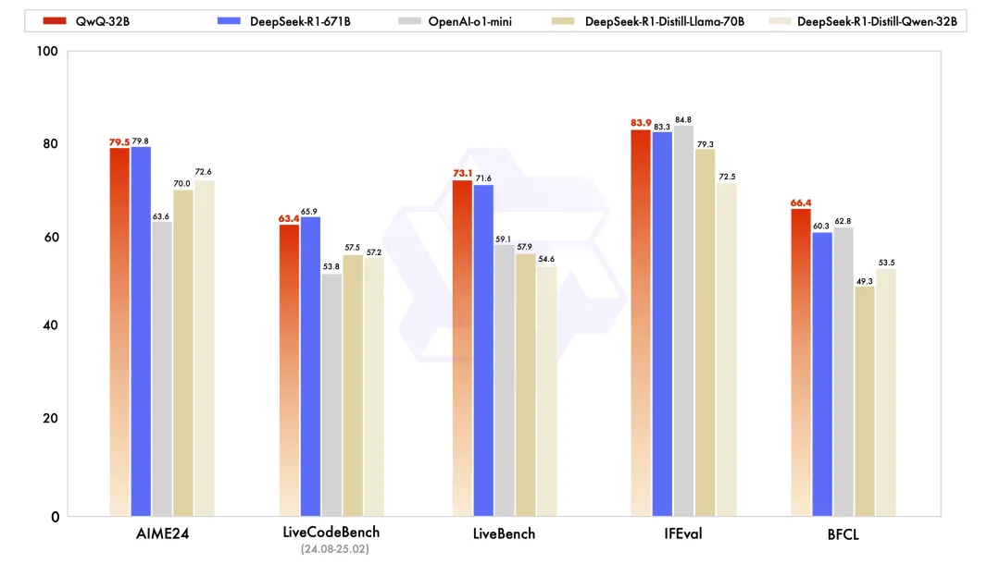

# 1. 资源

- 在线体验地址：https://chat.qwen.ai/?models=Qwen2.5-Plus
- ModeScope权重：https://huggingface.co/Qwen/QwQ-32B
- HuggingFace权重：https://modelscope.cn/models/Qwen/QwQ-32B

# 2. 简介

QwQ-32B性能强悍，在LiveCodeBench/LiveBench/AIME24/IFEval/BFCL等评测指标上，都能比肩甚至超越DeepSeek-R1。这可是32B的“小”模型，越越越级比较671B的超大模型，恐怖如斯。

相较于DeepSeek-R1、QwQ-Max这些超大参数量的MoE模型的部署成本和推理速度等，显然32B的模型尺寸更适合研究、业务迭代、部署上线。期待后续开源社区基于QwQ-32B的研究和衍生模型。

# 3. 原理

QwQ-32B是基于Qwen2.5-32B迭代而来的推理模型，在Post Training期间主要进行了SFT和RL训练，更具体的说是经过了三阶段训练：

冷启动SFT：类似DeepSeek-R1论文中所提到的冷启动阶段，更多的是进行模型学习，让模型学会推理的模式。

Code & Math RL：与依赖传统的奖励模型不同，该阶段主要是使用Rule Base的奖励来进行训练。该阶段主要通过校验生成答案的正确性来为数学问题提供反馈，并通过代码执行服务器评估生成的代码是否成功通过测试用例来提供代码的反馈。随着训练轮次的推进，这两个领域中的性能均表现出持续的提升

通用任务RL：该阶段使用通用奖励模型和一些基于规则的验证器进行训练。通过少量步骤的通用RL，可以提升模型的通用能力，同时在数学和编程任务上的性能没有显著下降。

# 4. 性能

# 参考

[1] Qwen开源QwQ-32B，“小”模型性能比肩DeepSeek-R1，RL的魅力,https://mp.weixin.qq.com/s/kcifPYZ9xErdj8Irnb0Qww
