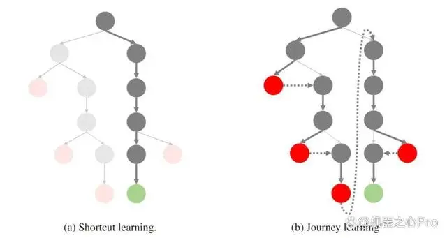
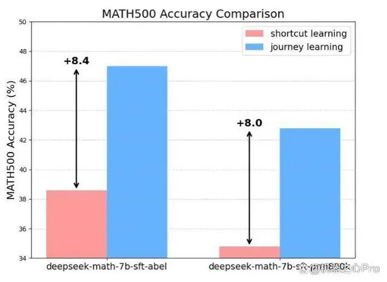
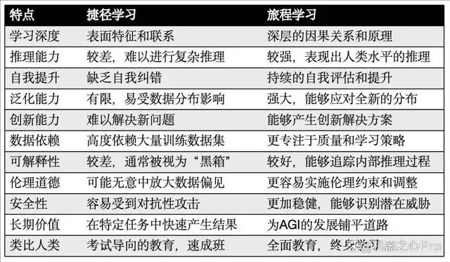
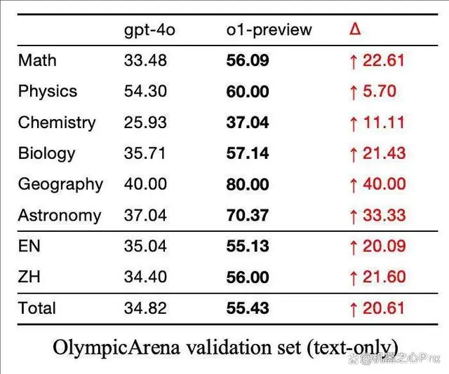
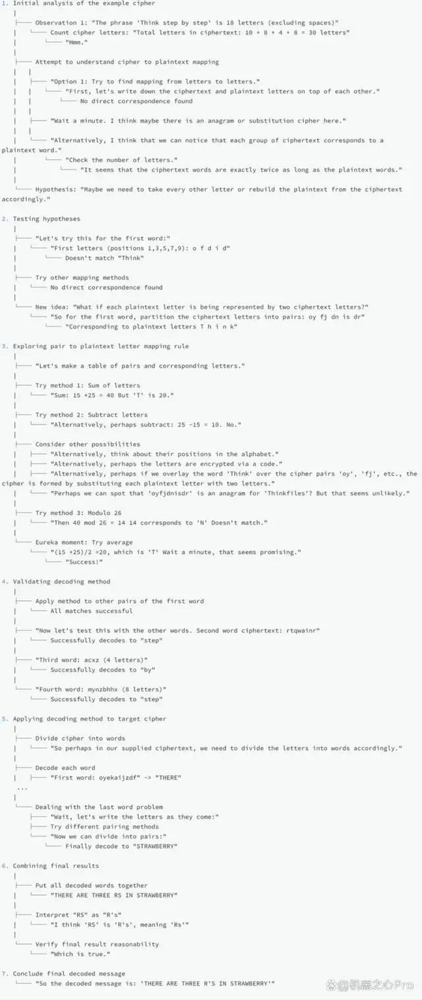

# 1. 资源
 - 技术报告链接：https://github.com/GAIR-NLP/O1-Journey/blob/main/resource/report.pdf
 - Github 链接：https://github.com/GAIR-NLP/O1-Journey
 - o1 讨论资源：https://github.com/GAIR-NLP/O1-Journey/tree/main/resource

- 论文链接：https://github.com/openreasoner/openr/blob/main/reports/OpenR-Wang.pdf
- 代码链接：https://github.com/openreasoner/openr
- 教程链接：https://openreasoner.github.io/

# 2. 原理

OpenAI o1 的做法本质上是 COT 的自动化。

从用户提出的问题形成树的根结点出发，最终走到给出正确答案，可以想像成类似 AlphaGo 下棋，形成了巨大的由 COT 具体步骤构成的树形搜索空间，这里 COT 的具体步骤的组合空间是巨大的

SFT-Journey Training 基本做法
先用模型M对327个已知答案的样本进行极长COT思维链的构造。构造过程就是运用常规的树搜索，树分岔的方式是按推理步骤分叉。搜到一些正确路径，例如

question->step0->step1->....->step6->right_answer （这类样本叫shotcut）

还有错误路径，例如

question->step0'->step1'->....->step6'->wrong_answer

极长思维链等于

"question->step0'->step1'->....->step6'->wrong_answer"+ "emmm, 好像不太对，我想一下" + "step0->step1->....->step6->right_answer"

构造完毕。这个样本就叫journey。同一个样本，错误COT路径的数量可以任意多（上面例子只有一个），串联在一起，只要中间加上伪思考语句过渡就好（这种过渡语句由GPT4o润色，比如 “emm，不太对，我看一下”， 哈哈）。正确路径和错误路径并不是毫无关系，错误路径是沿着搜好的正确路径伪造的，还用了深度优先搜索，所以整个journey描述的其实是一次成功的、裁剪过（不然错误路径太多）的深度优先搜索的伪历史。

图：从 "捷径学习" 到 "旅程学习" 的范式转变。这是一个用于推理任务的搜索树。对于数学问题解决任务，根节点代表初始问题，而叶节点则是最终结论。绿色节点表示正确答案，红色节点表示错误答案。传统上，学习主要集中在对直接从根到叶的捷径路径进行监督训练。然而，本研究探索了对整个探索路径进行监督学习，这包括了试错和纠正的过程。

团队认为，大多数现有的机器学习或大模型训练方法（如监督式微调）都可以被归类为 "捷径学习" (Shortcut Learning)，即模型学习到达正确答案的直接路径。这种传统范式虽然在特定、明确定义的任务中可能有效，但在面对复杂、动态和开放性问题时显示出明显的局限性。捷径学习具有以下几个关键特征：(1) 注重快速结果：强调在短时间内达到特定的性能指标或完成特定任务。(2) 高度依赖数据：性能改进通常依赖于增加训练数据量，而非改进学习算法本身。(3) 泛化能力有限：在训练数据分布之外的场景中，性能可能会急剧下降。(4) 缺乏自我纠正能力：这些系统通常缺乏识别和纠正自身错误的能力。尽管捷径学习推动了人工智能的许多进步，但它难以产生真正智能和可靠的人工智能系统，无法应对现实世界挑战的复杂性。随着我们追求更高级形式的人工智能甚至超级智能，这种方法的局限性变得越来越明显。

认识到这些缺点，本文提出了一种名为 "旅程学习"（Journey Learning) 的新范式。旅程学习旨在使人工智能系统能够通过学习、反思、回溯和适应不断进步，就像人类一样，从而展现出更高水平的智能。

图："捷径学习"(Shortcut Learning) 和 "历程学习"(Journey Learning) 在 MATH500（Lightman 等人，2024 年）上的表现。

如图所示，团队提出了 "旅程学习" 范式，它鼓励模型不仅学习捷径，还要学习完整的探索过程，包括试错、反思和回溯。仅使用 327 个训练样本，不借助任何额外训练技巧，旅程学习在 MATH 数据集上的表现就超过了传统监督学习 8% 以上，展示了其极其强大的潜力。作者也认为这是 o1 技术中最关键的组成部分。

图：OpenAI o1 真实推理过程的结构化形式本质是一颗搜索树（破译题目）

迭代式问题解决：模型首先定义函数，然后逐步探索相关表达式，将复杂方程分解为更简单的组成部分，反映了一种结构化和有条理的方法。

关键思维指标：使用 "Therefore" 表示结论，"Alternatively" 探索不同路径，"Wait" 表示反思，以及 "Let me compute" 过渡到计算，突出了模型的推理阶段。

递归和反思方法：模型经常重新评估和验证中间结果，使用递归结构确保一致性，这在严谨的数学推理中很典型。

假设探索：模型测试不同的假设，随着获得更多信息而调整其方法，展示了推理过程中的灵活性

结论和验证：最后，模型解方程并验证结果，强调在完成之前验证结论的重要性。

# 3. 训练

团队实验使用预训练语言模型 deepseek-math-7b-base（更多其他模型已经在等待列表中）。训练过程分为两个主要阶段：监督微调（SFT）和直接偏好学习（DPO）。

第一阶段：监督微调（SFT）:

SFT 过程包括两个阶段：

初始阶段：在这个初始阶段，团队专注于使用只包含正确中间步骤和最终正确答案的响应来微调模型。在 Abel 数据集和 PRM800K 数据集上微调 Deepseek-math-7b-base。对于 PRM800K 中的每个问题，使用单个正确的逐步解决方案，丢弃不导向最终答案的回复。在这个阶段，对每个数据集进行一个 epoch 的微调，主要目的是让模型熟悉所需的响应格式。

旅程学习：在第二阶段，使用构建的长思维（包含 327 个示例）进一步微调初始阶段的 SFT 模型。这个阶段旨在增强模型发现错误、自我反思、自我修正和执行回溯的能力。通过在合成的包含试错、反思的长思维数据上训练，模型对更长推理链中涉及的复杂性有更深入的理解。为了比较，团队还在从同一推理树生成的相应捷径上 (Shortcut Learning) 微调模型（同样是 327 个），从而更直观的比较旅程学习相比捷径学习所带来的增益。

第二阶段：直接偏好学习（DPO）

在这个阶段，使用核采样（top_p = 0.95 和温度 T = 0.7）从 MATH Train 数据集为每个问题生成 20 个回复。这 20 个回复根据最终答案的正确性分类为正面和负面响应。从中，随机选择 5 个正面响应和 5 个负面响应来创建 5 对偏好对。然后，使用这些偏好对和 DPO 损失来训练模型，使其能够从正确和错误答案的比较中学习。

# 参考

[1] 上交大发布首个OpenAI o1复现项目进展报告，满满的经验洞察，https://mp.weixin.qq.com/s/ZO_Rv98OakPuBaZl9Tw5VA