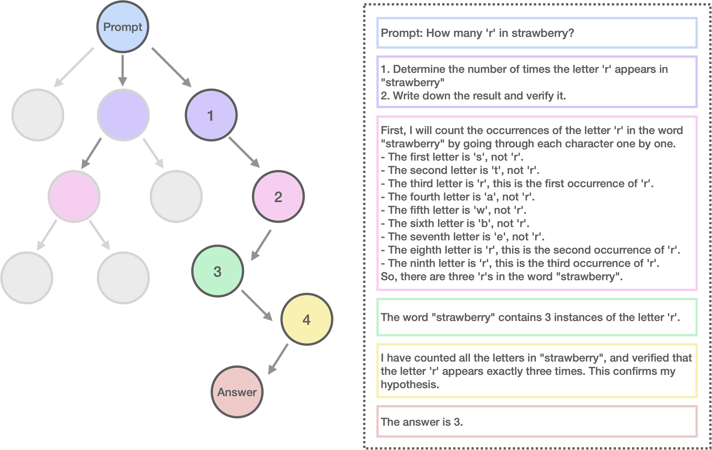
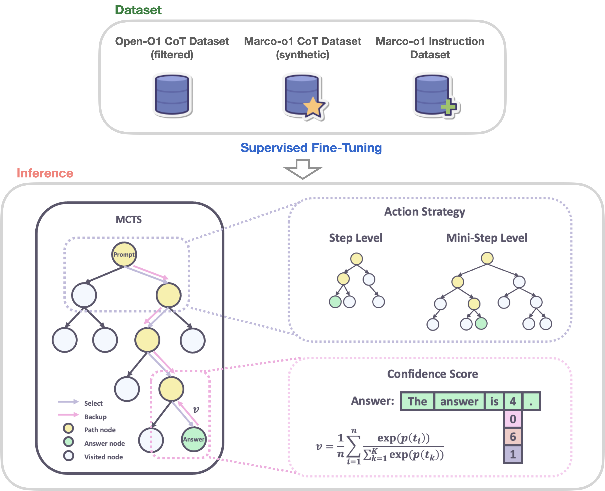
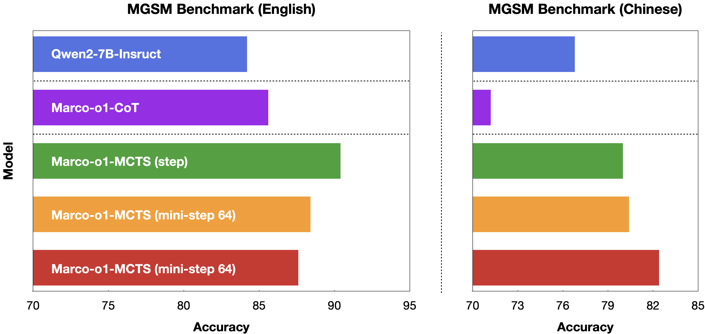
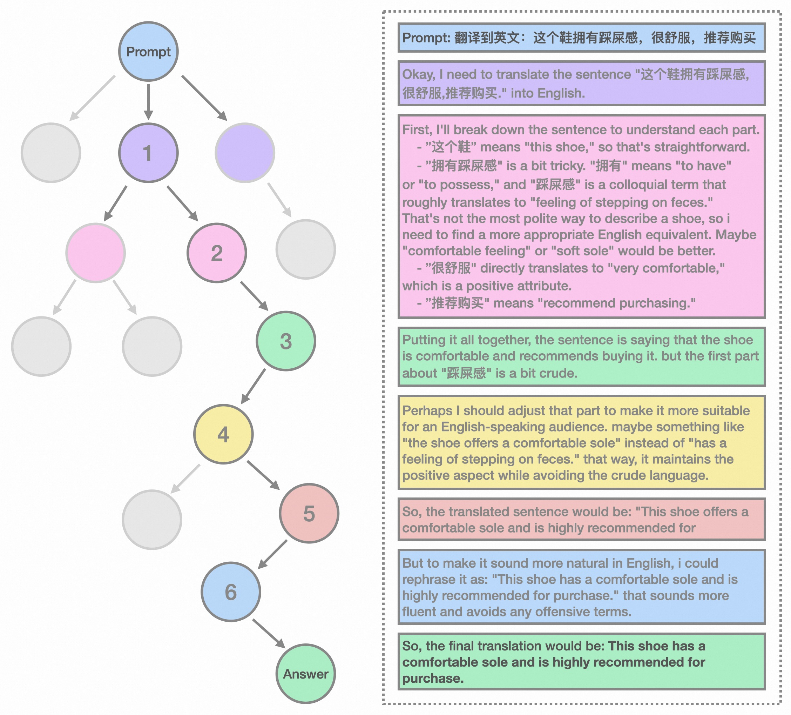

# 1. 资源

- 阿里国际开源
- modelscope模型下载：https://modelscope.cn/models/AIDC-AI/Marco-o1
- Github (938 star): https://github.com/AIDC-AI/Marco-o1
  - 里面没有什么有价值的东西，所谓的Chain-of-Thought (CoT) fine-tuning, Monte Carlo Tree Search (MCTS), reflection mechanisms, and innovative reasoning strategies均没有
- 论文：Marco-o1: Towards Open Reasoning Models for Open-Ended Solutions
  - https://arxiv.org/abs/2411.14405

简要评价：
- 仅通过长推理链COT数据进行SFT训练，没有所谓的类似STEP-DPO的强化学习训练
- 推理流程中的MCTS之类方法并未开源

Marco-o1 not only focuses on disciplines with standard answers, such as mathematics, physics, and coding—which are well-suited for reinforcement learning (RL)—but also places greater emphasis on open-ended resolutions. 

Currently, Marco-o1 Large Language Model (LLM) is powered by Chain-of-Thought (CoT) fine-tuning, Monte Carlo Tree Search (MCTS), reflection mechanisms, and innovative reasoning strategies—optimized for complex real-world problem-solving tasks.

# 2. 原理

MCTS方法

Currently, our work is distinguished by the following highlights:

🍀 Fine-Tuning with CoT Data: We develop Marco-o1-CoT by performing full-parameter fine-tuning on the base model using open-source CoT dataset combined with our self-developed synthetic data.

🍀 Solution Space Expansion via MCTS: We integrate LLMs with MCTS (Marco-o1-MCTS), using the model's output confidence to guide the search and expand the solution space.

🍀 Reasoning Action Strategy: We implement novel reasoning action strategies and a reflection mechanism (Marco-o1-MCTS Mini-Step), including exploring different action granularities within the MCTS framework and prompting the model to self-reflect, thereby significantly enhancing the model's ability to solve complex problems.

🍀 Application in Translation Tasks: We are the first to apply Large Reasoning Models (LRM) to Machine Translation task, exploring inference time scaling laws in the multilingual and translation domain.

Marco-o1 leverages advanced techniques like CoT fine-tuning, MCTS, and Reasoning Action Strategies to enhance its reasoning power. As shown in Figure 2, by fine-tuning Qwen2-7B-Instruct with a combination of the filtered Open-O1 CoT dataset, Marco-o1 CoT dataset, and Marco-o1 Instruction dataset, Marco-o1 improved its handling of complex tasks. MCTS allows exploration of multiple reasoning paths using confidence scores derived from softmax-applied log probabilities of the top-k alternative tokens, guiding the model to optimal solutions. Moreover, our reasoning action strategy involves varying the granularity of actions within steps and mini-steps to optimize search efficiency and accuracy.

🌏 As shown in Figure 3, Marco-o1 achieved accuracy improvements of +6.17% on the MGSM (English) dataset and +5.60% on the MGSM (Chinese) dataset, showcasing enhanced reasoning capabilities.

🌎 Additionally, in translation tasks, we demonstrate that Marco-o1 excels in translating slang expressions, such as translating "这个鞋拥有踩屎感" (literal translation: "This shoe offers a stepping-on-poop sensation.") to "This shoe has a comfortable sole," demonstrating its superior grasp of colloquial nuances.

