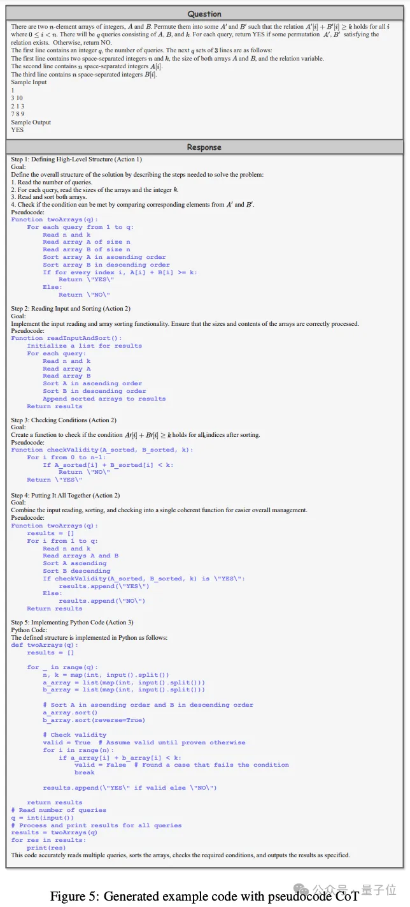

# 1. 资源

- 论文：o1-coder: AN o1 replication for coding
- 论文链接：https://arxiv.org/pdf/2412.00154
- 代码：https://github.com/ADaM-BJTU/O1-CODER
- 数据：https://huggingface.co/datasets/BAAI/TACO
- 参考代码：https://github.com/zhentingqi/rStar/

# 2. 原理

北京交通大学研究团队悄默声推出了一版o1，而且所有源代码、精选数据集以及衍生模型都开源！

名为O1-CODER，专注于编码任务。

而他们的策略是将强化学习（RL）与蒙特卡洛树搜索（MCTS）相结合，让模型能够不断生成推理数据，提升其System-2能力。

实验中，团队有以下几点关键发现：

当推理正确时，基于伪代码的推理显著提升了代码生成质量

将监督微调（SFT）与直接偏好优化（DPO）相结合能够提升测试用例生成效果

自我对弈强化学习为推理和代码生成创造了持续改进的循环机制

具体来说，团队采用了测试用例生成器，在经过DPO后达到89.2%的通过率，相比初始微调后的80.8%有显著提升；Qwen2.5-Coder-7B采用伪代码方法实现了74.9%的平均采样通过率，提升了25.6%。

## 2.1 六步，逐步优化o1

应用于代码生成的自我对弈强化学习面临两大挑战：

- 结果评估，即如何评判生成代码的质量。与围棋等任务不同，评估代码需要在测试环境中运行并验证。

- 定义思考和搜索行为，即确定过程奖励的对象和粒度。

对于第一个挑战，团队提出训练一个测试用例生成器（TCG），根据问题和标准代码自动生成测试用例，为强化学习提供标准化的代码测试环境和结果奖励。

对于第二个挑战，他们采取”先思考后行动“的方式：先通过详细的伪代码思考问题，再基于伪代码生成最终的可执行代码。

这种方式的优势在于适应性（同一伪代码可对应不同的具体实现）和可控粒度（通过调整伪代码的细节程度控制推理/搜索行为的粒度）。

具体来说，研究团队提出了一个包含六个步骤的框架：

- 训练测试用例生成器（TCG），为代码测试提供标准化的环境

- 利用MCTS生成包含推理过程的代码数据

- 迭代微调策略模型，先生成伪代码，再生成完整代码

- 基于推理过程数据初始化过程奖励模型（PRM）

- 在TCG提供的结果奖励和PRM提供的过程奖励的双重引导下，通过强化学习和MCTS更新策略模型

- 利用优化后的策略模型生成新的推理数据，返回第4步迭代训练

## 2.2 两阶段训练测试用例生成器

在实验部分，研究人员详细介绍了测试用例生成器的训练过程。

分为两个阶段：监督微调（SFT）和直接偏好优化（DPO）。

SFT阶段的主要目标是确保生成器的输出符合预定义格式，以便准确解析和提取生成的测试用例。训练数据来自TACO数据集。

DPO阶段的目标是引导模型生成符合特定偏好的测试用例，进一步提高生成器的性能和可靠性。

这里采用了带有人工构建样本对的DPO方法，构建了一个偏好数据集。

实验表明，SFT阶段过后，TCG在标准代码上生成的测试用例通过率达到80.8%，DPO阶段进一步提升至89.2%，大幅改善了生成器产出可靠测试用例的能力。

## 2.3 伪代码推理，引导模型进行深度推理
特别值得一提的是，研究者引入了基于伪代码的提示方法，将其作为引导模型进行深度推理的“认知工具”。

他们为此定义了三个关键行为：

- 使用伪代码定义算法结构：勾勒主要函数的结构和接口，把握任务的整体框架

- 细化伪代码：逐步明确每个函数的具体步骤、逻辑和操作

- 从伪代码生成代码：将伪代码的结构和逻辑精准翻译为可执行代码

在MBPP数据集上进行的初步实验表明，尽管整体通过率（Pass@1）有所下降，但Average Sampling Pass Rate（ASPR）显著提高。

表明结合伪代码显著改善了推理过程的质量，特别是在细化通向正确输出的路径方面。这为后续的自监督微调和强化学习提供了良好的起点。

## 2.4 自我对弈+强化学习

研究人员详细描述了如何使用蒙特卡洛树搜索（MCTS）来构建步骤级别的过程奖励数据。

这个过程涉及到为每个问题形成一个推理路径，该路径由一系列推理步骤组成，并最终产生一个可执行的代码。在MCTS的路径探索中，使用伪代码提示策略来引导推理过程。当达到终端节点时，就形成了一个完整的伪代码推理路径。

终端节点的奖励值是基于两个关键指标计算的：编译成功率（compile）和测试用例通过率（pass）。

这些指标被用来评估生成的代码的质量和正确性。

奖励值被反向传播到路径上的所有前序节点，为每个步骤分配一个奖励值。通过这种方式，构建了推理过程数据集，为策略模型的初始化和训练提供了基础。

过程奖励模型（PRM）的任务是为当前步骤分配一个奖励值，以估计其对最终答案的贡献。

在数据合成过程中使用的树搜索方法可以组织成点式（point-wise）和成对式（pair-wise）两种数据格式。

基于这些经过验证的正确推理解，策略模型得到初始化。

接下来，过程奖励模型（PRM）开始发挥作用，评估每一步推理对最终答案的贡献。在测试用例生成器（TCG）提供的结果奖励和PRM提供的过程奖励的双重引导下，策略模型通过强化学习不断改进。

更新后的策略模型被用来生成新的推理数据，补充到现有数据集中，形成自我对弈的闭环。这个数据生成-奖励建模-策略优化的迭代循环，确保了系统推理能力的持续提升。

# 参考

[1] 北交开源o1代码版！强化学习+蒙特卡洛树搜索，源代码、精选数据集以及衍生模型通通开源，https://mp.weixin.qq.com/s/Y7qZDFtBklmoTeRUxjV_fw