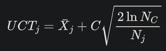
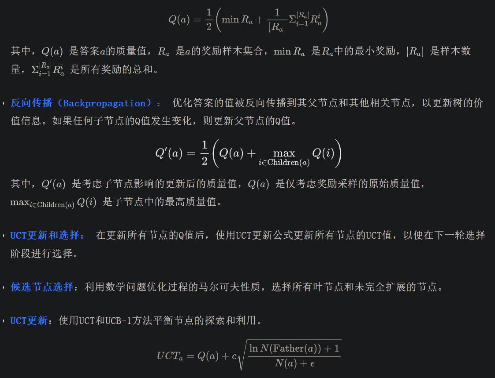
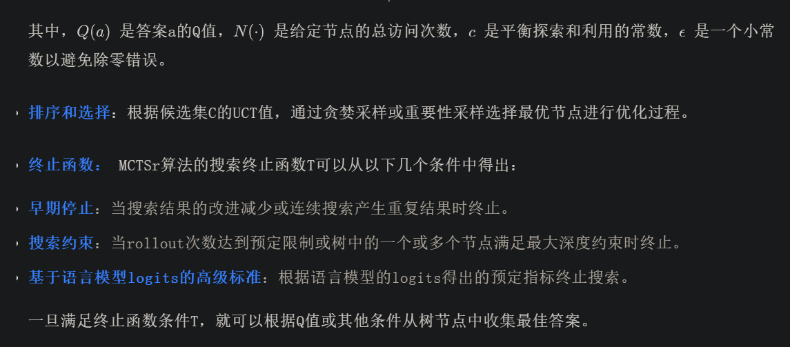

# 1. 资源

- 论文《Accessing GPT-4 level Mathematical Olympiad Solutions via Monte Carlo Tree Self-refine with LLaMa-3 8B- A Technical Report》
- 代码：https://github.com/BrendanGraham14/mcts-llm

# 2. 蒙特卡罗树搜索（MCTS）

蒙特卡罗树搜索（MCTS）是一种广泛用于游戏和复杂决策过程的算法，通过构建搜索树和模拟结果来估计动作的价值。MCTS包括四个关键阶段：

- 选择（Selection）：从根节点开始，算法根据特定的策略（如UCT策略）导航到最有潜力的子节点，直到到达叶节点。
- 扩展（Expansion）：在叶节点处，除非它代表游戏的终止状态，否则会添加一个或多个新的子节点来表示未来的可能移动。
- 模拟或评估（Simulation/Evaluation）：从新添加的节点开始，算法进行随机模拟（通常称为“rollouts”），选择随机移动直到游戏结束，从而评估节点的潜力。
- 反向传播（Backpropagation）：模拟结束后，结果（赢、输或平局）被反向传播回根节点，更新每个遍历节点的统计数据（如赢、输次数），以指导未来的决策。
- 通过反复迭代这些阶段，MCTS逐步构建决策树，优化在状态空间庞大且难以直接计算最佳策略的场景中的决策。

树上的上置信界（UCT）

UCT算法在MCTS的选择阶段至关重要，通过平衡探索和利用来选择最大化以下公式的动作：



其中， Xj是动作j 的平均奖励， Nc是父节点的总访问次数， Nj是节点j 的访问次数， C是平衡探索和利用的常数。

## MCT Self-Refine
MCT Self-Refine算法将蒙特卡罗树搜索（MCTS）与大型语言模型（LLMs）结合，将数学问题解决方案的迭代优化过程抽象为搜索树结构。树中的节点代表不同版本的答案，边表示改进的尝试。该算法的操作流程遵循MCTS的一般模式，使用自我反思驱动的自我改进来优化答案，并通过模型的自我奖励能力对不同答案版本进行奖励采样。

流程如下：
- 初始化： 建立一个根节点，使用模型生成的初始答案或虚拟响应（如“我不知道”）来最小化模型过拟合的倾向。

- 选择： 算法使用价值函数Q对所有未完全扩展的答案进行排序，并选择最高价值的节点进行进一步探索和优化。

- 自我优化（Self-Refine）： 选定的答案a通过多轮对话优化提示进行优化。模型首先生成关于a的反思或批评性评论m，然后根据m指导修改a以生成改进版本a'。

- 自我评估（Self-Evaluation）： 对优化后的答案进行评分以采样奖励值并计算其Q值。这包括模型自我奖励反馈和严格的评分标准，以确保评分的可靠性和公平性。具体步骤如下：

- 提示约束：模型在奖励评分时必须遵循最严格的标准。
- 满分抑制：模型被指示不提供满分反馈；任何超过95的奖励分数将被减少一定量，以抑制过高的分数。
- 奖励采样：模型使用自我奖励方法估计答案a的奖励，要求提供一个范围从-100到100的奖励分数。

- 约束设计：为避免模型奖励过于平滑，设计了三个约束：

- 重复采样：每次访问搜索树节点时，重复采样节点的奖励以增强自我评估的可靠性。

- Q值计算：计算答案a的值Q，通过平均奖励的最小值和均值来平衡最坏情况和平均情况。





# 3. 代码实现
## 蒙特卡洛搜索树节点
下面的代码定义了一个 MCTSNode 类，用于表示蒙特卡罗树搜索（MCTS）中的节点。每个节点包含一个答案、父节点、子节点列表、访问次数、Q值和奖励样本列表。老样子，解释部分放到代码内部。

```python
class MCTSNode(BaseModel):
    answer: str  # 存储节点的答案。
    parent: MCTSNode | None = None  # 存储节点的父节点。如果节点是根节点，则父节点为 None。
    children: list[MCTSNode] = []  # 存储节点的子节点列表。
    visits: int = 0  # 存储节点的访问次数。
    Q: float = 0  # 存储节点的Q值，表示节点的质量。
    reward_samples: list[int] = []  # 存储节点的奖励样本列表, 是具体的样本值。

    def add_child(self, child_node: MCTSNode):
        """向当前节点添加一个子节点。"""
        self.children.append(child_node)

    def __repr__(self):
        """返回节点的字符串表示形式，用于调试和日志记录。"""
        return f"MCTSNode(answer={self.answer}, Q={self.Q:.2f}, visits={self.visits})"

    def add_reward(self, reward: int):
        """向节点添加一个奖励样本，并更新节点的Q值。"""
        self.reward_samples.append(reward)
        avg_reward = np.mean(self.reward_samples)
        min_reward = np.min(self.reward_samples)

        # Average worst-case and average outcomes
        self.Q = (min_reward + avg_reward) / 2
```

MCTSNode 类定义了MCTS中的节点结构，包含答案、父节点、子节点列表、访问次数、Q值和奖励样本列表。通过add_child 方法可以添加子节点，通过add_reward 方法可以添加奖励样本并更新Q值。__repr__ 方法提供了节点的字符串表示形式，便于调试和日志记录。这些属性和方法共同支持MCTS算法中的节点管理和状态更新。

## 策略定义

目前定义了三种策略。

```python
class SelectionPolicy(Enum):
    GREEDY = 1  # 贪婪选择。
    IMPORTANCE_SAMPLING = 2  # 重要性采样。
    PAIRWISE_IMPORTANCE_SAMPLING = 3  # 成对重要性采样。
```

初始化策略定义了两种。

```python
class InitializeStrategy(Enum):
    ZERO_SHOT = 1  # 生成一个零样本答案。
    DUMMY_ANSWER = 2  # 使用虚拟答案（如“我不知道”）。
```

## MCTSr类
这里我们一层一层的来表达，就不一下子把代码全部复制到一个代码块里面了。

类的属性

```python
class MCTSr(BaseModel):
    problem: str  # 存储当前要解决的数学问题。
    max_rollouts: int  # 定义算法运行的最大迭代次数（rollouts）
    exploration_constant: float = 1.0  # 控制UCT公式中探索项的权重。较大的值鼓励更多的探索，较小的值鼓励更多的利用。
    max_children: int = 2  # 定义每个节点最多可以扩展的子节点数量。
    epsilon: float = 1e-10  # 在计算UCT值时，用于避免除零错误的小常数。
    reward_limit: int = 95  # 定义奖励的上限。超过这个值的奖励会被减少。
    excess_reward_penalty: int = 5  # 超过奖励上限时，减少的惩罚值。
    selection_policy: SelectionPolicy = SelectionPolicy.IMPORTANCE_SAMPLING  # 定义节点选择策略。可以是贪婪选择、重要性采样或成对重要性采样。
    initialize_strategy: InitializeStrategy = InitializeStrategy.ZERO_SHOT  # 定义根节点的初始化策略。可以是零样本生成或使用虚拟答案。

    root: MCTSNode = MCTSNode(answer="I don't know.")  # 定义搜索树的根节点。默认情况下，根节点的答案是“我不知道”。
    
    # Logs
    # 存储所有生成的批评（critiques）。
    # critiques = ["答案缺少详细推理步骤", "计算错误"]
    critiques: list[str] = []
    # 存储所有生成的优化（refinements）。
    # 如refinements = ["修正后的答案", "添加了详细推理步骤"]
    refinements: list[str] = []
    rewards: list[float] = []  # 存储所有生成的奖励（rewards）。
    selected_nodes: list[MCTSNode] = []  # 存储所有被选中的节点。
```

这些参数共同定义了 MCTSr 算法的配置和状态信息，包括问题的描述、算法的运行参数、节点的选择和初始化策略、以及日志记录等。通过调整这些参数，可以控制算法的探索和利用行为，优化搜索过程，并记录算法的运行状态以供分析和调试。

需要子类实现的方法
下面的两个方法是由子类来实现的，后面会给出相应的子类实现方法，它们用于定义自我优化（Self-Refine）和自我评估（Self-Evaluation）的具体实现。由于这些方法的具体实现依赖于不同的模型（如LLaMA-3 8B或GPT-4），因此在基类中它们被定义为抽象方法，需要在具体的子类中实现。

```python
def self_refine(self, node: MCTSNode) -> MCTSNode:
        raise NotImplementedError()

    def _evaluate_answer(self, node: MCTSNode) -> int:
        raise NotImplementedError()
        
    def self_evaluate(self, node: MCTSNode):
        """Evaluate the quality of the answer. Sample `num_samples` times and average the results."""
        reward = self._evaluate_answer(node)

        if reward > self.reward_limit:
            reward -= self.excess_reward_penalty

        node.add_reward(reward)
```

反向传播

反向传播的目的是在模拟结束后，将模拟结果（如奖励值）从叶节点反向传播到根节点，更新每个节点的统计信息（如Q值和访问次数）。

```python
def backpropagate(self, node: MCTSNode):
    parent = node.parent  # 获取当前节点的父节点。
    # 从当前节点开始，向上遍历到根节点，更新每个节点的统计信息。
    while parent:
        # 找到父节点的所有子节点中Q值最高的那个。
        best_child_Q = max(child.Q for child in parent.children)
        # 更新父节点的Q值，通过平均当前Q值和最佳子节点的Q值来计算。
        parent.Q = (parent.Q + best_child_Q) / 2
        # 增加父节点的访问次数。
        parent.visits += 1
        # 将父节点更新为其父节点，继续向上遍历。
        parent = parent.parent
```

UTC计算

这一部分就没必要详细说明了，对着上面的公式看即可理解。

```python
def uct(self, node: MCTSNode):
        if not node.parent:
            # Using an arbitrarily high UCT score for the root node.
            # helps to prioritize breadth.
            return ROOT_UCT_SCORE

        return node.Q + self.exploration_constant * math.sqrt(
            math.log(node.parent.visits + 1) / (node.visits + self.epsilon)
        )
```

判断节点是否完全扩展

下面的代码是用于判断一个节点是否已经完全扩展。完全扩展的节点意味着它已经达到了最大子节点数量，或者它的子节点中至少有一个节点的Q值超过了当前节点的Q值。

```python
def is_fully_expanded(self, node: MCTSNode):
    return len(node.children) >= self.max_children or any(
        child.Q > node.Q for child in node.children
    )
```

len(node.children) >= self.max_children: 检查当前节点的子节点数量是否达到了预设的最大值。
any(child.Q > node.Q for child in node.children): 检查当前节点的子节点中是否存在Q值超过当前节点Q值的子节点。

节点选择
下面的代码我们在代码内部进行说明，这段代码实现了蒙特卡罗树搜索（MCTS）中的节点选择过程。选择节点的目的是在搜索树中找到一个未完全扩展且具有最高UCT值的节点，以便进行进一步的探索和优化。

```python
def select_node(self):
      """Select a non-fully expanded node with the highest UCT value.

      A node is fully expanded if either:
      1. It has reached the max number of children
      2. Any of its children have a Q value greater than its own
      """
      # 初始化一个候选节点列表 candidates 和一个待考虑节点队列 to_consider。并将根节点 self.root 添加到 to_consider 队列中
      candidates: list[MCTSNode] = []
      to_consider = deque([self.root])
      
      # 遍历待考虑节点队列，检查每个节点是否已经完全扩展，并将未完全扩展的节点添加到候选节点列表中。
      while to_consider:
          current_node = to_consider.popleft()
          if not self.is_fully_expanded(current_node):
              candidates.append(current_node)
          to_consider.extend(current_node.children)
      
      # 如果候选节点列表为空，则返回根节点。
      if not candidates:
          return self.root
      # 根据选择策略从候选节点列表中选择一个节点。
      
      # 贪婪选择，选择UCT值最高的节点。
      if self.selection_policy == SelectionPolicy.GREEDY:
          return max(candidates, key=self.uct)
      # 重要性采样，根据UCT值对候选节点进行加权采样。计算每个候选节点的UCT值，并使用 random.choices 函数进行加权采样。
      elif self.selection_policy == SelectionPolicy.IMPORTANCE_SAMPLING:
          # Sample, weighted by UCT score
          uct_scores = [self.uct(node) for node in candidates]
          selected_pair_idx = random.choices(
              range(len(candidates)), weights=uct_scores, k=1
          )[0]
          return candidates[selected_pair_idx]
      # 成对重要性采样：
      #   根据UCT值的差异对候选节点进行成对加权采样。
      #   计算每个候选节点的UCT值，并生成所有节点对的列表。
      #   计算每对节点的UCT值差异，并使用 random.choices 函数进行加权采样。
      #   选择UCT值较高的节点。
      elif self.selection_policy == SelectionPolicy.PAIRWISE_IMPORTANCE_SAMPLING:
          # Sample, weighted by the difference in UCT scores between pairs
          uct_scores = [self.uct(node) for node in candidates]
          pairs = [
              (i, j) for i in range(len(candidates)) for j in range(len(candidates))
          ]
          pair_weights = [
              max(uct_scores[i], uct_scores[j]) - min(uct_scores[i], uct_scores[j])
              for i, j in pairs
          ]
          selected_pair_idx = random.choices(
              range(len(pairs)), weights=pair_weights, k=1
          )[0]
          selected_candidate_idx = max(
              pairs[selected_pair_idx], key=lambda x: uct_scores[x]
          )
          return candidates[selected_candidate_idx]
      else:
          raise ValueError(f"Invalid selection policy: {self.selection_policy}")
```

这段代码实现了MCTS中的节点选择过程，通过遍历搜索树中的节点，找到未完全扩展且具有最高UCT值的节点。

- 初始化候选节点列表和待考虑节点队列。
- 遍历待考虑节点队列，检查每个节点是否已经完全扩展，并将未完全扩展的节点添加到候选节点列表中。
- 如果候选节点列表为空，则返回根节点。
- 根据选择策略从候选节点列表中选择一个节点，包括贪婪选择、重要性采样和成对重要性采样。 通过这些步骤，算法可以在搜索过程中选择最有潜力的节点进行进一步的探索和优化。

zero_shot方法

```python
def zero_shot(self) -> str:
      """Generate a zero-shot answer."""
      raise NotImplementedError()
```

这个方法也是要由子类来实现，不同模型会有不同的实现方式。

初始化方法

根据选择的初始化策略，初始化根节点。

```python
def initialize(self):
    if self.initialize_strategy == InitializeStrategy.ZERO_SHOT:
        self.root = MCTSNode(answer=self.zero_shot())
    elif self.initialize_strategy == InitializeStrategy.DUMMY_ANSWER:
        self.root = MCTSNode(answer="I don't know.")
    else:
        raise ValueError(f"Invalid initialize strategy: {self.initialize_strategy}")
```

run 和 get_best_answer 方法

上面的代码都理解了其实下面的内容就不难理解，这一部门我们就跳过吧，读者可以自己品一下。

```python
def run(self):
      self.initialize()
      for _ in tqdm.tqdm(range(self.max_rollouts)):
          node = self.select_node()
          self.self_evaluate(node)
          child = self.self_refine(node)
          node.add_child(child)
          self.self_evaluate(child)
          self.backpropagate(child)

      return self.get_best_answer()
      
  def get_best_answer(self):
    from collections import deque

    to_visit = deque([self.root])
    best_node = self.root

    while to_visit:
        current_node = to_visit.popleft()
        if current_node.Q > best_node.Q:
            best_node = current_node
        to_visit.extend(current_node.children)

    return best_node.answer
```

## MCTSrLlama38B
这个类是继承自MCTSr的子类，它是运用在Llama3-8B模型上的蒙特卡洛搜索树，它主要实现基类中没有实现的三个方法：zero_shot、self_refine、_evaluate_answer。

zero_shot、self_refine、_evaluate_answer
读一下下面代码，很简单，就是提示词+大模型，就获得了zero_shot、self_refine、_evaluate_answer结果了，所以这一部分也不进行解读了，更重要的还是基类里面实现的蒙特卡洛搜索树的逻辑。

```python
def zero_shot(self) -> str:
      response = openai_chat_completion(
          messages=[
              {
                  "role": "system",
                  "content": "The user will provide a problem. Solve the problem. Think step by step.",
              },
              {
                  "role": "user",
                  "content": f"<problem>\n{self.problem}\n</problem>",
              },
          ],
          model=llama_3_8b_prompt_config.model,
          base_url=llama_3_8b_prompt_config.base_url,
          max_tokens=4000,
      )
      assert response.choices[0].message.content is not None
      return response.choices[0].message.content

  def self_refine(self, node: MCTSNode) -> MCTSNode:
      critique_response = openai_chat_completion(
          messages=[
              {
                  "role": "system",
                  "content": llama_3_8b_prompt_config.critic_system_prompt,
              },
              {
                  "role": "user",
                  "content": "\n\n".join(
                      [
                          f"<problem>\n{self.problem}\n</problem>",
                          f"<current_answer>\n{node.answer}\n</current_answer>",
                      ]
                  ),
              },
          ],
          model=llama_3_8b_prompt_config.model,
          base_url=llama_3_8b_prompt_config.base_url,
          max_tokens=4000,
      )
      critique = critique_response.choices[0].message.content
      assert critique is not None
      self.critiques.append(critique)

      refined_answer_response = openai_chat_completion(
          messages=[
              {
                  "role": "system",
                  "content": llama_3_8b_prompt_config.refine_system_prompt,
              },
              {
                  "role": "user",
                  "content": "\n\n".join(
                      [
                          f"<problem>\n{self.problem}\n</problem>",
                          f"<current_answer>\n{node.answer}\n</current_answer>",
                          f"<critique>\n{critique}\n</critique>",
                      ]
                  ),
              },
          ],
          model=llama_3_8b_prompt_config.model,
          base_url=llama_3_8b_prompt_config.base_url,
          max_tokens=4000,
      )
      refined_answer = refined_answer_response.choices[0].message.content
      assert refined_answer is not None
      self.refinements.append(refined_answer)

      return MCTSNode(answer=refined_answer, parent=node)

  def _evaluate_answer(self, node: MCTSNode) -> int:
      messages = [
          {
              "role": "system",
              "content": llama_3_8b_prompt_config.evaluate_system_prompt,
          },
          {
              "role": "user",
              "content": "\n\n".join(
                  [
                      f"<problem>\n{self.problem}\n</problem>",
                      f"<answer>\n{node.answer}\n</answer>",
                  ]
              ),
          },
      ]
      for attempt in range(3):
          try:
              response = openai_chat_completion(
                  messages=messages,
                  model=llama_3_8b_prompt_config.model,
                  base_url=llama_3_8b_prompt_config.base_url,
                  max_tokens=4000,
              )
              assert response.choices[0].message.content is not None
              return int(response.choices[0].message.content)
          except ValueError:
              messages.extend(
                  [
                      {
                          "role": "assistant",
                          "content": response.choices[0].message.content,
                      },
                      {
                          "role": "user",
                          "content": "Failed to parse reward as an integer.",
                      },
                  ]
              )
              if attempt == 2:
                  raise
```


# 参考

[1] [蒙特卡洛搜索树] MCT Self-Refine (MCTSr)的算法（包含代码理解）, https://mp.weixin.qq.com/s/6hFxdtenAsJ0qU1wEP_XOA