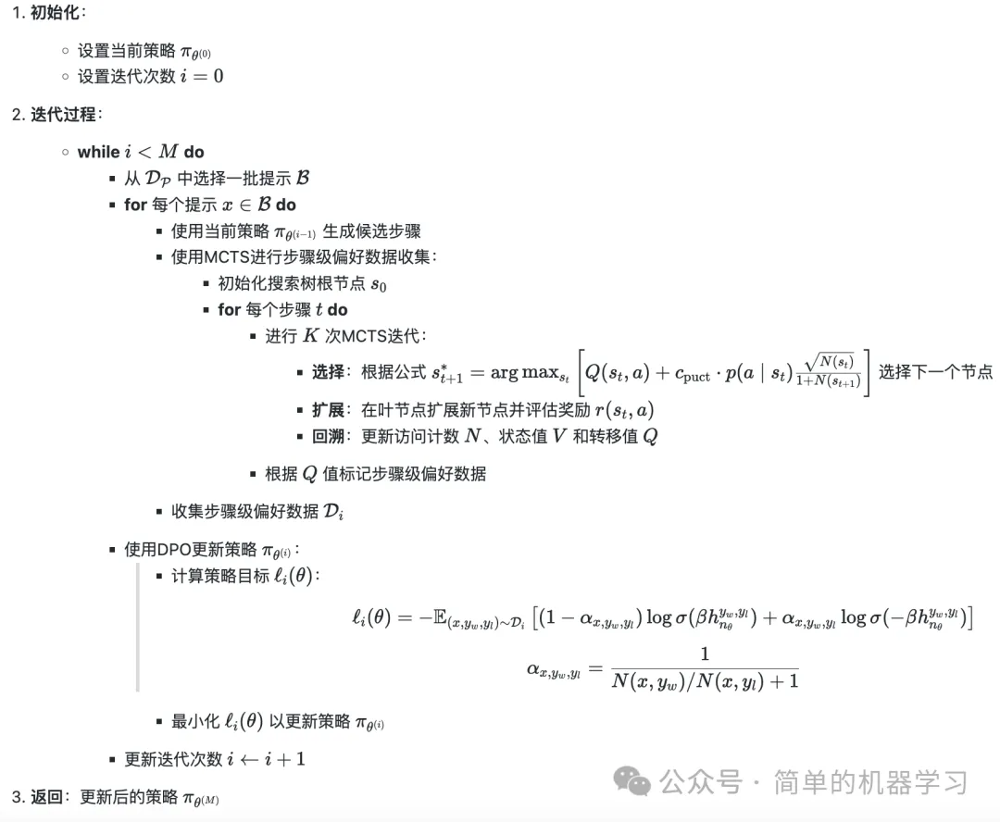

# 参考

[1] [蒙特卡洛搜索树] 通过迭代偏好学习提升推理能力_MTCS-DPO（理论部分）
, https://mp.weixin.qq.com/s?__biz=Mzg4NDkwNzY3Nw==&mid=2247486592&idx=1&sn=eae47d42e20f8124097b50e5726cadb4&chksm=cfb04772f8c7ce649194c13513c2de88bc029ca62bdf301c0187aaf85e8710038c9f06c75931&cur_album_id=3737702306649997313&scene=189#wechat_redirect