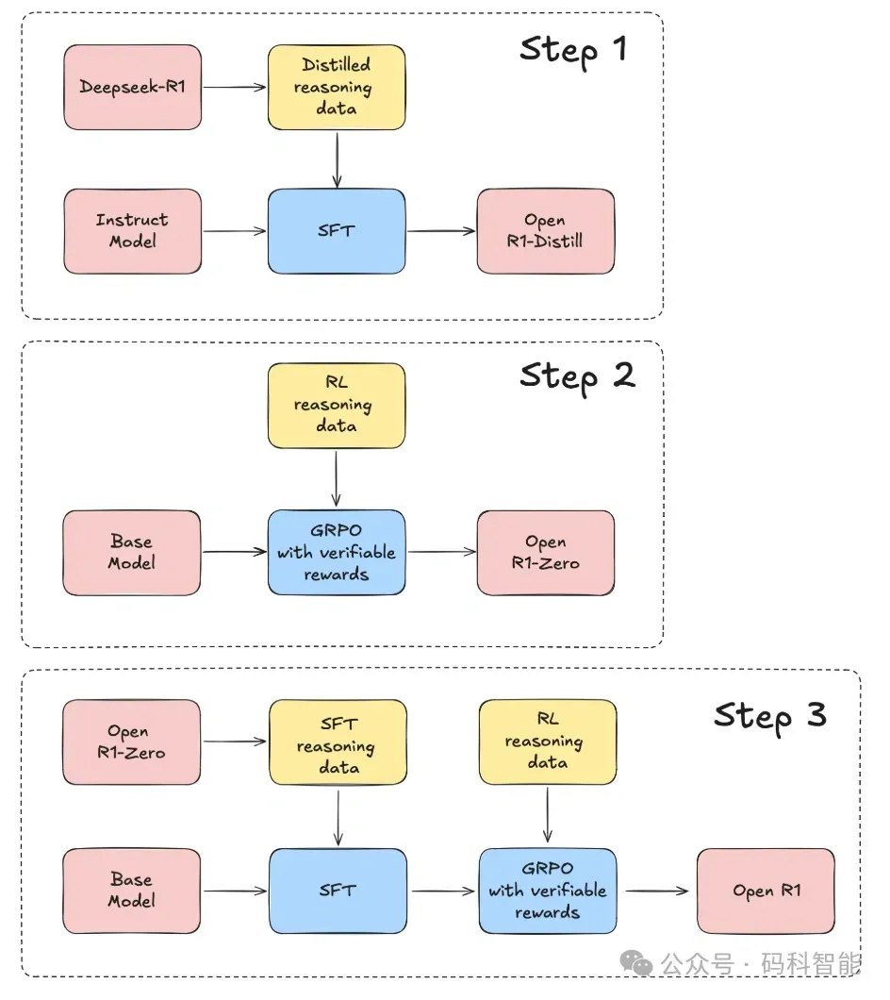
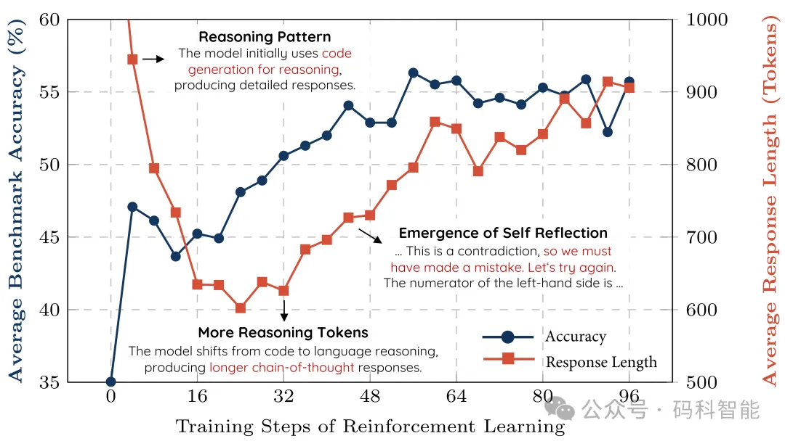

#  1. Hugging face Open-R1

- Project：https://github.com/huggingface/open-r1
- 数据集地址：https://huggingface.co/datasets/open-r1/OpenR1-Math-220k

其复现过程分三阶段：  

- 蒸馏高质量推理数据集：从 R1 提取知识，构建通用语料库。  
- 复现 R1-Zero 的强化学习训练流程：构建全新的大规模数学、推理和编程数据集。
- 完整多阶段训练流程：基础模型、监督微调、强化学习多阶段

目前已经完成的部分：

- GRPO 实现
- 训练与评估代码
- 用于合成数据的生成器
- 发布了 OpenR1-Math-220k 数据集

Open R1 团队使用 DeepSeek R1 生成了 80 万条推理轨迹，经过筛选和验证后得到了 22 万条高质量数据。

数据集地址：https://huggingface.co/datasets/open-r1/OpenR1-Math-220k

在 OpenR1-Math-220k 数据集上训练出来的 Qwen-7B-Math-Instruct，达到了与 DeepSeek-Distill-Qwen-7B 相当的性能。

#  2. DeepSeek R1 轻量级实现 simpleRL-reason

Project：https://github.com/hkust-nlp/simpleRL-reason

港科大开源了一个简单的强化学习方法，用于提高模型的推理能力。

它很简单，因为只使用了基于规则的奖励，该方法与DS用的方法几乎相同，只是代码当前使用的是 PPO 而不是 GRPO。其采用两种训练策略：  

SimpleRL-Zero：直接对基础模型应用PPO强化学习。  

SimpleRL：先通过监督微调冷启动，再结合强化学习。

目前已经使用此代码在有限的数据（8K 示例）上训练小型模型（7B），取得了令人惊讶的强劲结果。

例如，从 Qwen2.5-Math-7B（基础模型）开始，直接在其上执行 RL。没有 SFT，没有奖励模型，只有 8K MATH 示例用于验证，结果模型在 AIME 上实现 (pass@1) 33.3%、在 AMC 上实现 62.5%、在 MATH 上实现 77.2%，优于 Qwen2.5-math-7B-instruct，并且可与使用 >50 倍更多数据和更复杂组件的以前基线相媲美。

训练的最低硬件要求是 6 个 H/A100-80G GPU。为了加速实验，团队使用了 4 个节点，每个节点配备 8 个 H/A100-80G GPU，在约 1.5 天内对 8K MATH 示例进行 120 步训练，实现收敛。

# 3. DeepSeek R1 最小实现 TinyZero 

Project：https://github.com/Jiayi-Pan/TinyZero

伯克利团队以倒计时游戏为测试场景，仅需 30 美元的运行成本（使用 2xH200，每小时 6.4 美元，不到 5 小时），就能实现与 DeepSeeK-R1 Zero 相同的顿悟效果。

通过强化学习（RL）的实验发现：  
- 参数规模决定能力：0.5B模型仅会猜测，而1.5B模型已能执行搜索、自我验证与修正。  
- 任务决定行为模式：在倒计时任务中，模型倾向搜索；在数值乘法中，则分解问题（如利用分配律）。  
- 算法无关性：PPO、GRPO、PRIME 等不同强化学习算法均能激发长链思维，且指令微调非必需。  