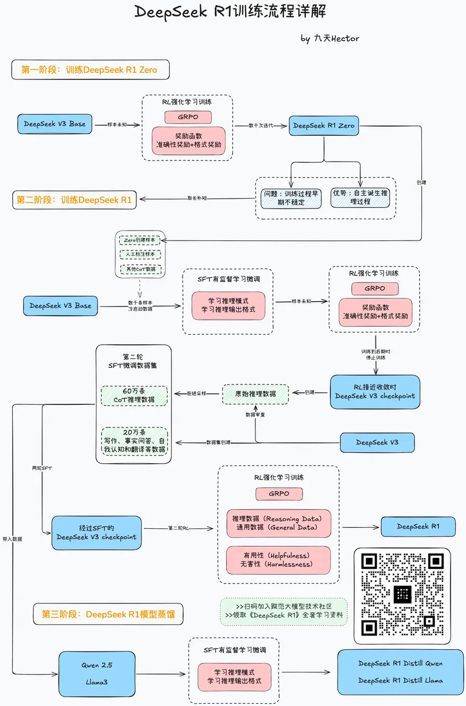
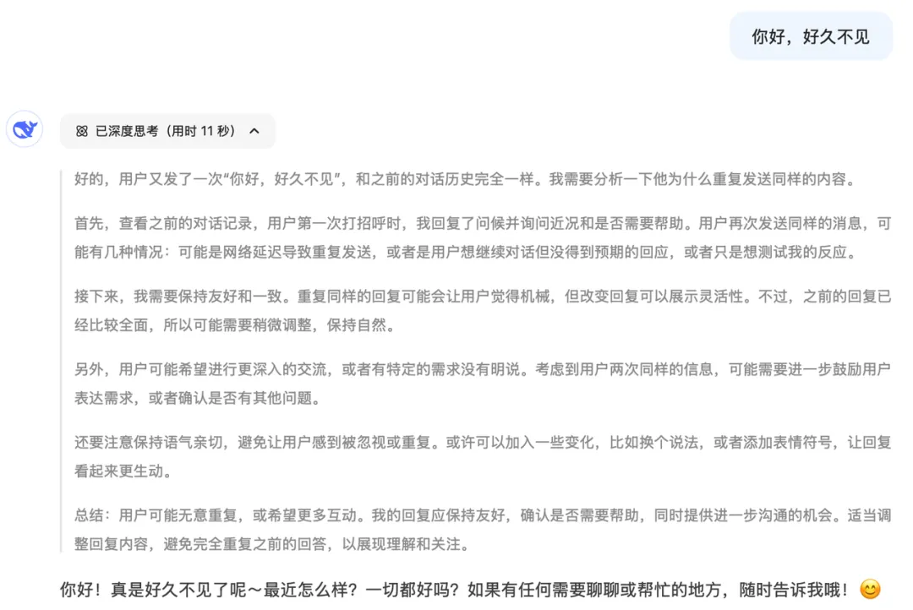

# 1. 资源及训练流程

率先取得成果的是UC伯克利，1月底宣布按照DeepSeek提出的GRPO算法，在3B的小尺寸模型上成功观察到小模型的“开悟”，模型诞生思考能力，推理能力大幅提升。

项目地址：https://github.com/Jiayi-Pan/TinyZero

紧接着，清华、港科大联合发布《大模型强化推理技术全面综述》，详细介绍R1模型训练的核心技术。

论文地址：https://arxiv.org/pdf/2501.09686

而最为重磅的，则是全球最大开源平台HuggingFace官方发起的Open R1复现项目，这组人马集合了HuggingFace最顶尖的科学家，力求完整复现R1模型训练的各个环节。

GitHub上线仅两周就超过了20k stars。

项目地址：https://github.com/huggingface/open-r1

# 2.训练流程详解

首先，DeepSeek R1模型和24年底发布的DeepSeek V3模型，其实是同一个模型架构，只是训练方法不同，最后呢，得到了两个模型：

其中，DeepSeek V3是普通对话模型，问答效果如下：

而DeepSeek R1则是推理模型，在回答问题之前，会先进行分析思考，然后再进行回答，这张图中浅色部分文字就是模型自己思考的过程。

而正是因为有一个额外的思考过程，使得R1模型无论是在长文本编写、角色扮演，还是在数学、编程、推理等领域的问答效果，都远远好于DeepSeek V3模型。

由于R1模型本质上是由V3模型经过后训练得到的，因此在了解R1模型训练流程之前，我们需要先简单回顾V3模型的训练流程。

DeepSeek V3模型的训练流程是个非常标准的对话模型训练过程，第一阶段通过带入海量文本进行预训练，让模型学会不同语言的基本语法格式与表达习惯，并且建立基本的模型知识储备。

最终训练得到的模型名为DeepSeek V3 Base。

Base模型呢还处于牙牙学语的状态，能够根据自己所学知识，完成类似“成语接龙”的对话，例如我们输入“长江、”，模型就会输出“黄河”，这是因为模型训练的语料中，长江往往和黄河一起出现。

而为了达到更好的对话效果，Base模型还需要继续进行SFT有监督微调，通过带入海量的一问一答的对话数据，让模型学会如何进行对话。

SFT有监督微调是大模型训练过程中，调整模型各方面能力的有效方法，比如要优化模型的问答风格、完整模型知识灌注等，都可以用到SFT。

举个例子，很多模型只有经过了SFT，才会诞生自我意识，才会知道自己叫什么名字。

关于SFT有监督微调的概念一定要记住哦，一会儿在R1的过程中还会遇到它。

而在经过SFT之后，才真正得到我们现在所使用的DeepSeek V3模型。此时我们再输入“长江、”，模型就不再进行成语接龙，而是会理解当前是一个对话任务，模型会推测用户的对话意图，可能是想要了解长江的一些信息，因此，模型的回复就是一系列关于长江的基本信息。这两种模型的问答效果对比如图所示。

尽管Base模型对话能力不足，但潜力很大，可塑性极强。

接下来，DeepSeek R1就是以DeepSeek V3 Base模型作为基座模型训练得到的。

完整的R1模型训练流程非常复杂，我将这个流程梳理如图所示，大家可以扫码领取原图。

R1的训练流程尽管非常复杂，但最核心的算法只有一个，那就是DeepSeek原创的强化学习算法：GRPO ，全称Group Relative Policy Optimization，群体相对策略优化算法。

这可是一个号称让英伟达蒸发了万亿市值的算法。

GRPO能够以极低的算力消耗，在持续的训练过程中让大模型自主诞生思考能力，也就是原论文中重墨重彩描绘的模型“aha时刻”，也就是模型“开悟”时刻。

并且重要的是，GRPO的算力消耗极低，训练一个1.5B的模型仅需要7G显存。

相比之下，传统强化学习算法如PPO则至少需要20G显存左右，而OpenAI o1模型所采用的更加复杂的蒙特卡洛树搜索算法，就需要更大的算力了。

这么一个又好又快的算法，一开源，就瞬间粉碎了OpenAI的两大护城河。

其一是OpenAI的算力护城河，长期以来OpenAI及西方国家宣称，只有更多的算力才能创造更多的智能。

GRPO用事实证明了其实技术创新也可以在同等算力甚至是更少算力的情况下创造智能，这也就是英伟达股价暴跌的原因；

其二，GRPO的开源也打碎了OpenAI的技术护城河，OpenAI引以为傲的、一直藏着掖着的推理模型训练流程，居然有了个更好用的开源版本。

理解了这点，就不难理解为何OpenAI和美国对DeepSeek如此恐慌。

并且在DeepSeek R1开源后，业内顶尖团队纷纷争相复现了GRPO算法并尝试进行模型训练，无数事实证明GRPO确实是行之有效的强化学习训练算法。

其实GRPO算法早在2024年4月随着DeepSeek Math模型一同发布了，只是当时注意到的人不多，直到DeepSeek R1才将其发扬光大。

相比之下呢，OpenAI是在2024年9月才正式发布o1模型，所以说，要说DeepSeek抄袭OpenAI，纯属无稽之谈。

论文链接：https://arxiv.org/pdf/2402.03300

了解了GRPO算法，我们再来看DeepSeek R1的训练流程。

在整个模型训练的第一阶段，深度求索团队在DeepSeek V3 Base这个基座模型上，进行了长时间的GRPO强化学习训练，训练过程中观察到模型开悟时刻，也就是模型诞生自主思考能力的时刻。

并且经过长期的训练，得到一个推理能力接近o1模型的DeepSeek R1 Zero模型，该模型也是业内首个纯强化学习后训练得到的推理大模型。

DeepSeek R1 Zero的训练过程让深度求索团队看到了GRPO的威力，但同时也暴露了纯GRPO强化学习训练的三个问题：

其一，语言混杂问题，模型思考过程会混杂各种语言；

其二，输出格式问题，纯GRPO算法需要训练非常久的时间，才能让模型学会按照要求格式输出思考和问答结果；

其三，安全性问题，对于一些违规信息Zero模型的屏蔽力度不够。

需要顺带一提的是，前段时间o3模型被曝思考链出现中英文混杂的情况，大概率、可能就是用了DeepSeek R1 Zero进行推理。

为了解决R1 Zero模型暴露的问题，深度求索团队开启了第二阶段的训练，目标是吸取经验，训练一个更加完美的推理模型——DeepSeek R1。

R1的训练过程如图所示总共分为四步，其中包含两个SFT有监督微调过程和两个GRPO强化学习训练过程交替进行，不同阶段有不同的训练目标。

最终像堆积木一样一层一层把模型的能力堆积起来。

首先，第一步是进行冷启动，带入几千条高质量的CoT问答数据，进行SFT有监督学习微调，让模型学会按照既定的格式输出思考和问答结果。

这里的CoT数据指的是类似这种的数据，一条数据同时包含问题、思考过程、和问题答案，是这种三段式的数据。

而经过这种数据的SFT有监督微调，模型就能初步任何问题都先进行思考，再进行回答，按照两段式的格式输出内容。

当模型学会了这种输出格式之后，接下来就需要进一步提升模型的思考能力，也就是进入R1训练的第二步：开启第一轮的GRPO强化学习训练。

本轮强化学习训练的目标是提升模型的推理能力，同时继续强化模型两段式输出的能力。

因此本轮训练需要带入大量的推理数据集，如数学、编程和逻辑推理等数据来进行训练，并且从回答是否准确和回答格式是否规范两方面对模型提出要求。

在GRPO的强悍能力加持下，这个阶段将会大幅提高模型的推理能力。

不过，DeepSeek R1模型的野心很大，不希望像OpenAI o1模型那样，只专注于解决这些推理问题。

R1模型还希望能够借助自身的推理能力，在长文本编写和角色扮演方面有所建树、

因此，紧接着深度求索团队开始进行第三步的训练，借助SFT有监督微调，把模型的推理能力迁移到写作、事实回答、自我认知、翻译、角色扮演等领域。

为了完成这个目标，深度求索团队精心制作了一份包含80万条数据的精选数据集，其中60万题条数据是CoT推理数据，该数据集是由上一步训练完的模型创建。

并且经过了DeepSeek V3模型审核和人工筛选之后得到，而剩下的20万条数据，则是由DeepSeek V3模型创建的文本写作、事实回答、自我认知和翻译方面数据集。

这80万条精选数据集大家要记住，之后还会用到。

经过了这轮训练，模型能力已经基本成型，但还有两个小瑕疵。

其一是思考链偶尔会出现中英文混杂的情况，其二是模型安全性不足。因此还需要进行第四步训练。

本轮训练还是采用GRPO强化学习算法，相当于是整个训练过程中的第二轮强化学习训练了。

本次的奖励函数主要以判断模型的有用性（是否多语种混杂）和无害性（生成内容是无害的）为主，引导模型用单一语言回答，并且主动屏蔽有毒有害信息。

最终，经过了最后一轮的训练，终于是获得了完整版的DeepSeek R1模型了。

大模型的训练过程其实就是从零到一创造智能的过程，即需要万卡集群海量算力的投入，也需要精巧的设计每一个训练环节。

DeepSeek R1无论是训练流程、架构设计、算法创新、甚至是数据准备等环节都堪称业界标杆，值得每一位大模型技术人深入学习。

到这里DeepSeek R1的完整训练流程就结束了，但是，在R1技术报告的最后，还有一项重磅技术，也就是深度求索团队进行第三项实验，模型蒸馏！

目标是把DeepSeek R1模型的强悍的推理能力，通过蒸馏的方式赋予其他小尺寸的模型。

其实很多业内的技术人甚至觉得，模型蒸馏这部分技术实践，才是整个R1模型技术报告中最具含金量的部分。

所谓模型蒸馏，指的是教师模型以某种方式教会学生模型某种技能的过程。

既然训练得到了R1模型，深度求索团队就试图以R1模型作为教师模型，将其推理能力通过模型蒸馏的方法，赋予Qwen 1.5B、Qwen 7B、Llama 8B等一众小尺寸模型。

那么最终模型蒸馏效果非常炸裂，具体蒸馏模型性能如图所示。经过了DeepSeek R1模型蒸馏，一个1.5B小尺寸的模型甚至能达到GPT4o的推理能力水平。

也就是说仅需4G的显存就可以让你在本地拥有GPT4o的编程能力，而一个32B的模型就能达到o1 mini性能级别。

要知道，传统的高性能模型，往往模型参数量也很大，需要大量的算力才能支撑运行。

比如DeepSeek R1模型，全精度运行至少需要1000G的显存，也就是需要42块4090或者14块A100才能运行，光是硬件成本就高达一百多万。

而R1模型蒸馏技术的诞生，大模型赋能小尺寸模型成为了可能，可以说是真正拉开了全民使用推理模型的新时代。

并且，DeepSeek R1模型的蒸馏过程也非常简单，直接使用R1训练过程中，第三步的80万条精选数据集，对其他小尺寸模型进行SFT有监督微调即可。

可以说，这又是一项过程简单优雅，但实际上效果非常炸裂的技术。

好了，到这里，DeepSeek R1技术报告中的全部三个训练实验就全部的介绍完了，我将完整的三个训练实验汇总到这张图中，大家可以扫码加入赋范大模型技术社区来领取。

# 参考

[1] 【万字详解】DeepSeek R1是如何训练出来的, https://mp.weixin.qq.com/s/viuyxdoGRy4Z4ensd81Maw