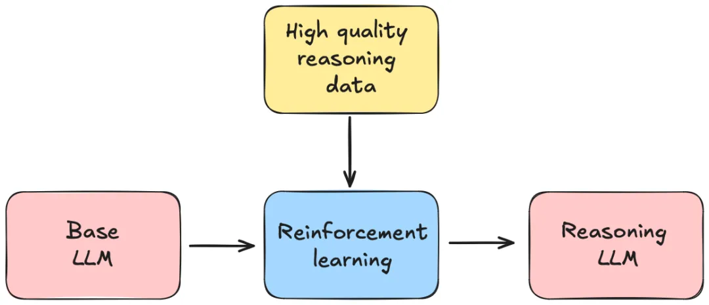
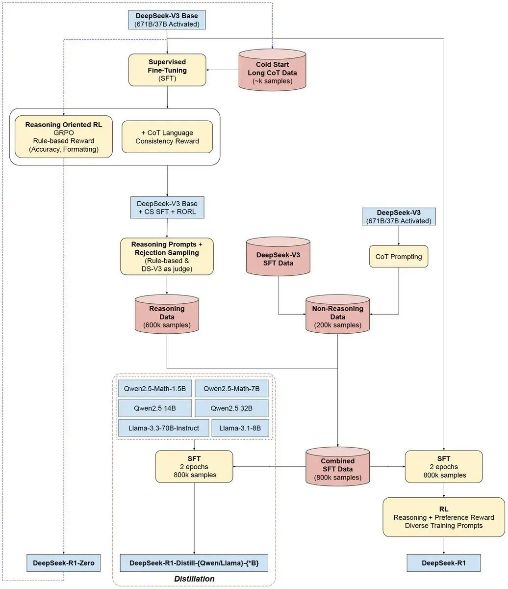
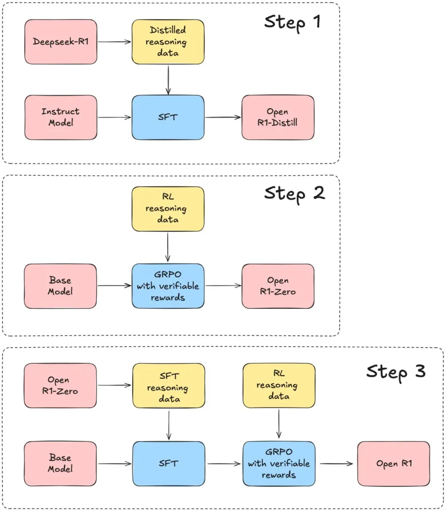
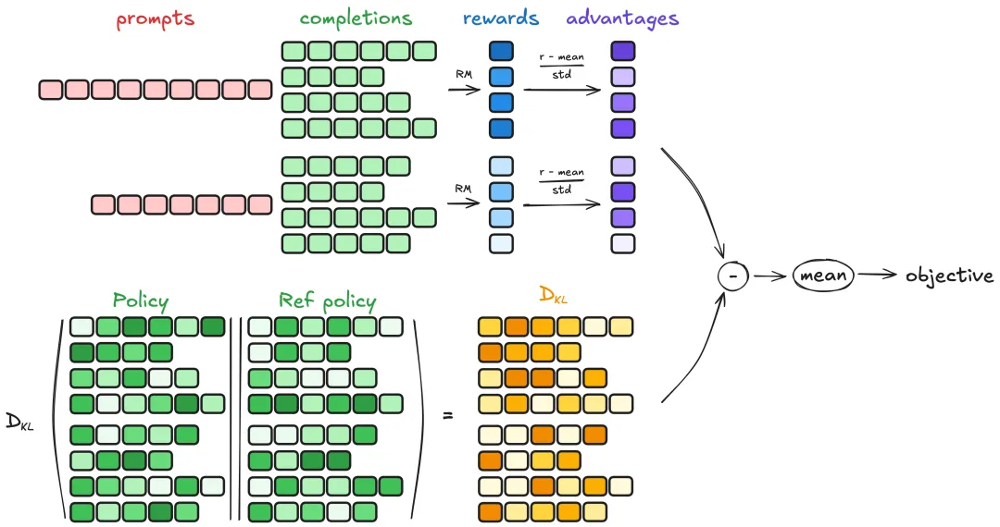
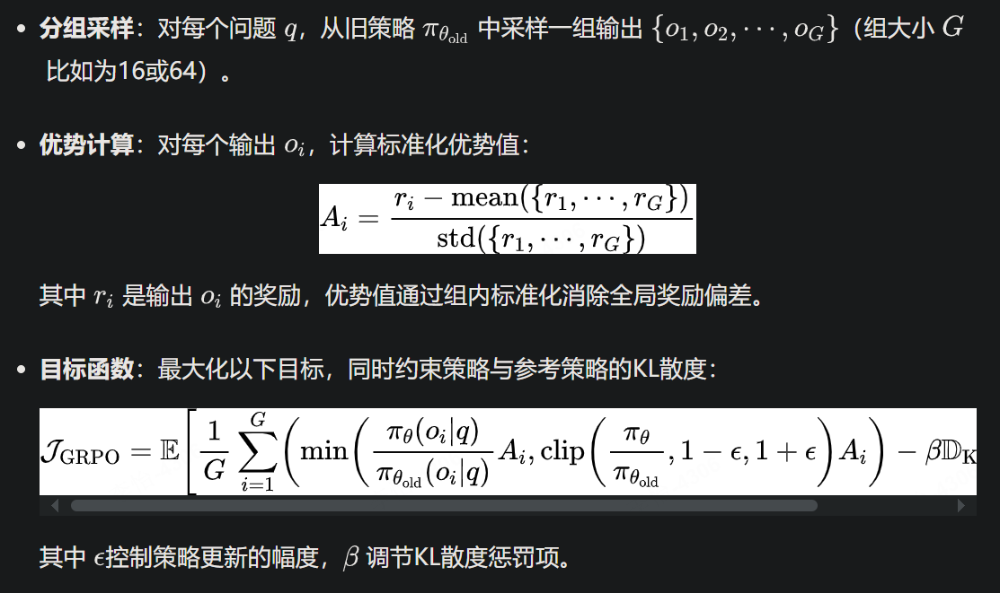

# 1. 资源

随着deepseek的爆火，越来越多的复现工作随之而来，号称30刀即可见证aha moment，比如：

- 港科大simplerl-reason，https://github.com/hkust-nlp/simpleRL-reason；
- hugging face的open-r1，https://github.com/huggingface/open-r1；
- UC伯克利，https://github.com/Jiayi-Pan/TinyZero，实现类似24点的游戏；
- RAGEN，第一个复现deepseek-R1用于训练agent，RAGEN: A General-Purpose Reasoning Agent Training Framework，正全力押注 RL（强化学习）+ LLM（大语言模型）+ Agents（智能体）融合的未来，https://github.com/ZihanWang314/ragen。

# 2. 问题

DeepSeek-R1开源了，但仍然遗留了几个值得深思的问题：

- 数据收集：推理特定数据集是如何精挑细选出来的？如何制作数据集可能是最核心的工作，论文中针对R1的数据集有比较详细的描述，但是对Zero训练所使用的数据集提的比较少。
- 模型训练：由于没有公开DeepSeek对DeepSeek-R1进行训练的代码，因此不清楚最佳超参数是什么，以及在不同模型家族和规模下它们之间有何差异。
- Scaling Law：在训练推理模型时，计算资源与数据集之间存在怎样的权衡？

# 3. 复现流程

本文先介绍huggingface的Open-R1项目，这是一个旨在系统性地重构DeepSeek-R1的数据集及其训练流程、验证paper里的成果、推进开源推理模型发展。通过构建Open-R1，目标是阐明强化学习如何提升推理能力、向开源社区分享可复现的洞察，并为未来基于这些技术开发的模型奠定基础。

DeepSeek是如何做到的？

这部分不做过多的展开，有非常多的解读文章。整体原理图如下所示：

本文主要关注代码实践部分。

Open-R1：弥补缺失的部分

DeepSeek-R1模型权重是开放的，但用于训练的数据集和代码没有提供。

Open-R1的目标是填补这一空白，以便整个研究和行业社区都可以利用这些资源构建类似或更好的模型。以下是复现行动计划：

- Step 1:  复现通过R1蒸馏Qwen等小模型。Replicate the R1-Distill models by distilling a high-quality reasoning dataset from DeepSeek-R1。
- Step 2:  复现通过纯强化学习训练R1-Zero的过程，包括如何生成推理数据集。Replicate the pure RL pipeline that DeepSeek used to create R1-Zero. This will involve curating new, large-scale datasets for math, reasoning, and code。
- Step 3:  复现训练R1的完整pipeline，包括2阶段SFT、2阶段RL。Show we can go from base model → SFT → RL via multi-stage training。

可参照原论文深度理解这3个步骤，此处不做赘述。

下面将围绕step1、2、3，给大家重点展示模型的输入、输出、核心代码片段。

**step1：通过DeepSeek-R1蒸馏的数据训练**

使用 DeepSeek-R1 的 蒸馏数据创建了 Bespoke-Stratos-17k——一个包含问题、推理轨迹和答案的推理数据集。制作好的数据集参见：https://huggingface.co/datasets/bespokelabs/Bespoke-Stratos-17k。这里面的关键是推理轨迹，通过R1得到。

该数据集包含：

- 5,000 条来自 APPs 和 TACO 的编程数据；
- 10,000 条来自 NuminaMATH 数据集的 AIME、MATH 和 Olympiads 子集的数学数据；
- 1,000 条来自 STILL-2 的科学和谜题数据。

生成过程：

- 高效数据生成：通过 Bespoke Curator(用于生成和管理高质量合成数据的项目) 和 DeepSeek-R1，仅用 1.5 小时生成高质量推理数据集，成本控制在 800 美元。
- 改进拒绝采样：引入 Ray 集群加速代码验证，作者后面计划直接集成代码执行验证器。
- 优化推理轨迹：DeepSeek-R1 的推理轨迹质量高，无需额外格式化步骤，简化了流程。
- 提升数学解题精度：通过 gpt-4o-mini，过滤错误的数学解决方案，显著提高了正确数学解决方案的保留率（从 25% 提升至 73%）。

至此，我们可以看到R1蒸馏的Qwen模型也具备了一定的推理能力。

**step2：通过推理数据集+GRPO训练R1-Zero**

此处未完整复现推理数据集的构造全流程，这个可能是R1-Zero最重要的点。

Open-R1直接采用了推理数据集：AI-MO/NuminaMath-TIR，共72540条数据，['problem', 'solution', 'messages']

按照R1-Zero论文的描述，problem字段是提供给模型的输入，通过规则化的RL奖励来引导模型进行思维链(CoT)慢思考。规则化的RL奖励包括答案的准确性和格式的准确性。答案的准确性会通过比对：

- 数学问题：generation结构化输出(即\boxed{}中answer)  vs  数学问题确定性解solution。此处AI-MO/NuminaMath-TIR数据集的solution中，不仅包含了确定性的答案，还包括了CoT。按照deepseek-R1原文，此处训练Zero只输入了确定性答案(\boxed{}中的结果 ) ，未使用CoT，通过RL激发Zero自主探索CoT。
- 代码问题：如LeetCode，基于预定义好的测试用例(input、output)，通过代码编译器执行generation结构化输出(如\boxed{}中的代码)，喂入input，然后比对编译器输出和测试用例的output。

**grpo训练展开介绍**

https://huggingface.co/docs/trl/main/en/grpo_trainer

整体grpo原理如下：

**奖励函数的设计与应用**

在模型训练过程中，奖励函数扮演着至关重要的角色，它们指导模型如何优化其行为以适应特定的任务需求。上述代码中定义了两个主要的奖励函数：

accuracy_reward：

重要性：准确度奖励函数确保模型在训练过程中尽可能地输出正确的答案，是衡量模型性能的核心指标。

功能：计算模型完成内容与正确答案之间的匹配程度。

步骤：

- 提取所有生成内容。
- 对于每个生成和解，分别解析解和生成内容。
- 使用验证函数（verify）检查解析结果是否一致。
- 返回奖励分数，若解不可解析，则跳过该sample。

format_reward：

重要性：格式奖励函数确保模型不仅能够输出正确的答案，还能以正确的方式呈现结果，满足用户对输出形式的需求。

功能：检查完成内容是否符合特定的格式要求。

步骤：

- 使用正则表达式匹配特定的格式模式。
- 返回匹配结果作为奖励分数。

step3：通过多阶段pipeline训练R1

源码还未复现，待下次解读。

# 总结
目前，open-R1还处在迭代阶段，仅R1蒸馏QWen模型的代码和复现实验是比较完善的。通过结合报告原文、模型的输入、输出、核心代码，希望对大家更好的理解原理有一定帮助。R1-zero\R1部分还处在迭代中，后续有机会将进一步分享。下期将分享其他复现方案。

# 参考

[1] DeepSeek-R1复现方案解读之「Open-R1」https://mp.weixin.qq.com/s/AN3NaqyQOrcH4TMjItjmZQ