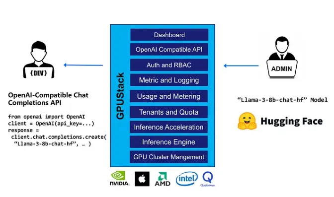

# 1. 简介
1https://docs.gpustack.ai/overview/
2. https://github.com/gpustack/gpustack

GPUStack，一个用于运行大型语言模型（LLMs）的开源GPU集群管理器。尽管LLMs作为公共云服务广泛可用，但组织机构难以轻松地托管自己的LLM部署以供私有使用。它们需要安装和管理复杂的集群软件，如Kubernetes，然后弄清楚如何在其上安装和管理AI工具栈。流行的本地运行LLMs的方式，如LMStudio和LocalAI，仅在单机上工作。
GPUStack允许您从Apple MacBook、Windows PC和Linux服务器中的任何品牌的GPU创建统一的集群。管理员可以从如Hugging Face这样的流行仓库部署LLMs。开发者随后可以像访问OpenAI或Microsoft Azure等供应商提供的公共LLM服务一样轻松地访问LLMs。

# 参考

[1] GPUStack：一个开源 GPU 集群管理器，用于运行大型语言模型 (LLM)。https://mp.weixin.qq.com/s/SVVveo_VqBQyT4xb3TTU3Q