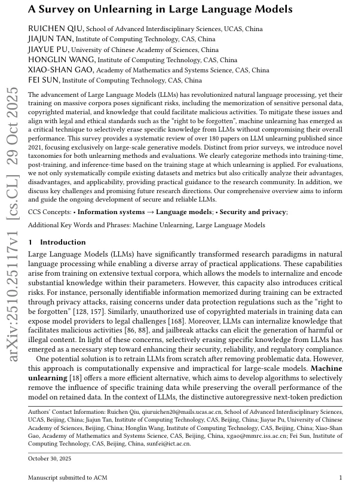

22页论文！LLM遗忘学习全面综述，系统梳理可信AI不可或缺技术路径
近年来，大语言模型的迅猛发展极大地推动了自然语言处理的技术边界，其在文本生成、知识问答和代码合成等任务中展现出卓越能力。然而，这种强大性能的背后潜藏着严峻的安全与伦理风险：模型在训练过程中可能无意中记忆敏感个人信息、受版权保护的内容，甚至内化可用于恶意目的的知识，从而引发隐私泄露、法律纠纷或安全威胁。为应对这些挑战，并满足如“被遗忘权”等日益严格的法规要求，遗忘学习应运而生，旨在高效、精准地从已训练模型中移除特定知识，而不损害其整体性能。相较于代价高昂的全量重训练，遗忘技术通过在训练时、训练后或推理阶段介入，提供了一条更具可行性的路径。当前研究正围绕如何定义遗忘目标、设计高效算法、构建可靠评估体系展开深入探索。这一研究方向被视为实现值得信赖AI不可或缺的技术路径，正逐步成为LLM对齐与治理的核心支柱之一。
 
中国科学院学者系统叙述了2021年以来的180余篇相关研究成果，首次提出了一种基于干预阶段的新型方法分类体系，并对现有评估数据集与评价指标进行了多维度深入剖析。该工作不仅清晰梳理了大语言模型遗忘学习领域的技术发展脉络，也为构建更安全、合规、可信的大模型指明了未来方向。研究团队指出，遗忘学习正从早期简单的“数据删除”范式，逐步演进为涵盖架构适配、功能化工具应用、抽象知识处理、鲁棒性保障以及可验证机制设计等多个维度的综合性研究方向。然而，当前该领域仍处于初级发展阶段，在遗忘学习的形式化定义、评估标准、实际效果验证以及部署落地等方面，尚面临一系列基础性挑战。
 
其中，图2对比了该文章与其他现有大语言模型遗忘学习领域的综述，图3表示遗忘学习的流程，图4为实体级与样本级遗忘请求的示例，图5展示了遗忘学习方法框架，不同遗忘学习方法的优化目标设计对比如图6所示，参数定位策略分类如图7所示，图8展示了三种不同的引入新结构的遗忘学习方法，推理时遗忘学习方法的分类如图9所示，LLM遗忘学习方法评估框架如图10所示，图11展示了评估遗忘学习的不同任务示例，现有的遗忘学习评估基准和数据集如图12所示，LLM 遗忘学习评估中知识记忆指标的使用统计如图13所示，遗忘学习评估基准概览如图14所示。

# 参考

[1] https://mp.weixin.qq.com/s/3g_OpDEmD4PULaXZuNmgpw