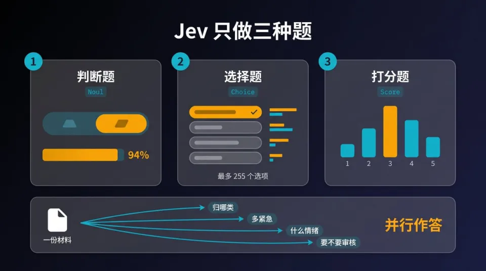

- Github (1k stars): https://github.com/vinnylarouge/jevlike

Jev 是“函数调用式”前沿模型

输入：非结构化的状态（文本或程序状态）

输出：带概率的类型化决策。

Jev 特点

无需自回归解码即可并行分类，推理开销大幅降低；

结果直接用于业务阈值（例如 p(紧急) > 0.1 就升级处理）；这个结果并非语言建模目标训练出的概率，置信度比LLM更有保障

显式数值分布让下游系统把误报与漏报的代价写进业务逻辑，而不是藏在模型行为里。

核心特点

不生成自然语言：没有自回归 token 生成，一次前向并行完成多个结构化问题判断；一次请求可以并发多个决策问题，新增问题几乎不增加延迟

三类原生输出原语（Typed Output）

Choice选择题：从给定候选列表选择，返回选中项、所有选项概率分布、置信度

Noul判断题：命题真假判断，返回 0~1 之间真实概率（是 / 否概率）

Score打分题：按自定义分级标尺打分，返回档位、概率分布、置信度

类型安全输出：返回结构化 JSON，代码可直接分支，无需 LLM 输出解析、清洗

输入形式：任意文本 / 日志 / 工单 / JSON 状态 + 用户定义的结构化决策问题

参考文章：https://news.qq.com/rain/a/20260919A099H700