# 1. Qwen系列
## 1.1 Qwen
参考：https://arxiv.org/abs/2309.16609

### 1.1.1 tokenizer

- 使用fast BPE tiktoken
- select the vocabulary cl100k base as our starting point
- To enhance the performance of our model on
 multilingual downstream tasks, particularly in Chinese, we augment the vocabulary with commonly
 used Chinese characters and words, as well as those in other languages. 
- split numbers into single digits. The final vocabulary size is approximately 152K

### 1.1.2 结构

- Embedding and output projection：and output projection. This decision was made in order to achieve better performance with
 the price of memory costs.
-  Positional embedding：RoPE
-  Bias: For most layers, we remove biases, but we add
 biases in the QKV layer of attention to enhance the extrapolation ability of the model 
- Pre-Norm & RMSNorm: 
  -  pre-normalization: improve training stability compared to post-normalization
  -  RMSNorm: equivalent performance while also improving efficiency
-  Activation function: SwiGLU (a combine of swish and GLU),  reduced the dimension of the feed-forward
 network (FFN) from 4 times the hidden size to 3/8 of the hidden size
- two attention mechanisms:
  - LogN-Scaling: rescales the dot product of
 the query and value by a factor that depends on the ratio of the context length to the training length,
 ensuring that the entropy of the attention value remains stable as the context length grows.
  - window attention: restricts the attention to a limited context window, preventing the model from attending to
 tokens that are too far away.
  - We also observed that the long-context modeling ability of our model varies across layers, with lower
layers being more sensitive in context length extension compared to the higher layers. To leverage
this observation, we assign different window sizes to each layer, using shorter windows for lower
layers and longer windows for higher layers.

### 1.1.3 预训练
数据构成
- 3 Trillion tokens
-  it has been demonstrated that
 pretraining language models with multi-task instructions can enhance their zero-shot and few-shot
 performance. 
- 2048 context length

数据处理流程：
- For public web data, we extract text from HTML and use language identification tools to
 determine the language. 
- To increase the diversity of our data, we employ deduplication techniques,
 including exact-match deduplication after normalization and fuzzy deduplication using MinHash
 and LSH algorithms. 
- To filter out low-quality data, we employ a combination of rule-based and
 machine-learning-based methods. Specifically, we use multiple models to score the content, including
 language models, text-quality scoring models, and models for identifying potentially offensive or
 inappropriate content. 
- We also manually sample texts from various sources and review them to ensure
 their quality. 
-  To further enhance the quality of our data, we selectively up-sample data from certain
 sources

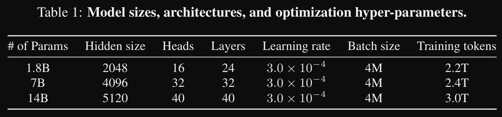

训练配置：
- flash attention
- AdamW: b1=0.9, b2=0.95, e=1e-8
- cosine learning rate with a specified peak learning rate for each model size, The learning rate is decayed to a minimum learning rate of 10% of the peak
 learning rate. 
- BFloat16 mixed precision for training stability

长度外推：
- NTK-aware interpolation
- NTK-aware interpolation adjusts the base of RoPE to prevent the loss of high-frequency information
 in a training-free manner.
- To further improve performance, we have also implemented a trivial
 extension called dynamicNTK-aware interpolation. It dynamically changes the scale by chunks, avoiding severe performance degradation.

### 1.1.4 SFT

use ChatML-style format

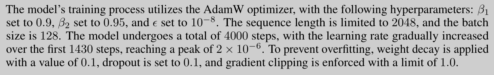

## 1.1.5 RLHF

reward model:

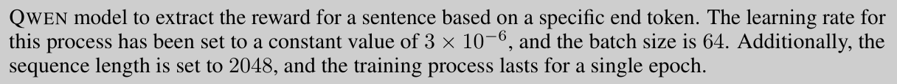

PPO:
- 50 steps
- set the KL divergence coefficient to 0.04 and normalize the reward based on the running mean

# 2. ChatGLM系列
参考：https://arxiv.org/pdf/2406.12793

## 2.1 ChatGLM-6B
### 2.1.1 预训练
- 1 Trillion token：主要中文和英文，另包含20国语言
- 2048 context length

## 2.2 ChatGLM2-6B
- Multi-Query-Attention推理提速42%

## 2.3 GLM4-9B
### 2.1.1 预训练
数据构成
- 10 Trillion tokens
- 8192 context length
- mostly English and Chinese
- documents from a mixture of different sources, including webpages, Wikipedia, books, code, and
papers

数据处理流程：
- deduplication：exact deduplication and fuzzy deduplication
- filtering：removing noisy documents that contain offensive language, placeholder text, source code, etc
- tokenization：converts the text into a sequence of tokens

模型结构优化：

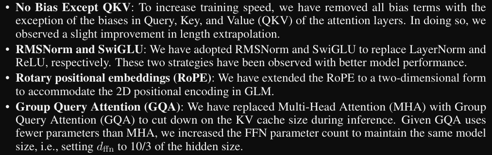

# 3. InternLM
## 3.1 InternLM-104B
### 3.1.1 预训练
- 104B 1.6T tokens

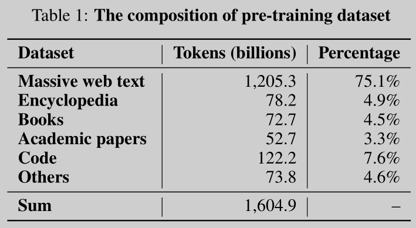

### 3.1.2 SFT
- 5M conversations

## 3.2 InternLM2
### 3.2.1 预训练

- 1.8B, 7B, and 20B models ranges from 2.0T to 2.6T
- the pre-training process consists of three distinct phases. In the first phase,
 we used pre-training corpora with lengths not exceeding 4k. In the second phase, we
 included 50% of pre-training corpora with lengths not exceeding 32k. In the third phase,
 we utilized capability-specific enhancement data. During each phase, we mixed data in
 English, Chinese, and code.

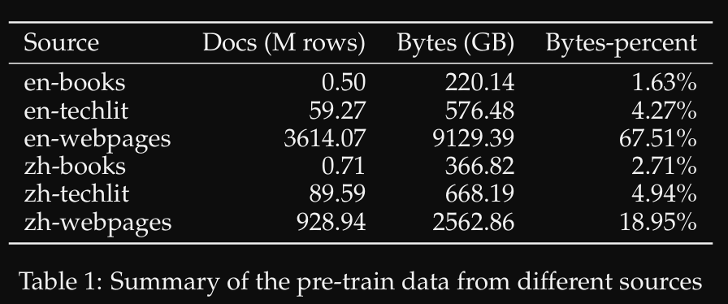

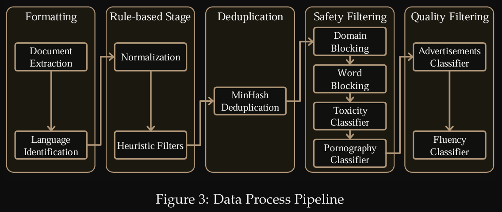

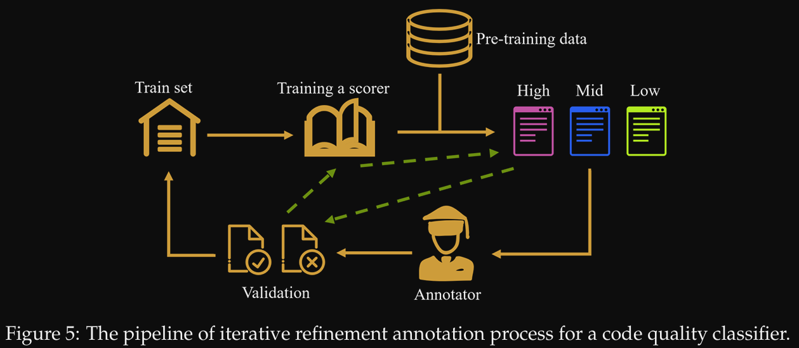

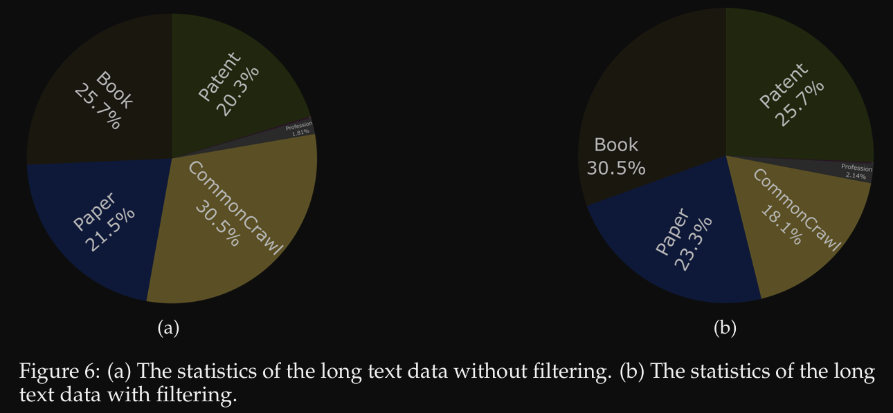

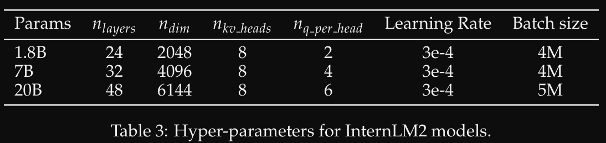

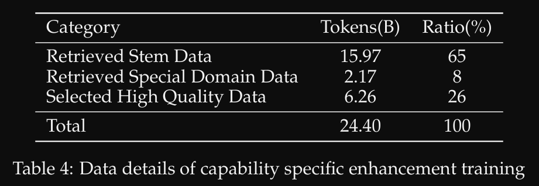

### 3.2.2. SFT
- 10 MILLION instances

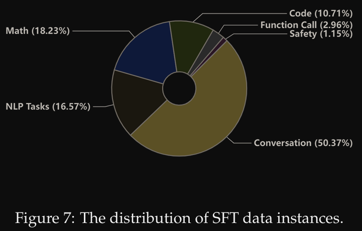

### 3.2.3 RLHF

- PPO
- Conditional OnLine RLHF (COOLRLHF)

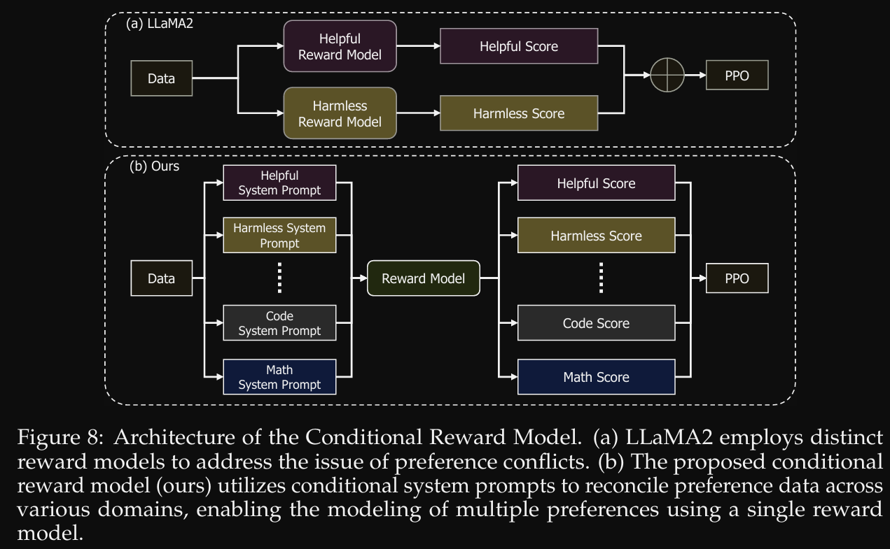

- RM: 2.4M pairs
-  encompassing various fields such as dialogue, article writing, poetry,
 summarization, coding, mathematics
- PPO: 200k

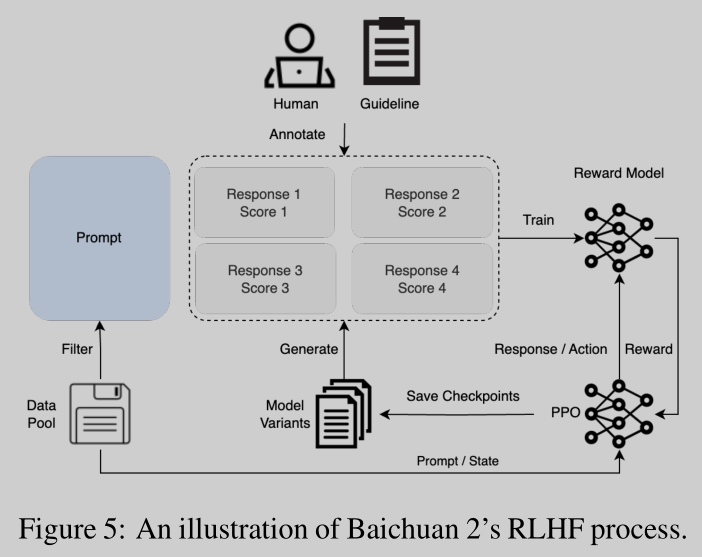

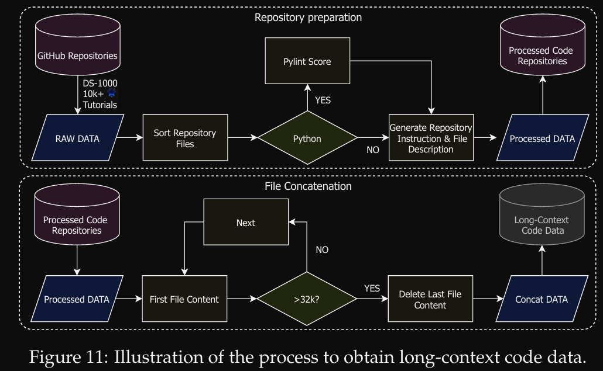

# 4. DeepSeek
## 4.1 DeepSeek-V2
### 4.1.1 模型结构

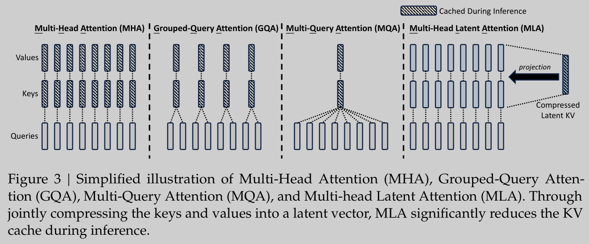

- Multi-Head Latent Attention (MLA)
- Low-Rank Key-Value Joint Compression
- Decoupled Rotary Position Embedding
- Comparison of Key-Value Cache

### 4.1.2 预训练
- moe: 236B with 21B activated for each token
- 8.1T tokens
- maximum sequence length to 4K
- trained based on the HAI-LLM framework
- additionally train the model for 1000 steps, with a sequence length of 32K and a batch
size of 576 sequences. Although the training is conducted solely at the sequence length of 32K,
the model still demonstrates robust performance when being evaluated at a context length of
128K.

### 4.1.3 SFT
- 1.5M conversations
- 验证10k数据不够，更多效果更好

### 4.1.4 RLHF

- Group Relative Policy Optimization (GRPO)

## 4.2 DeepSeek
### 4.2.1 预训练
- 2 Trillion tokens
- training framework named HAI-LLM
-  Data parallelism, tensor parallelism, sequence
 parallelism, and 1F1B pipeline parallelism
- use ZeRO-1

### 4.2.2 Align

We collect around 1.5 million instruction data instances in English and Chinese, covering a wide
 range of helpfulness and harmlessness topics. Our helpful data contains 1.2 million instances,
 with a distribution of 31.2% for general language tasks, 46.6% for mathematical problems, and
 22.2% for coding exercises. The safety data consists of 300K instances, covering various sensitive
 topics

- 7B 4 EPOCHS
- 67B 2 EPOCHS
- learning rate is 1e-5 and 5e-6 for 7B and 67B models

### 4.2.2. SFT
- 1M INSTANCES

We observed that the repetition ratio tends to rise as the quantity of math SFT data increases.

This can be attributed to the fact that math SFT data occasionally includes similar patterns in
 reasoning. To tackle the problem, we tried two-stage fine-tuning and DPO

### 4.2.3 RLHF
- DPO

### 4.2.4 tokenizer
-  24 GB

# 5. Baichuan
## 5.1 Baichuan2

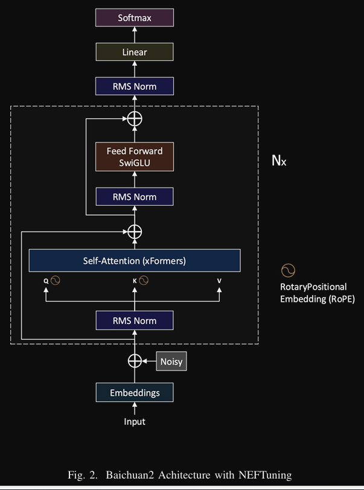

### 5.1.1 toknizer

A tokenizer needs to balance two critical factors:
a high compression rate for efficient inference,
and an appropriately sized vocabulary to ensure
adequate training of each word embedding. We
have taken both these aspects into account. We
have expanded the vocabulary size from 64,000
in Baichuan 1 to 125,696, aiming to strike a
balance between computational efficiency and
model performance.

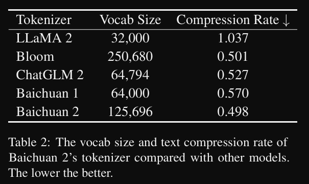

### 5.1.1 预训练

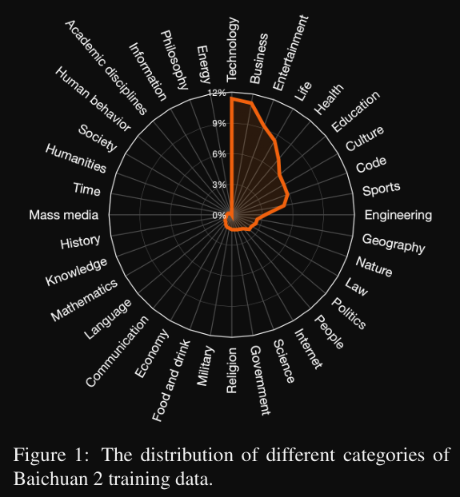

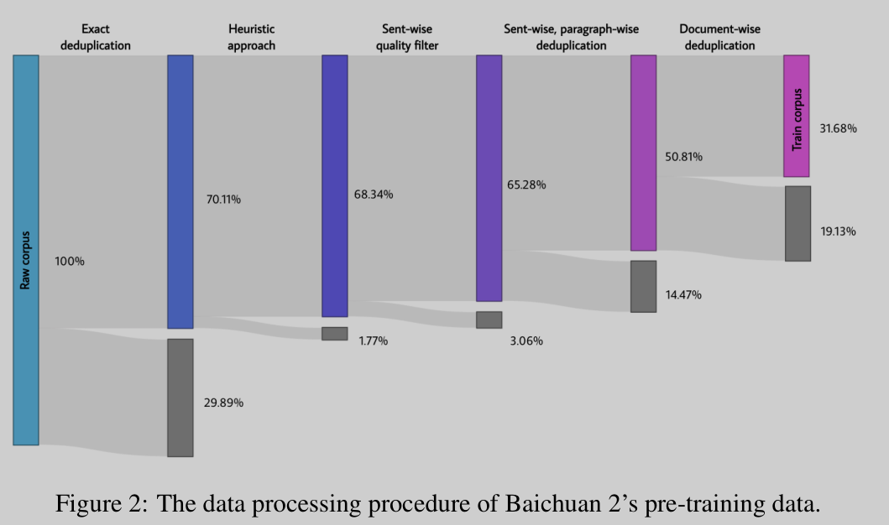

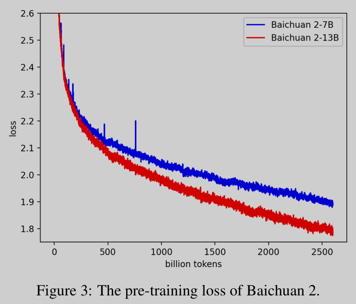

### 5.1.2 SFT
- 100k 

### 5.1.3 RLHF

RM: 6 primary categories,
30 secondary categories, and over 200 tertiary
categories
