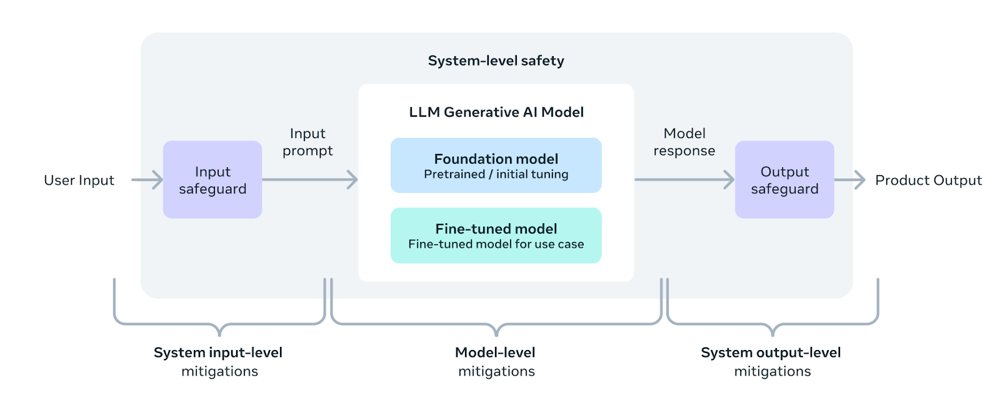

# 1. LLama
## 1.1 LLama3
### 1.1.1 Pretrain
数据构成
- 15T token
- over 5% of the Llama 3 pretraining dataset consists of high-quality non-English data that covers over 30 languages.

数据清洗：pipelines include using heuristic filters, NSFW filters, semantic deduplication approaches, and text classifiers to predict data quality

### 1.1.2 Alignment
- SFT
- PPO and DPO

### 1.1.3 Safety

