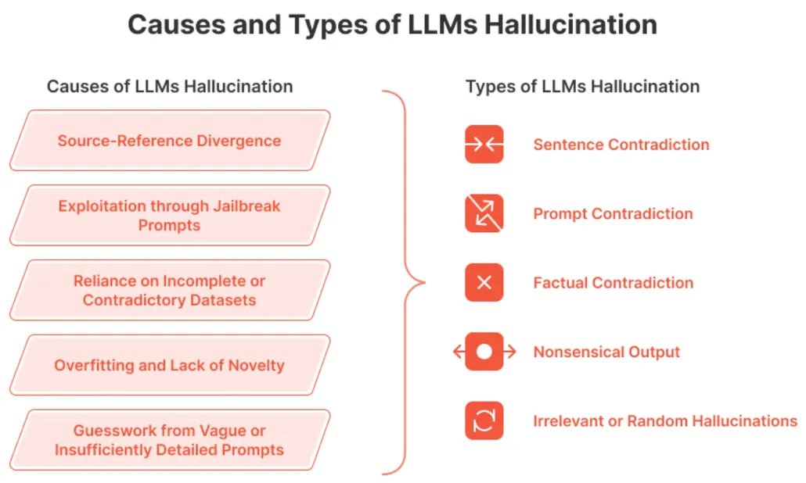

# 参考

[1] RAG：从理论到LlamaIndex实践（详细版），https://mp.weixin.qq.com/s?__biz=MzI2ODUyMTQyNA==&mid=2247488172&idx=1&sn=f7f1af16fe28dc1d6117f0eaebc33da7&chksm=eaef0813dd98810544fe787663673176d69ea570fb5cd2ad767553f2171bddc10e246ad66754&cur_album_id=3347161101687324680&scene=189#wechat_redirect