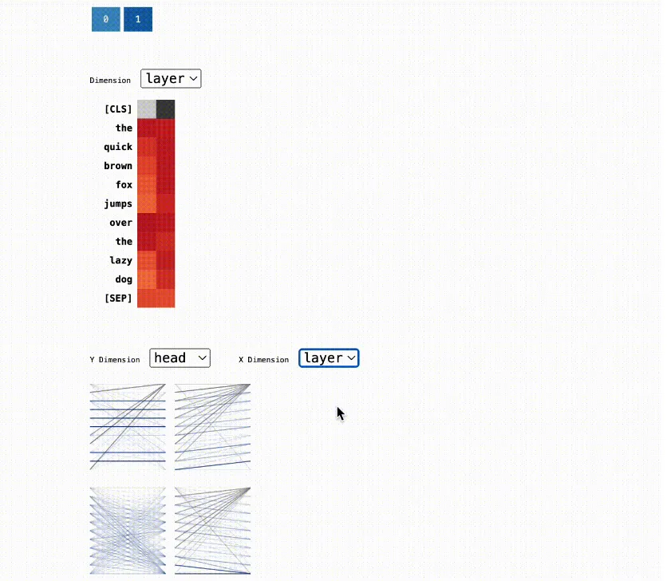

# 1. 简介

Github (489 stars): https://github.com/labmlai/inspectus

Inspectus是一款多功能的大型语言模型可视化工具。它通过一个易于使用的Python API，在Jupyter笔记本中流畅运行。Inspectus提供了多种视图，能够从不同角度深入洞察语言模型的行为。


- 注意力矩阵：此功能可视化了词元间的注意力分数，突出显示了在处理过程中每个词元如何聚焦于其他词元。
- 查询词元热图：展示了每个查询词元与选定的键词元之间的注意力分数总和。
- 键词元热图：展示了每个键词元与选定的查询词元之间的注意力分数总和。
- 维度热图：展示了每个维度（层和头）中项的注意力分数总和，并对该维度进行了标准化处理。



Inspectus通过多种指标展示了其强大的能力：
1. 易用性：Inspectus提供了一个易于使用的Python API，使用户能够快速地可视化注意力模式，无需复杂的设置或配置。
2. 灵活性：支持不同的查询和键词元，用户可以根据特定的需求和研究问题定制自己的分析。
3. 兼容性：Inspectus与Huggingface模型无缝集成，并支持自定义注意力图，确保与广泛的语言模型和研究场景兼容。
4. 可解释性：Inspectus提供的直观可视化工具使用户能够更有效地解释注意力模式，从而更好地理解和优化语言模型。

# 2. 使用

```python
from transformers import AutoTokenizer, GPT2LMHeadModel, AutoConfig
import torch
import inspectus

# Initialize the tokenizer and model
context_length = 128
tokenizer = AutoTokenizer.from_pretrained("huggingface-course/code-search-net-tokenizer")

config = AutoConfig.from_pretrained(
    "gpt2",
    vocab_size=len(tokenizer),
    n_ctx=context_length,
    bos_token_id=tokenizer.bos_token_id,
    eos_token_id=tokenizer.eos_token_id,
)

model = GPT2LMHeadModel(config)

# Tokenize the input text
text= 'The quick brown fox jumps over the lazy dog'
tokenized = tokenizer(
    text,
    return_tensors='pt',
    return_offsets_mapping=True
)
input_ids = tokenized['input_ids']

tokens = [text[s: e] for s, e in tokenized['offset_mapping'][0]]

with torch.no_grad():
    res = model(input_ids=input_ids.to(model.device), output_attentions=True)

# Visualize the attention maps using the Inspectus library
inspectus.attention(res['attentions'], tokens)
```

# 参考 

[1] Inspectus：一款LLM可视化分析工具！, https://mp.weixin.qq.com/s/m7sPkH2D3RB7NLYw8YljFA